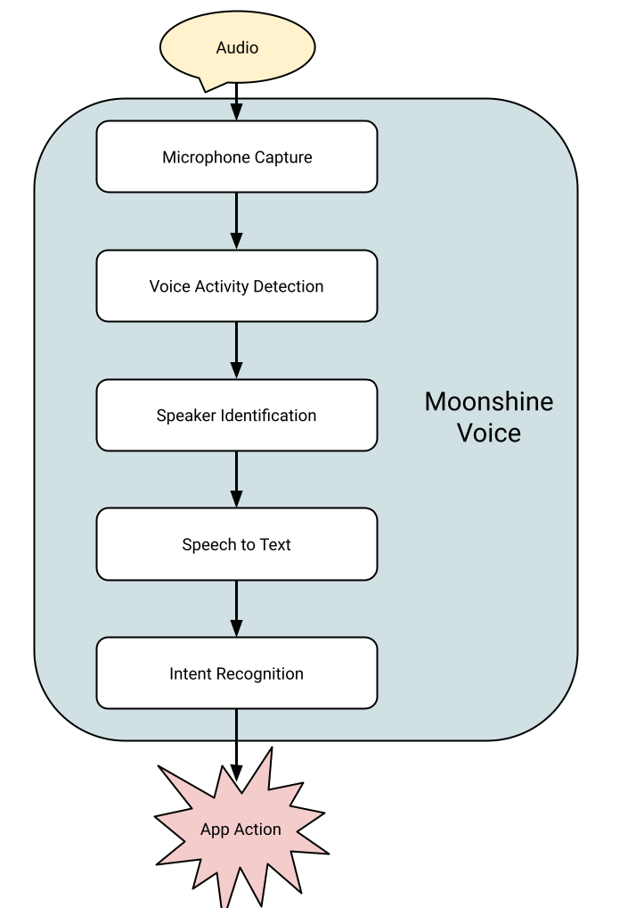

# Moonshine Voice

**Voice Interfaces for Everyone**

- [Quickstart](#quickstart)
- [When should you choose Moonshine over Whisper?](#when-should-you-choose-moonshine-over-whisper)
- [Using the Library](#using-the-library)
- [Models](#models)
- [API Reference](#api-reference)
- [Support](#support)
- [Roadmap](#roadmap)
- [Acknowledgements](#acknowledgements)
- [License](#license)

[Moonshine](https://moonshine.ai) Voice is an open source AI toolkit for developers building real-time voice applications.

- Everything runs on-device, so it's fast, private, and you don't need an account, credit card, or API keys.
- The framework and models are optimized for live streaming applications, offering low latency responses by doing a lot of the work while the user is still talking.
- All models are based on our [cutting edge research](https://arxiv.org/abs/2602.12241) and trained from scratch, so we can offer [higher accuracy than Whisper Large V3 at the top end](https://huggingface.co/spaces/hf-audio/open_asr_leaderboard), down to tiny 26MB models for constrained deployments.
- It's easy to integrate across platforms, with the same library running on [Python](#python), [iOS](#ios), [Android](#android), [MacOS](#macos), [Linux](#linux), [Windows](#windows), [Raspberry Pis](#raspberry-pi), [IoT devices](https://www.linkedin.com/posts/petewarden_most-of-the-recent-news-about-ai-seems-to-activity-7384664255242932224-v6Mr/), and wearables.
- Batteries are included. Its high-level APIs offer complete solutions for common tasks like transcription, speaker identification (diarization) and command recognition, so you don't need to be an expert to build a voice application.
- It supports multiple languages, including English, Spanish, Mandarin, Japanese, Korean, Vietnamese, Ukrainian, and Arabic.

## Quickstart

[Join our community on Discord to get live support](https://discord.gg/27qp9zSRXF).

### Python

```bash
pip install moonshine-voice
python -m moonshine_voice.mic_transcriber --language en
```

Listens to the microphone and prints updates to the transcript as they come in.

```bash
python -m moonshine_voice.intent_recognizer
```

Listens for user-defined action phrases, like "Turn on the lights", using semantic matching so natural language variations are recognized. For more, check out [our "Getting Started" Colab notebook](https://bit.ly/moonshine-colab) and [video](https://www.youtube.com/watch?v=WH-AGvHmtoM).

### iOS

Download [github.com/moonshine-ai/moonshine/releases/latest/download/ios-examples.tar.gz](https://github.com/moonshine-ai/moonshine/releases/latest/download/ios-examples.tar.gz), extract it, and then open the `Transcriber/Transcriber.xcodeproj` project in Xcode.

### Android

Download [github.com/moonshine-ai/moonshine/releases/latest/download/android-examples.tar.gz](https://github.com/moonshine-ai/moonshine/releases/latest/download/android-examples.tar.gz), extract it, and then open the `Transcriber` folder in Android Studio.

### Linux

[Download](https://github.com/moonshine-ai/moonshine/archive/refs/heads/main.zip) or `git clone` this repository and then run:

```bash
cd core
mkdir build
cmake ..
cmake --build .
./moonshine-cpp-test
```

### MacOS

Download [github.com/moonshine-ai/moonshine/releases/latest/download/macos-examples.tar.gz](https://github.com/moonshine-ai/moonshine/releases/latest/download/macos-examples.tar.gz), extract it, and then open the `MicTranscription/MicTranscription.xcodeproj` project in Xcode.

### Windows

Download [github.com/moonshine-ai/moonshine/releases/latest/download/windows-examples.tar.gz](https://github.com/moonshine-ai/moonshine/releases/latest/download/windows-examples.tar.gz), extract it, and then open the `cli-transcriber\cli-transcriber.vcxproj` project in Visual Studio.

[Install Moonshine in Python](#python) for model downloading.

In the terminal:

```batch
pip install moonshine-voice
cd examples\windows\cli-transcriber
.\download-lib.bat
msbuild cli-transcriber.sln /p:Configuration=Release /p:Platform=x64
python -m moonshine_voice.download --language en
x64\Release\cli-transcriber.exe --model-path <path from the download command> --model-arch <number from the download command>
```

### Raspberry Pi

You'll need a USB microphone plugged in to get audio input, but the Python pip package has been optimized for the Pi, so you can run:

```bash
 sudo pip install --break-system-packages moonshine-voice
 python -m moonshine_voice.mic_transcriber --language en
```

I've recorded [a screencast on YouTube](https://www.youtube.com/watch?v=NNcqx1wFxl0) to help you get started, and you can also download [github.com/moonshine-ai/moonshine/releases/latest/download/raspberry-pi-examples.tar.gz](https://github.com/moonshine-ai/moonshine/releases/latest/download/raspberry-pi-examples.tar.gz) for some fun, Pi-specific examples. [The README](examples/raspberry-pi/my-dalek/README.md) has information about using a virtual environment for the Python install if you don't want to use `--break-system-packages`.

## When should you choose Moonshine over Whisper?

TL;DR - When you're working with live speech.

| Model                      | WER    | # Parameters | MacBook Pro | Linux x86 | 
| -------------------------- | ------ | ------------ | ----------- | --------- | 
| Moonshine Medium Streaming | 6.65%  | 245 million  | 258ms       | 347ms     | 
| Whisper Large v3           | 7.44%  | 1.5 billion  | 11,286ms    | 16,919ms  | 
| Moonshine Small Streaming  | 7.84%  | 123 million  | 148ms       | 201ms     | 
| Whisper Small              | 8.59%  | 244 million  | 1940ms      | 3,425ms   | 
| Moonshine Tiny Streaming   | 12.00% | 34 million   | 50ms        | 76ms      | 
| Whisper Tiny               | 12.81% | 39 million   | 277ms       | 1,141ms   | 

_See [benchmarks](#benchmarks) for how these numbers were measured._

[OpenAI's release of their Whisper family of models]() was a massive step forward for open-source speech to text. They offered a range of sizes, allowing developers to trade off compute and storage space against accuracy to fit their applications. Their biggest models, like Large v3, also gave accuracy scores that were higher than anything available outside of large tech companies like Google or Apple. At Moonshine we were early and enthusiastic adopters of Whisper, and we still remain big fans of the models and the great frameworks like [FasterWhisper](https://github.com/SYSTRAN/faster-whisper) and others that have been built around them.

However, as we built applications that needed a live voice interface we found we needed features that weren't available through Whisper:

- **Whisper always operates on a 30-second input window**. This isn't an issue when you're processing audio in large batches, you can usually just look ahead in the file and find a 30-second-ish chunk of speech to apply it to. Voice interfaces can't look ahead to create larger chunks from their input stream, and phrases are seldom longer than five to ten seconds. This means there's a lot of wasted computation encoding zero padding in the encoder and decoder, which means longer latency in returning results. Since one of the most important requirements for any interface is responsiveness, usually defined as latency below 200ms, this hurts the user experience even on platforms that have compute to spare, and makes it unusable on more constrained devices.
- **Whisper doesn't cache anything**. Another common requirement for voice interfaces is that they display feedback as the user is talking, so that they know the app is listening and understanding them. This means calling the speech to text model repeatedly over time as a sentence is spoken. Most of the audio input is the same, with only a short addition to the end. Even though a lot of the input is constant, Whisper starts from scratch every time, doing a lot of redundant work on audio that it has seen before. Like the fixed input window, this unnecessary latency impairs the user experience.
- **Whisper supports a lot of languages poorly**. Whisper's multilingual support is an incredible feat of engineering, and demonstrated a single model could handle many languages, and even offer translations. This chart from OpenAI ([raw data in Appendix D-2.4](https://cdn.openai.com/papers/whisper.pdf)) shows the drop-off in Word Error Rate (WER) with the very largest 1.5 billion parameter model.


82 languages are listed, but only 33 have sub-20% WER (what we consider usable). For the Base model size commonly used on edge devices, only 5 languages are under 20% WER. Asian languages like Korean and Japanese stand out as the native tongue of large markets with a lot of tech innovation, but Whisper doesn't offer good enough accuracy to use in most applications The proprietary in-house versions of Whisper that are available through OpenAI's cloud API seem to offer better accuracy, but aren't available as open models.

- **Fragmented edge support**. A fantastic ecosystem has grown up around Whisper, there are a lot of mature frameworks you can use to deploy the models. However these often tend to be focused on desktop-class machines and operating systems. There are projects you can use across edge platforms like iOS, Android, or Raspberry Pi OS, but they tend to have different interfaces, capabilities, and levels of optimization. This made building applications that need to run on a variety of devices unnecessarily difficult.

All these limitations drove us to create our own family of models that better meet the needs of live voice interfaces. It took us some time since the combined size of the open speech datasets available is tiny compared to the amount of web-derived text data, but after extensive data-gathering work, we were able to release [the first generation of Moonshine models](https://arxiv.org/abs/2410.15608). These removed the fixed-input window limitation along with some other architectural improvements, and gave significantly lower latency than Whisper in live speech applications, often running 5x faster or more.

However we kept encountering applications that needed even lower latencies on even more constrained platforms. We also wanted to offer higher accuracy than the Base-equivalent that was the top end of the initial models. That led us to this second generation of Moonshine models, which offer:

- **Flexible input windows**. You can supply any length of audio (though we recommend staying below around 30 seconds) and the model will only spend compute on that input, no zero-padding required. This gives us a significant latency boost.
- **Caching for streaming**. Our models now support incremental addition of audio over time, and they cache the input encoding and part of the decoder's state so that we're able to skip even more of the compute, driving latency down dramatically.
- **Language-specific models**. We have gathered data and trained models for multiple languages, including Arabic, Japanese, Korean, Spanish, Ukrainian, Vietnamese, and Chinese. As we discuss in our [Flavors of Moonshine paper](https://arxiv.org/abs/2509.02523), we've found that we can get much higher accuracy for the same size and compute if we restrict a model to focus on just one language, compared to training one model across many.
- **Cross-platform library support**. We're building applications ourselves, and needed to be able to deploy these models across Linux, MacOS, Windows, iOS, and Android, as well as use them from languages like Python, Swift, Java, and C++. To support this we architected a portable C++ core library that handles all of the processing, uses OnnxRuntime for good performance across systems, and then built native interfaces for all the required high-level languages. This allows developers to learn one API, and then deploy it almost anywhere they want to run.
- **Better accuracy than Whisper V3 Large**. On [HuggingFace's OpenASR leaderboard](https://huggingface.co/spaces/hf-audio/open_asr_leaderboard), our newest streaming model for English, Medium Streaming, achieves a lower word-error rate than the most-accurate Whisper model from OpenAI. This is despite Moonshine's version using 250 million parameters, versus Large v3's 1.5 billion, making it much easier to deploy on the edge.

Hopefully this gives you a good idea of how Moonshine compares to Whisper. If you're working with GPUs in the cloud on data in bulk where throughput is most important then Whisper (or Nvidia alternatives like Parakeet) offer advantages like batch processing, but we believe we can't be beat for live speech. We've built the framework and models we wished we'd had when we first started building applications with voice interfaces, so if you're working with live voice inputs, [give Moonshine a try](#quickstart).

## Using the Library

The Moonshine API is designed to take care of the details around capturing and transcribing live speech, giving application developers a high-level API focused on actionable events. I'll use Python to illustrate how it works, but the API is consistent across all the supported languages.

- [Architecture](#architecture)
- [Concepts](#concepts)
- [Getting Started with Transcription](#getting-started-with-transcription)
  - [Transcription Event Flow](#transcription-event-flow)
- [Getting Started with Command Recognition](#getting-started-with-command-recognition)
- [Examples](#examples)
- [Adding the Library to your own App](#adding-the-library-to-your-own-app)
- [Python](#python-1)
- [iOS or MacOS](#ios-or-macos)
- [Android](#android-1)
- [Windows](#windowsc)
- [Debugging](#debugging)
  - [Console Logs](#console-logs)
  - [Input Saving](#input-saving)
  - [API Call Logging](#api-call-logging)
- [Building from Source](#building-from-source)
  - [Cmake](#cmake)
  - [Language Bindings](#language-bindings)
  - [Porting](#porting)
- [Downloading Models](#downloading-models)
- [Benchmarking](#benchmarking)

### Architecture

Our goal is to build a framework that any developer can pick up and use, even with no previous experience of speech technologies. We've abstracted away a lot of the unnecessary details and provide a simple interface that lets you focus on building your application, and that's reflected in our system architecture.

The basic flow is:

- Create a `Transcriber` or `IntentRecognizer` object, depending on whether you want the text that's spoken, or just to know that a user has requested an action.
- Attach an `EventListener` that gets called when important things occur, like the end of a phrase or an action being triggered, so your application can respond.

Traditionally, adding a voice interface to an application or product required integrating a lot of different libraries to handle all the processing that's needed to capture audio and turn it into something actionable. The main steps involved are microphone capture, voice activity detection (to break a continuous stream of audio into sections of speech), speech to text, speaker identification, and intent recognition. Each of these steps typically involved a different framework, which greatly increased the complexity of integrating, optimizing, and maintaining these dependencies.

Moonshine Voice includes all of these stages in a single library, and abstracts away everything but the essential information your application needs to respond to user speech, whether you want to transcribe it or trigger actions.



Most developers should be able to treat the library as a black box that tells them when something interesting has happened, using our event-based classes to implement application logic. Of course the framework is fully open source, so speech experts can dive as deep under the hood as they'd like, but it's not necessary to use it.

### Concepts

A [**Transcriber**](python/src/moonshine_voice/transcriber.py#L66) takes in audio input and turns any speech into text. This is the first object you'll need to create to use Moonshine, and you'll give it a path to [the models you've downloaded](#downloading-models).

A [**MicTranscriber**](python/src/moonshine_voice/mic_transcriber.py#L10) is a helper class based on the general transcriber that takes care of connecting to a microphone using your platform's built-in support (for example sounddevice in Python) and then feeding the audio in as it's captured.

A [**Stream**](python/src/moonshine_voice/transcriber.py#L297) is a handler for audio input. The reason streams exist is because you may want to process multiple audio inputs at once, and a transcriber can support those through multiple streams, without duplicating the model resources. If you only have one input, the transcriber class includes the same methods (start/stop/add_audio) as a stream, and you can use that interface instead and forget about streams.

A [**TranscriptLine**](python/src/moonshine_voice/moonshine_api.py#L51) is a data structure holding information about one line in the transcript. When someone is speaking, the library waits for short pauses (where punctuation might go in written language) and starts a new line. These aren't exactly sentences, since a speech pause isn't a sure sign of the end of a sentence, but this does break the spoken audio into segments that can be considered phrases. A line includes state such as whether the line has just started, is still being spoken, or is complete, along with its start time and duration.

A [**Transcript**](python/src/moonshine_voice/moonshine_api.py#67) is a list of lines in time order holding information about what text has already been recognized, along with other state like when it was captured.

A [**TranscriptEvent**](python/src/moonshine_voice/transcriber.py#L22) contains information about changes to the transcript. Events include a new line being started, the text in a line being updated, and a line being completed. The event object includes the transcript line it's referring to as a member, holding the latest state of that line.

A [**TranscriptEventListener**](python/src/moonshine_voice/transcriber.py#L266) is a protocol that allows app-defined functions to be called when transcript events happen. This is the main way that most applications interact with the results of the transcription. When live speech is happening, applications usually need to respond or display results as new speech is recognized, and this approach allows you to handle those changes in a similar way to events from traditional user interfaces like touch screen gestures or mouse clicks on buttons.

An [**IntentRecognizer**](python/src/moonshine_voice/intent_recognizer.py#L44) is a type of TranscriptEventListener that allows you to invoke different callback functions when preprogrammed intents are detected. This is useful for building voice command recognition features.

### Getting Started with Transcription

We have [examples](#examples) for most platforms so as a first step I recommend checking out what we have for the systems you're targeting.

Next, you'll need to [add the library to your project](#adding-the-library-to-your-own-app). We aim to provide pre-built binaries for all major platforms using their native package managers. On Python this means a pip install, for Android it's a Maven package, and for MacOS and iOS we provide a Swift package through SPM.

The transcriber needs access to the files for the model you're using, so after [downloading them](#downloading-models) you'll need to place them somewhere the application can find them, and make a note of the path. This usually means adding them as resources in your IDE if you're planning to distribute the app, or you can use hard-wired paths if you're just experimenting. The download script gives you the location of the models and their architecture type on your drive after it completes.

Now you can try creating a transcriber. Here's what that looks like in Python:

```python
transcriber = Transcriber(model_path=model_path, model_arch=model_arch)
```

If the model isn't found, or if there's any other error, this will throw an exception with information about the problem. You can also check the console for logs from the core library, these are printed to `stderr` or your system's equivalent.

Now we'll create a listener that contains the app logic that you want triggered when the transcript updates, and attach it to your transcriber:

```python
class TestListener(TranscriptEventListener):
    def on_line_started(self, event):
        print(f"Line started: {event.line.text}")

    def on_line_text_changed(self, event):
        print(f"Line text changed: {event.line.text}")

    def on_line_completed(self, event):
        print(f"Line completed: {event.line.text}")

transcriber.add_listener(listener)
```

The transcriber needs some audio data to work with. If you want to try it with the microphone you can update your transcriber creation line to use a MicTranscriber instead, but if you want to start with a .wav file for testing purposes here's how you feed that in:

```python
    audio_data, sample_rate = load_wav_file(wav_path)

    transcriber.start()

    # Loop through the audio data in chunks to simulate live streaming
    # from a microphone or other source.
    chunk_duration = 0.1
    chunk_size = int(chunk_duration * sample_rate)
    for i in range(0, len(audio_data), chunk_size):
        chunk = audio_data[i: i + chunk_size]
        transcriber.add_audio(chunk, sample_rate)

    transcriber.stop()
```

The important things to notice here are:

- We create an array of mono audio data from a wav file, using the convenience `load_wav_file()` function that's part of the Moonshine library.
- We start the transcriber to activate its processing code.
- The loop adds audio in chunks. These chunks can be any length and any sample rate, the library takes care of all the housekeeping.
- As audio is added, the event listener you added will be called, giving information about the latest speech.

In a real application you'd be calling `add_audio()` from an audio handler that's receiving it from your source. Since the library can handle arbitrary durations and sample rates, just make sure it's mono and otherwise feed it in as-is.

The transcriber analyses the speech at a default interval of every 500ms of input. You can change this with the `update_interval` argument to the transcriber constructor. For streaming models most of the work is done as the audio is being added, and it's automatically done at the end of a phrase, so changing this won't usually affect the workload or latency massively.

The key takeaway is that you usually don't need to worry about the transcript data structure itself, the event system tells you when something important happens. You can manually trigger a transcript update by calling `update_transcription()` which returns a transcript object with all of the information about the current session if you do need to examine the state.

By calling `start()` and `stop()` on a transcriber (or stream) we're beginning and ending a session. Each session has one transcript document associated with it, and it is started fresh on every `start()` call, so you should make copies of any data you need from the transcript object before that.

The transcriber class also offers a simpler `transcribe_without_streaming()` method, for when you have an array of data from the past that you just want to analyse, such as a file or recording.

We also offer a specialization of the base `Transcriber` class called `MicTranscriber`. How this is implemented will depend on the language and platform, but it should provide a transcriber that's automatically attached to the main microphone on the system. This makes it straightforward to start transcribing speech from that common source, since it supports all of the same listener callbacks as the base class.

#### Transcription Event Flow

The main communication channel between the library and your application is through events that are passed to any listener functions you have registered. There are four major event types:

- `LineStarted`. This is sent to listeners when the beginning of a new speech segment is detected. It may or may not contain any text, but since it's dispatched near the start of an utterance, that text is likely to change over time.
- `LineUpdated`. Called whenever any of the information about a line changes, including the duration, audio data, and text.
- `LineTextChanged`. Called only when the text associated with a line is updated. This is a subset of `LineUpdated` that focuses on the common need to refresh the text shown to users as often as possible to keep the experience interactive.
- `LineCompleted`. Sent when we detect that someone has paused speaking, and we've ended the current segment. The line data structure has the final values for the text, duration, and speaker ID.

We offer some guarantees about these events:

- `LineStarted` is always called exactly once for any segment.
- `LineCompleted` is always called exactly once after `LineStarted` for any segment.
- `LineUpdated` and `LineTextChanged` will only ever be called after the `LineStarted` and before the `LineCompleted` events for a segment.
- Those update events are not guaranteed to be called (and in practice can be disabled by setting `update_interval` to a very large value).
- There will only be one line active at any one time for any given stream.
- Once `LineCompleted` has been called, the library will never alter that line's data again.
- If `stop()` is called on a transcriber or stream, any active lines will have `LineCompleted` called.
- Each line has a 64-bit `lineId` that is designed to be unique enough to avoid collisions.
- This `lineId` remains the same for the line over time, from the first `LineStarted` event onwards.

### Getting Started with Command Recognition

If you want your application to respond when users talk, you need to understand what they're saying. The previous generation of voice interfaces could only recognize speech that was phrased in exactly the form they expected. For example "Alexa, turn on living-room lights" might work, but "Alexa, lights on in the living room please" might not. The general problem of figuring out what a user wants from natural speech is known as intent recognition. There have been decades of research into this area, but the rise of transformer-based LLMs has given us new tools. We have integrated some of these advances into Moonshine Voice's command recognition API.

The basic idea is that your application registers some general actions you're interested in, like "Turn the lights on" or "Move left", and then Moonshine sends an event when the user says something that matches the meaning of those phrases. It works a lot like a graphical user interface - you define a button (action) and an event callback that is triggered when the user presses that button.

To give it a try for yourself, run this built-in example:

```bash
python -m moonshine_voice.intent_recognizer
```

This will present you with a menu of command phrases, and then start listening to the microphone. If you say something that's a variant on one of the phrases you'll see a "triggered" log message telling you which action was matched, along with how confident the system is in the match.

```bash
📝 Let there be light.
'TURN ON THE LIGHTS' triggered by 'Let there be light.' with 76% confidence
```

To show that you can modify these at run time, try supplying your own list of phrases as a comma-separated string argument to `--intents`.

```bash
python -m moonshine_voice.intent_recognizer --intents "Turn left, turn right, go backwards, go forward"
```

This could be the core command set to control a robot's movement for example. It's worth spending a bit of time experimenting with different wordings of the command phrases, and different variations on the user side, to get a feel for how the system works.

Under the hood this is all accomplished using two main classes. We've met the `MicTranscriber` above, the new addition is `IntentRecognizer`. This listens to the results of the transcriber, fuzzily matches completed lines against any intents that have been registered with it, and calls back the client-supplied code.

The fuzzy matching uses a sentence-embedding model based on Gemma300m, so the first step is downloading it and getting the path:

```python
embedding_model_path, embedding_model_arch = get_embedding_model(
    args.embedding_model, args.quantization
)
```

Once we have the model's location, we create an `IntentRecognizer` using that path. The only other argument is the `threshold` we use for fuzzy matching. It's between 0 and 1, with low numbers producing more matches but at the cost of less accuracy, and vice versa for high values.

```python
intent_recognizer = IntentRecognizer(
    model_path=embedding_model_path,
    model_arch=embedding_model_arch,
    model_variant=args.quantization,
    threshold=args.threshold,
)
```

Next we tell the recognizer what kinds of phrases to listen out for, and what to do when there's a match.

```python
def on_intent_triggered_on(trigger: str, utterance: str, similarity: float):
    print(f"\n'{trigger.upper()}' triggered by '{utterance}' with {similarity:.0%} confidence")

for intent in intents:
    intent_recognizer.register_intent(intent, on_intent_triggered_on)
```

The recognizer supports the transcript event listener interface, so the final stage is adding it as a listener to the `MicTranscriber`.

```python
mic_transcriber.add_listener(intent_recognizer)
```

Once you start the transcriber, it will listen out for any variations on the supplied phrases, and call `on_intent_triggered_on()` whenever there's a match.

The current intent recognition is designed for full-sentence matching, which works well for straightforward commands, but we will be expanding into more advanced "slot filling" techniques in the future, to handle extracting the quantity from "I want ten bananas" for example.

### Examples

The [`examples`](examples/) folder has code samples organized by platform. We offer these for [Android](examples/android/), [portable C++](examples/c++/), [iOS](examples/ios/), [MacOS](examples/macos/), [Python](examples/python), and [Windows](examples/windows/). We have tried to use the most common build system for each platform, so Android uses Android Studio and Maven, iOS and MacOS use Xcode and Swift, while Windows uses Visual Studio.

The examples usually include one minimal project that just creates a transcriber and then feeds it data from a WAV file, and another that's pulling audio from a microphone using the platform's default framework for accessing audio devices.

### Adding the Library to your own App

We distribute the library through the most widely-used package managers for each platform. Here's how you can use these to add the framework to an existing project on different systems.

#### Python

The Python package is [hosted on PyPi](https://pypi.org/project/moonshine-voice/), so all you should need to do to install it is `pip install moonshine-voice`, and then `import moonshine_voice` in your project.

#### iOS or MacOS

For iOS we use the Swift Package Manager, with [an auto-updated GitHub repository](https://github.com/moonshine-ai/moonshine-swift/) holding each version. To use this right-click on the file view sidebar in Xcode and choose "Add Package Dependencies..." from the menu. A dialog should open up, paste `https://github.com/moonshine-ai/moonshine-swift/` into the top search box and you should see `moonshine-swift`. Select it and choose "Add Package", and it should be added to your project. You should now be able to `import MoonshineVoice` and use the library. You will need to add any model files you use to your app bundle and ensure they're copied during the deployment phase, so they can be accessed on-device.

For reference purposes you can find Xcode projects with these changes applied in [`examples/ios/Transcriber`](examples/ios/Transcriber) and [`examples/macos/BasicTranscription`](examples/macos/BasicTranscription/).

#### Android

On Android we publish [the package to Maven](https://mvnrepository.com/artifact/ai.moonshine/moonshine-voice). To include it in your project using Android Studio and Gradle, first add the version number you want to the `gradle/libs.versions.toml` file by inserting a line in the `[versions]` section, for example `moonshineVoice = "0.0.48"`. Then in the `[libraries]` part, add a reference to the package: `moonshine-voice = { group = "ai.moonshine", name = "moonshine-voice", version.ref = "moonshineVoice" }`.

Finally, in your `app/build.gradle.kts` add the library to the `dependencies` list: `implementation(libs.moonshine.voice)`. You can find a working example of all these changes in [`examples/android/Transcriber`].

#### Windows/C++

We couldn't find a single package manager that is used by most Windows developers, so instead we've made the raw library and headers available as a download. The script in [`examples/windows/cli-transcriber/download-lib.bat`](examples/windows/cli-transcriber/download-lib.bat) will fetch these for you. You'll see an `include` folder that you should add to the include search paths in your project settings, and a `lib` directory that you should add to the include search paths. Then add all of the library files in the `lib` folder to your project's linker dependencies.

The recommended interface to use on Windows is the C++ language binding. This is a header-only library that offers a higher-level API than the underlying C version. You can `#include "moonshine-cpp.h"` to access Moonshine from your C++ code. If you want to see an example of all these changes together, take a look at [`examples/windows/cli-transcriber`](examples/windows/cli-transcriber).

### Debugging

#### Console Logs

The library is designed to help you understand what's going wrong when you hit an issue. If something isn't working as expected, the first place to look is the console for log messages. Whenever there's a failure point or an exception within the core library, you should see a message that adds more information about what went wrong. Your language bindings should also recognize when the core library has returned an error and raise an appropriate exception, but sometimes the logs can be helpful because they contain more details.

#### Input Saving

If no errors are being reported but the quality of the transcription isn't what you expect, it's worth ruling out an issue with the audio data that the transcriber is receiving. To make this easier, you can pass in the `save_input_wav_path` option when you create a transcriber. That will save any audio received into .wav files in the folder you specify. Here's a Python example:

```python
python -m moonshine_voice.transcriber --options='save_input_wav_path=.'
```

This will run test audio through a transcriber, and write out the audio it has received into an `input_1.wav` file in the current directory. If you're running multiple streams, you'll see `input_2.wav`, etc for each additional one. These wavs only contain the audio data from the latest session, and are overwritten after each one is started. Listening to these files should help you confirm that the input you're providing is as you expect it, and not distorted or corrupted.

#### API Call Logging

If you're running into errors it can be hard to keep track of the timeline of your interactions with the library. The `log_api_calls` option will print out the underlying API calls that have been triggered to the console, so you can investigate any ordering or timing issues.

```python
uv run -m moonshine_voice.transcriber --options='log_api_calls=true'
```

### Building from Source

If you want to debug into the library internals, or add instrumentation to help understand its operation, or add improvements or customizations, all of the source is available for you to build it for yourself.

#### Cmake

The core engine of the library is contained in the `core` folder of this repo. It's written in C++ with a C interface for easy integration with other languages. We use cmake to build on all our platforms, and so the easiest way to get started is something like this:

```bash
cd core
mkdir -p build
cd build
cmake ..
cmake --build .
```

After that completes you should have a set of binary executables you can run on your own system. These executables are all unit tests, and expect to be run from the `test-assets` folder. You can run the build and test process in one step using the [`scripts/run-core-tests.sh`](scripts/run-core-tests.sh), or [`scripts/run-core-tests.bat`](scripts/run-core-tests.bat) for Windows. All tests should compile and run without any errors.

#### Language Bindings

There are various scripts for building for different platforms and languages, but to see examples of how to build for all of the supported systems you should look at [`scripts/build-all-platforms.sh`](scripts/build-all-platforms.sh). This is the script we call for every release, and it builds all of the artifacts we upload to the various package manager systems.

The different platforms and languages have a layer on top of the C interfaces to enable idiomatic use of the library within the different environments. The major systems have their own top-level folders in this repo, for example: [`python`](python/), [`android`](android/), and [`swift`](swift/) for iOS and MacOS. This is where you'll find the code that calls the underlying core library routines, and handles the event system for each platform.

#### Porting

If you have a device that isn't supported, you can try [building using cmake](#cmake) on your system. The only major dependency that the C++ core library has is [the Onnx Runtime](https://github.com/microsoft/onnxruntime). We include [pre-built binary library files](core/third-party/onnxruntime/lib/) for all our supported systems, but you'll need to find or build your own version if the libraries we offer don't cover your use case.

If you want to call this library from a language we don't support, then you should take a look at [the C interface bindings](core/moonshine-c-api.h). Most languages have some way to call into C functions, so you can use these and the binding examples for other languages to guide your implementation.

### Downloading Models

The easiest way to get the model files is using the Python module. After [installing it](#python) run the downloader like this:

```bash
python -m moonshine_voice.download --language en
```

You can use either the two-letter code or the English name for the `language` argument. If you want to see which languages are supported by your current version they're [listed below](#available-models), or you can supply a bogus language as the argument to this command:

```bash
python -m moonshine_voice.download --language foo
```

You can also optionally request a specific model architecture using the `model-arch` flag, chosen from the numbers in [moonshine-c-api.h](/core/moonshine-c-api.h). If no architecture is set, the script will load the highest-quality model available.

The download script will log the location of the downloaded model files and the model architecture, for example:

```bash
encoder_model.ort: 100%|███████████████████████████████████████████████████████| 29.9M/29.9M [00:00<00:00, 34.5MB/s]
decoder_model_merged.ort: 100%|██████████████████████████████████████████████████| 104M/104M [00:02<00:00, 52.6MB/s]
tokenizer.bin: 100%|█████████████████████████████████████████████████████████████| 244k/244k [00:00<00:00, 1.44MB/s]
Model download url: https://download.moonshine.ai/model/base-en/quantized/base-en
Model components: ['encoder_model.ort', 'decoder_model_merged.ort', 'tokenizer.bin']
Model arch: 1
Downloaded model path: /Users/petewarden/Library/Caches/moonshine_voice/download.moonshine.ai/model/base-en/quantized/base-en
```

The last two lines tell you which model architecture is being used, and where the model files are on disk. By default it uses your user cache directory, which is `~/Library/Caches/moonshine_voice` on MacOS, but you can use a different location by setting the `MOONSHINE_VOICE_CACHE` environment variable before running the script.

### Benchmarks

The core library includes a benchmarking tool that simulates processing live audio by loading a .wav audio file and feeding it in chunks to the model. To run it:

```
cd core
md build
cd build
cmake ..
cmake --build . --config Release
./benchmark
```

This will report the absolute time taken to process the audio, what percentage of the audio file's duration that is, and the average latency for a response.

The percentage is helpful because it approximates how much of a compute load the model will be on your hardware. For example, if it shows 20% then that means the speech processing will take a fifth of the compute time when running in your application, leaving 80% for the rest of your code.

The latency metric needs a bit of explanation. What most applications care about is how soon they are notified about a phrase after the user has finished talking, since this determines how fast the product can respond. As with any user interface, the time between speech ending and the app doing something determines how responsive the voice interface feels, with a goal of keeping it below 200ms. The latency figure logged here is the average time between when the library determines the user has stopped talking and the delivery of the final transcript of that phrase to the client. This is where streaming models have the most impact, since they do a lot of their work upfront, while speech is still happening, so they can usually finish very quickly.

By default the benchmark binary uses the Tiny English model that's embedded in the framework, but you can pass in the `--model-path` and `--model-arch` parameters to choose [one that you've downloaded](#downloading-models).

You can also choose how often the transcript should be updated using the `--transcription-interval` argument. This defaults to 0.5 seconds, but the right value will depend on how fast your application needs updates. Longer intervals reduce the compute required a bit, at the cost of slower updates.

#### Whisper Comparisons

For platforms that support Python, you can run the [`scripts/run-benchmarks.py`](scripts/run-benchmarks.py) script which will evaluate similar metrics, with the advantage that it can also download the models so you don't need to worry about path handling.

It also evaluates equivalent Whisper models. This is a pretty opinionated benchmark that looks at the latency and total compute cost
of the two families of models in a situation that is representative of many common
real-time voice applications' requirements:

- Speech needs to be responded to as quickly as possible once a user completes a phrase.
- The phrases are of durations between a range of one to ten seconds.

These are very different requirements from bulk offline processing scenarios, where the
overall throughput of the system is more important, and so the latency on a single
segment of speech is less important than the overall throughput of the system. This
allows optimizations like batch processing.

We are not claiming that Whisper is not a great model for offline processing, but we
do want to highlight the advantages we that Moonshine offers for live speech
applications with real-time latency requirements.

The experimental setup is as follows:

- We use the two_cities.wav audio file as a test case, since it has a mix of short
  and long phrases. You can vary this by passing in your own audio file with the
  --wav_path argument.
- We use the Moonshine Tiny, Base, Tiny Streaming, Small Streaming, and Medium
  Streaming models.
- We compare these to the Whisper Tiny, Base, Small, and Large v3 models. Since the
  Moonshine Medium Streaming model achieves lower WER than Whisper Large v3 we compare
  those two, otherwise we compare each with their namesake.
- We use the Moonshine VAD segmenter to split the audio into phrases, and feed each
  phrase to Whisper for transcription.
- Response latency for both models is measured as the time between a phrase being
  identified as complete by the VAD segmenter and the transcribed text being returned.
  For Whisper this means the full transcription time, but since the Moonshine models
  are streaming we can do a lot of the work while speech is still happening, so the
  latency is much lower.
- We measure the total compute cost of the models by totalling the duration of the
  audio processing times for each model, and then expressing that as a percentage of the
  total audio duration. This is the inverse of the commonly used real-time factor (RTF)
  metric, but it reflects the compute load required for a real-time application.
- We're using faster-whisper for Whisper, since that seems to provide the best
  cross-platform performance. We're also sticking with the CPU, since most applications
  can't rely on GPU or NPU acceleration being present on all the platforms they target.
  We know there are a lot of great GPU/NPU-accelerated Whisper implementations out there,
  but these aren't portable enough to be useful for the applications we care about.

## Models

Moonshine Voice is based on a family of speech to text models created by the team at Moonshine AI. If you want to download models to use with the framework, you can use [the Python package to access them](#downloading-models). This section contains more information about the history and characteristics of the models we offer.

 - [Papers](#papers)
 - [Available Models](#available-models)
 - [Domain Customization](#domain-customization)
 - [Quantization](#quantization)
 - [HuggingFace](#huggingface)

### Papers

These research papers are a good resource for understanding the architectures and performance strategies behind the models:

- [**Moonshine: Speech Recognition for Live Transcription and Voice Commands**](https://arxiv.org/abs/2410.15608): Describes the first-generation model architecture, which enabled flexible-duration input windows, improving on Whisper's fixed 30 second requirement.
- [**Flavors of Moonshine: Tiny Specialized ASR Models for Edge Devices**](https://arxiv.org/abs/2509.02523): How we improved accuracy for non-English languages by training mono-lingual models.
- [**Moonshine v2: Ergodic Streaming Encoder ASR for Latency-Critical Speech
  Applications**](https://arxiv.org/abs/2602.12241): Introduces our approach to streaming, and the advantages it offers for live voice applications.

### Available Models

Here are the models currently available. See [Downloading Models](#downloading-models) for how to obtain them. This library uses the Onnx model format, converted to the memory-mappable OnnxRuntime (`.ort`) flatbuffer encoding. For `safetensor` versions, see the [HuggingFace](#huggingface) section.

| Language   | Architecture     | # Parameters | WER/CER |
| ---------- | ---------------- | ------------ | ------- |
| English    | Tiny             | 26 million   | 12.66%  |
| English    | Tiny Streaming   | 34 million   | 12.00%  |
| English    | Base             | 58 million   | 10.07%  |
| English    | Small Streaming  | 123 million  | 7.84%   |
| English    | Medium Streaming | 245 million  | 6.65%   |
| Arabic     | Base             | 58 million   | 5.63%   |
| Japanese   | Base             | 58 million   | 13.62%  |
| Korean     | Tiny             | 26 million   | 6.46%   |
| Mandarin   | Base             | 58 million   | 25.76%  |
| Spanish    | Base             | 58 million   | 4.33%   |
| Ukrainian  | Base             | 58 million   | 14.55%  |
| Vietnamese | Base             | 58 million   | 8.82%   |

The English evaluations were done using the [HuggingFace OpenASR Leaderboard](https://huggingface.co/spaces/hf-audio/open_asr_leaderboard) datasets and methodology. The other languages were evaluated using the FLEURS dataset and the [`scripts/eval-model-accuracy`](scripts/eval-model-accuracy.py) script, with the character or word error rate chosen per language.

One common issue to watch out for if you're using models that don't use the Latin alphabet (so any languages except English and Spanish) is that you'll need to set the [`max_tokens_per_second` option](#transcriber-options) to 13.0 when you create the transcriber. This is because the most common pattern for hallucinations is endlessly repeating the last few words, and our heuristic to detect this is to check if there's an unusually high number of tokens for the duration of a segment. Unfortunately the base number of tokens per second for non-Latin languages is much higher than for English, thanks to how we're tokenizing, so you have to manually set the threshold higher to avoid cutting off valid outputs.

### Domain Customization

It's often useful to be able to calibrate a speech to text model towards certain words that you're expecting to hear in your application, whether it's technical terms, slang, or a particular dialect or accent. [Moonshine AI offers full retraining using our internal dataset for customization as a commercial service](mailto:contact@moonshine.ai) and we do hope to support free lighter-weight approaches in the future. You can find a community project working on this at [github.com/pierre-cheneau/finetune-moonshine-asr](https://github.com/pierre-cheneau/finetune-moonshine-asr).

### Quantization

We typically quantize our models to eight-bit weights across the board, and eight-bit calculations for heavy operations like MatMul. This is all post-training quantization, using a combination of OnnxRuntime's tools and [my Onnx Shrink Ray utility](https://pypi.org/project/onnx-shrink-ray/). The only anomaly in the process is the treatment of the frontend, which uses convolution layers to generate features, which produces results similar to the more traditional MEL spectrogram preprocessing, but in a learned way with standard ML operations. The inputs to this initial stage correspond to 16-bit signed integers from the raw audio data (though they're encoded as floats) so we've found it necessary to leave the convolution operations in at least B16 float precision. 

You can see the options we use for the conversions in [scripts/quantize-streaming-model.sh](scripts/quantize-streaming-model.sh).

### HuggingFace

We have `safetensors` versions of the models linked from our organization on HF, [huggingface.co/UsefulSensors/models](https://huggingface.co/UsefulSensors/models). The organization name is from an earlier incarnation of the company, when we were focused on supplying complete voice interface solutions integrated onto a low-cost chip with a built-in microphone. These are all floating-point checkpoints exported from our training pipeline

## API Reference

This documentation covers the Python API, but the same functions and classes are present in all the other supported languages, just with native adaptations (for example CamelCase). You should be able to use this as a reference for all platforms the library runs on.

- [Data Structures](#data-structures)
  - [TranscriberLine](#transcriberline)
  - [Transcript](#transcript)
  - [TranscriptEvent](#transcriptevent)
  - [IntentMatch](#intentmatch)
- [Classes](#classes)
  - [Transcriber](#transcriber)
  - [MicTranscriber](#mictranscriber)
  - [Stream](#stream)
  - [TranscriptEventListener](#transcripteventlistener)
  - [IntentRecognizer](#intentrecognizer)

### Data Structures

#### TranscriberLine

Represents a single "line" or speech segment in a transcript. It includes information about the timing, speaker, and text content of the utterance, as well as state such as whether the speech is ongoing or done. If you're building an application that involves transcription, this data structure has all of the information available about each line of speech. Be aware that each line can be updated multiple times with new text and other information as the user keeps speaking.

- `text`: A string containing the UTF-8 encoded text that has been extracted from the audio of this segment.
- `start_time`: A float value representing the time in seconds since the start of the current session that the current utterance was first detected.
- `duration`: A float that represents the duration in seconds of the current utterance.
- `line_id`: An unsigned 64-bit integer that represents a line in a collision-resistant way, for use in storage and ensuring the application can keep track of lines as they change over time. See [Transcription Event Flow](#transcription-event-flow) for more details.
- `is_complete`: A boolean that is false until the segment has been completed, and true for the remainder of the line's lifetime.

- `is_updated`: A boolean that's true if any information about the line has changed since the last time the transcript was updated. Since the transcript will be periodically updated internally by the library as you add audio chunks, you can't rely on polling this to detect changes. You should rely on the event/listener flow to catch modifications instead. This applies to all of the booleans below too.
- `is_new`: A boolean indicating whether the line has been added to the transcript by the last update call.
- `has_text_changed`: A boolean that's set if the contents of the line's text was modified by the last transcript update. If this is set, `is_updated` will always be set too, but if other properties of the line (for example the duration or the audio data) have changed but the text remains the same, then `is_updated` can be true while `has_text_changed` is false.

- `has_speaker_id`: Whether a speaker has been identified for this line. Unless the `identify_speakers` option passed to the Transcriber is set to false, this will always be true by the time the line is complete, and potentially it may be set earlier. The speaker identification process is still experimental, so the current accuracy may not be reliable enough for some applications.

- `speaker_id`: A unique-ish unsigned 64-bit integer that is designed for storage or used to identify the same speaker across multiple sessions.

- `speaker_index`: An integer that represents the order in which the speaker appeared in the transcript, to make it easy to give speakers default names like "Speaker 1:", etc.

- `audio_data`: An array of 32-bit floats representing the raw audio data that the line is based on, as 16KHz mono PCM data between 0.0 and 1.0. This can be useful for further processing (for example to drive a visual indicator or to feed into a specialized speech to text model after the line is complete).

#### Transcript

A Transcript contains a list of TranscriberLines, arranged in descending time order. The transcript is reset at every `Transcriber.start()` call, so if you need to retain information from it, you should make explicit copies. Most applications won't work with this structure, since all of the same information is available through event callbacks.

#### TranscriptEvent

Contains information about a change to the transcript. It has four subclasses, which are explained in more detail in [the transcription event flow section](#transcription-event-flow). Most of the information is contained in the `line` member, but there's also a `stream_handle` that your application can use to tell the source of a line if you're running multiple streams.

#### IntentMatch

This event is sent to any listeners you have registered when an `IntentRecognizer` finds a match to a command you've specified.

- `trigger_phrase`: The string representing the canonical command, exactly as you registered it with the recognizer.
- `utterance`: The text of the utterance that triggered the match.
- `similarity`: A float value that reflects how confident the recognizer is that the utterance has the same meaning as the command, with zero being the least confident and one the most.

### Classes

#### Transcriber

Handles the speech to text pipeline.

- <a id="transcriber-init"></a>`__init__()`: Loads and initializes the transcriber.
  - `model_path`: The path to the directory holding the component model files needed for the complete flow. Note that this is a path to the **folder**, not an individual **file**. You can download and get a path to a cached version of the standard models using the [download_model()](#downloading-models) function.
  - `model_arch`: The architecture of the model to load, from the selection defined in `ModelArch`.
  - `update_interval`: By default the transcriber will periodically run text transcription as new audio data is fed, so that update events can be triggered. This value is how often the speech to text model should be run. You can set this to a large duration to suppress updates between a line starting and ending, but because the streaming models do a lot of their work before the final speech to text stage, this may not reduce overall latency by much.
  - <a id="transcriber-options"></a>`options`: These are flags that affect how the transcription process works inside the library, often enabling performance optimizations or debug logging. They are passed as a dictionary mapping strings to strings, even if the values are to be interpreted as numbers - for example `{"max_tokens_per_second", "15"}`.
    - `skip_transcription`: If you only want the voice-activity detection and segmentation, but want to do further processing in your app, you can set this to "true" and then use the `audioData` array in each line.
    - `max_tokens_per_second`: The models occassionally get caught in an infinite decoder loop, where the same words are repeated over and over again. As a heuristic to catch this we compare the number of tokens in the current run to the duration of the audio, and if there seem to be too many tokens we truncate the decoding. By default this is set to 6.5, but for non-English languages where the models produce a lot more raw tokens per second, you may want to bump this to 13.0.
    - `transcription_interval`: How often to run transcription, in seconds.
    - `vad_threshold`: Controls the sensitivity of the initial voice-activity detection stage that decides how to break raw audio into segments. This defaults to 0.5, with lower values creating longer segments, potentially with more background noise sections, and higher values breaking up speech into smaller chunks, at the risk of losing some actual speech by clipping.
    - `save_input_wav_path`: One of the most common causes of poor transcription quality is incorrect conversion or corruption of the audio that's fed into the pipeline. If you set this option to a folder path, the transcriber will save out exactly what it has received as 16KHz mono WAV files, so you can ensure that your input audio is as you expect.
    - `log_api_calls`: Another debugging option, turning this on causes all calls to the C API entry points in the library to write out information on their arguments to stderr or the console each time they're run.
    - `log_ort_runs`: Prints information about the ONNXRuntime inference runs and how long they take.
    - `vad_window_duration`: The VAD runs every 30ms, but to get higher-confidence values we average the results over time. This value is the time in seconds to average over. The default is 0.5s, shorter durations will spot speech faster at the cost of lower accuracy, higher values may increase accuracy, but at the cost of missing shorter utterances.
    - `vad_look_behind_sample_count`: Because we're averaging over time, the mean VAD signal will lag behind the initial speech detection. To compensate for that, when speech is detected we pull in some of the audio immediately before the average passed the threshold. This value is the number of samples to prepend, and defaults to 8192 (all at 16KHz).
    - `vad_max_segment_duration`: It can be hard to find gaps in rapid-fire speech, but a lot of applications want their text in chunks that aren't endless. This option sets the longest duration a line can be before it's marked as complete and a new segment is started. The default is 15 seconds, and to increase the chance that a natural break is found, the `vad_threshold` is linearly decreased over time from two thirds of the maximum duration until the maximum is reached.
    - `identify_speakers`: A boolean that controls whether to run the speaker identification stage in the pipeline.
    - `return_audio_data`: By default the transcriber returns the segment of audio data corresponding to a line of text along with the transcription. You can disable this if you want to reduce memory overhead.

- <a id="transcriber-transcribe-without-streaming"></a>`transcribe_without_streaming()`: A convenience function to extract text from a non-live audio source, such as a file. We optimize for streaming use cases, so you're probably better off using libraries that specialize in bulk, batched transcription if you use this a lot and have performance constraints. This will still call any registered event listeners as it processes the lines, so this can be useful to test your application using pre-recorded files, or to easily integrate offline audio sources.
  - `audio_data`: An array of 32-bit float values, representing mono PCM audio between -1.0 and 1.0, to be analyzed for speech.
  - `sample_rate`: The number of samples per second. The library uses this to convert to its working rate (16KHz) internally.
  - `flags`: Integer, currently unused.

- <a id="transcriber-start"></a>`start()`: Begins a new transcription session. You need to call this after you've created the `Transcriber` and before you add any audio.
- <a id="transcriber-stop"></a>`stop()`: Ends a transcription session. If a speech segment was still active, it's marked as complete and the appropriate event handlers are called.
- <a id="transcriber-add-audio"></a>`add_audio()`: Call this every time you have a new chunk of audio from your input, to begin processing. The size and sample rate of the audio should be whatever's natural for your source, since the library will handle all conversions.
  - `audio_data`: Array of 32-bit floats representing a mono PCM chunk of audio.
  - `sample_rate`: How many samples per second are present in the input audio. The library uses this to convert the data to its preferred rate.
- <a id="transcriber-update-transcription"></a>`update_transcription`: The transcript is usually updated periodically as audio data is added, but if you need to trigger one yourself, for example when a user presses refresh, or want access to the complete transcript, you can call this manually.
  - `flags`: Integer holding flags that are combined using bitwise or (`|`).
    - `MOONSHINE_FLAG_FORCE_UPDATE`: By default the transcriber returns a cached version of the transcript if less than 200ms of new audio has come in since the last transcription, but by setting this you can ensure that a transcription happens regardless.

- <a id="transcriber-create-stream"></a>`create_stream()`: If your application is taking audio input from multiple sources, for example a microphone and system audio, then you'll want to create multiple streams on a single transcriber to avoid loading multiple copies of the models. Each stream has its own transcript, and line events are tagged with the stream handle they came from. You don't need to worry about this if you only need to deal with a single input though, just use the `Transcriber` class's `start()`, `stop()`, etc. This function returns `Stream` class object.
  - `flags`: Integer, reserved for future expansion.
  - `update_interval`: Period in seconds between transcription updates.

- <a id="transcriber-add-listener"></a>`add_listener()`: Registers a callable object with the transcriber. This object will be called back as audio is fed in and text is extracted.
  - `listener`: This is often a subclass of `TranscriptEventListener`, but can be a plain function. It defines what code is called when a speech event happens.

- <a id="transcriber-remove-listener"></a>`remove_listener()`: Deletes a listener so that it no longer receives events.
  - `listener`: An object you previously passed into `add_listener()`.

- <a id="transcriber-remove-all-listeners"></a>`remove_all_listeners()`: Deletes all registered listeners so than none of them receive events anymore.

#### MicTranscriber

This class supports the []`start()`](#transcriber-start), [`stop()`](#transcriber-stop) and listener functions of [`Transcriber`](#transcriber), but internally creates and attaches to the system's microphone input, so you don't need to call [`add_audio()`](#transcriber-add-audio) yourself. In Python this uses the [`sounddevice` library](), but in other languages the class uses the native audio API under the hood.

#### Stream

The access point for when you need to feed multiple audio inputs into a single transcriber. Supports [`start()`](#transcriber-start), [`stop()`](#transcriber-stop), [`add_audio()`](#transcriber-add-audio), [`update_transcription()`](#transcriber-update-transcription), [`add_listener()`](#transcriber-add-listener), [`remove_listener()`](#transcriber-remove-listener), and [`remove_all_listeners()`](#transcriber-remove-all-listeners) as documented in the [`Transcriber`](#transcriber) class.

#### TranscriptEventListener

A convenience class to derive from to create your own listener code. Override any or all of `on_line_started()`, `on_line_updated()`, `on_line_text_changed()`, and `on_line_completed()`, and they'll be called back when the corresponding event occurs.

#### IntentRecognizer

A specialized kind of event listener that you add as a listener to a `Transcriber`, and it then analyzes the transcription results to determine if any of the specified commands have been spoken, using natural-language fuzzy matching.

- <a id="intentrecognizer-init"></a>`__init__()`: Constructs a new recognizer, loading required models.
  - `model_path`: String holding a path to a folder that contains the required embedding model files. You can download and obtain a path by calling `download_embedding_model()`.
  - `model_arch`: An `EmbeddingModelArch`, obtained from the `download_embedding_model()` function.
  - `model_variant`: The precision to run the model at. "q4" is recommended.
  - `threshold`: How close an utterance has to be to the target sentence to trigger an event.
- <a id="intentrecognizer-register-intent"></a>`register_intent()`: Asks the recognizer to look for utterances that match a given command, and call back into the application when one is found.
  - `trigger_phrase`: The canonical command sentence to match against.
  - `handler`: A callable function or object that contains code you want to trigger when the command is recognized.
- <a id="intentrecognizer-unregister-intent"></a>`unregister_intent()`: Removes an intent handler from the event callback process.
  - `handler`: A handler that had previously been registered with the recognizer.
- <a id="intentrecognizer-clear-intents"></a>`clear_intents()`: Removes all intent listeners from the recognizer.
- <a id="intentrecognizer-set-on-intent"></a>`set_on_intent()`: Sets a callable that is called when any registered action is triggered, not just a single command as for `register_intent()`.

## Support

Our primary support channel is [the Moonshine Discord](https://discord.gg/27qp9zSRXF). We make our best efforts to respond to questions there, and other channels like [GitHub issues](https://github.com/moonshine-ai/moonshine/issues). We also offer paid support for commercial customers who need porting or acceleration on other platforms, model customization, more languages, or any other services, please [get in touch](mailto:contact@moonshine.ai).

## Roadmap

This library is in active development, and we aim to implement:

- Binary size reduction for mobile deployment.
- More languages.
- More streaming models.
- Improved speaker identification.
- Lightweight domain customization.

## Acknowledgements

We're grateful to:

- Lambda and Stephen Balaban for supporting our model training through [their foundational model grants](https://lambda.ai/research).
- The ONNX Runtime community for building [a fast, cross-platform inference engine](https://github.com/microsoft/onnxruntime).
- [Alexander Veysov](https://github.com/snakers4) for the great [Silero Voice Activity Detector](https://github.com/snakers4/silero-vad).
- [Viktor Kirilov](https://github.com/onqtam) for [his fantastic DocTest C++ testing framework](https://github.com/doctest/doctest).
- [Nemanja Trifunovic](https://github.com/nemtrif) for [his very helpful UTF8 CPP library](https://github.com/nemtrif/utfcpp).
- The [Pyannote team](https://www.pyannote.ai/) for making available their speaker embedding model.

## License

This code, apart from the source in `core/third-party`, is licensed under the MIT License, see LICENSE in this repository.

The English-language models are also released under the MIT License. Models for other languages are released under the [Moonshine Community License](https://moonshine.ai), which is a non-commercial license.

The code in `core/third-party` is licensed according to the terms of the open source projects it originates from, with details in a LICENSE file in each subfolder.
