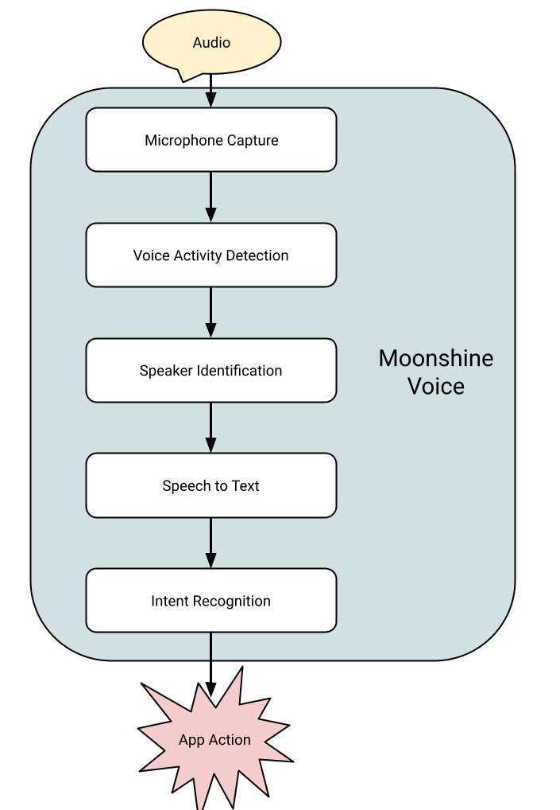

# Moonshine Voice

**Voice Interfaces for Everyone**

- [Quickstart](#quickstart)
- [When should you choose Moonshine over Whisper?](#when-should-you-choose-moonshine-over-whisper)
- [Using the Library](#using-the-library)
  - [Speech to Text](#getting-started-with-transcription)
  - [Text to Speech](#getting-started-with-text-to-speech)
  - [Conversational Agents](#getting-started-with-a-conversational-agent)
- [Models](#models)
- [API Reference](#api-reference)
- [Support](#support)
- [Roadmap](#roadmap)
- [Acknowledgements](#acknowledgements)
- [License](#license)

[Moonshine](https://moonshine.ai) Voice is an open source AI toolkit for developers building real-time voice agents and applications.

- Everything runs on-device, so it's fast, private, and you don't need an account, credit card, or API keys.
- The framework and models are optimized for live streaming applications, offering low latency responses by doing a lot of the work while the user is still talking.
- All speech to text models are based on our [cutting edge research](https://arxiv.org/abs/2602.12241) and trained from scratch, so we can offer [higher accuracy than Whisper Large V3 at the top end](https://huggingface.co/spaces/hf-audio/open_asr_leaderboard), down to [tiny 1MB models for constrained deployments](micro/README.md).
- It's easy to integrate across platforms, with the same library running on [Python](#python), [iOS](#ios), [Android](#android), [MacOS](#macos), [Linux](#linux), [Windows](#windows), [Raspberry Pis](#raspberry-pi), [IoT devices](https://www.linkedin.com/posts/petewarden_most-of-the-recent-news-about-ai-seems-to-activity-7384664255242932224-v6Mr/), [microcontrollers](micro/README.md), [DSPs](micro/README.md), and wearables.
- Batteries are included. Its high-level APIs offer complete solutions for common tasks like transcription, text to speech, voice cloning, speaker identification (diarization), command recognition, and [conversational agents](#getting-started-with-a-conversational-agent), so you can build your voice application with a single library.
- It supports multiple languages, including English, Spanish, Mandarin, Japanese, Korean, Vietnamese, Ukrainian, and Arabic for STT, and English, Spanish, Arabic, German, French, Hindi, Italian, Japanese, Korean, Dutch, Portuguese, Russian, Turkish, Ukrainian, Vietnamese, and Mandarin for TTS.
  
## Quickstart

[Join our community on Discord to get live support](https://discord.gg/27qp9zSRXF).

Example apps for iOS, Android, macOS, Windows, and Raspberry Pi are published on [GitHub Releases](https://github.com/moonshine-ai/moonshine/releases/latest) as separate archives (mostly **`{platform}-{Project}.tar.gz`**, matching folder names under [`examples/`](examples/); Windows also ships [`moonshine-voice-windows-x86_64.tar.gz`](https://github.com/moonshine-ai/moonshine/releases/latest/download/moonshine-voice-windows-x86_64.tar.gz) for the C++ sample). See the [Examples](#examples) section for the full list of release downloads.

### Python

<!-- doc-test: parse-only -->
```bash
pip install moonshine-voice
moonshine-voice mic --language en
```

Listens to the microphone and prints updates to the transcript as they come in.

<!-- doc-test: parse-only -->
```bash
moonshine-voice agent
```

Runs a spoken wifi-setup conversation: it listens for a trigger phrase, asks questions, and confirms the answers. Matching is semantic, so natural language variations are recognized. For more, check out [our "Getting Started" Colab notebook](https://bit.ly/moonshine-colab) and [video](https://www.youtube.com/watch?v=WH-AGvHmtoM).

<!-- doc-test: parse-only -->
```bash
moonshine-voice tts --language en_us --text "Hello world"
```

Synthesizes and speaks the text.

### iOS

Download [github.com/moonshine-ai/moonshine/releases/latest/download/ios-Transcriber.tar.gz](https://github.com/moonshine-ai/moonshine/releases/latest/download/ios-Transcriber.tar.gz), extract it, and then open the `Transcriber/Transcriber.xcodeproj` project in Xcode.

### Android

Download [github.com/moonshine-ai/moonshine/releases/latest/download/android-Transcriber.tar.gz](https://github.com/moonshine-ai/moonshine/releases/latest/download/android-Transcriber.tar.gz), extract it, and then open the `Transcriber` folder in Android Studio.

### Linux

Moonshine Voice ships prebuilt shared libraries for both x86_64 and arm64 Linux. The quickest way to try it is with the [portable C++ example](/examples/c++/README.md), which downloads the library, an English speech to text model, and a sample recording, then builds and runs a transcriber:

<!-- doc-test: skip -->
```bash
curl -O -L https://github.com/moonshine-ai/moonshine/releases/download/v0.1.1/cpp-examples.tar.gz
tar xzf cpp-examples.tar.gz
cd c++
./download-library.sh
g++ transcriber.cpp -Imoonshine-voice/include -Lmoonshine-voice/lib -lmoonshine -Wl,-rpath,'$ORIGIN/moonshine-voice/lib' -o transcriber
./transcriber
```
 
### MacOS

Moonshine Voice supports both Apple Silicon (arm64) and Intel (x86_64) Macs.

Download [github.com/moonshine-ai/moonshine/releases/latest/download/macos-MicTranscription.tar.gz](https://github.com/moonshine-ai/moonshine/releases/latest/download/macos-MicTranscription.tar.gz), extract it, and then open the `MicTranscription/MicTranscription.xcodeproj` project in Xcode.

### Windows

Download [github.com/moonshine-ai/moonshine/releases/latest/download/windows-cli-transcriber.tar.gz](https://github.com/moonshine-ai/moonshine/releases/latest/download/windows-cli-transcriber.tar.gz), extract it, and then open the `cli-transcriber\cli-transcriber.vcxproj` project in Visual Studio.

It's a self-contained archive that includes the library and model, so Ctrl+Shift+B or F7 will build the executable.

### Raspberry Pi

You'll need a USB microphone plugged in to get audio input, but the Python pip package has been optimized for the Pi, so you can run:

<!-- doc-test: skip -->
```bash
 sudo pip install --break-system-packages moonshine-voice
 moonshine-voice mic --language en
```

I've recorded [a screencast on YouTube](https://www.youtube.com/watch?v=NNcqx1wFxl0) to help you get started, and you can also download [github.com/moonshine-ai/moonshine/releases/latest/download/raspberry-pi-my-dalek.tar.gz](https://github.com/moonshine-ai/moonshine/releases/latest/download/raspberry-pi-my-dalek.tar.gz) for some fun, Pi-specific examples. [The README](examples/raspberry-pi/my-dalek/README.md) has information about using a virtual environment for the Python install if you don't want to use `--break-system-packages`.

You can look at [github.com/moonshine-ai/pi-help-bot](https://github.com/moonshine-ai/pi-help-bot) for a more advanced example.

## When should you choose Moonshine over Whisper?

TL;DR - When you're working with live speech.

| Model                      | WER    | # Parameters | MacBook Pro | Linux x86 | R. Pi 5   | Pixel 10a | iPad (A16) |
| -------------------------- | ------ | ------------ | ----------- | --------- | --------- | --------- | ---------- |
| Moonshine Medium Streaming | 6.65%  | 245 million  | 103ms       | 269ms     | 802ms     | 1091ms    | 294ms      |
| Whisper Large v3           | 7.44%  | 1.5 billion  | 11,286ms    | 16,919ms  | N/A       | —         | —          |
| Moonshine Small Streaming  | 7.84%  | 123 million  | 80ms        | 165ms     | 527ms     | 586ms     | 185ms      |
| Whisper Small              | 8.59%  | 244 million  | 1940ms      | 3,425ms   | 10,397ms  | —         | —          |
| Moonshine Tiny Streaming   | 12.00% | 34 million   | 32ms        | 69ms      | 237ms     | 191ms     | 68ms       |
| Whisper Tiny               | 12.81% | 39 million   | 277ms       | 1,141ms   | 5,863ms   | —         | —          |

_See [benchmarks](#benchmarks) for how these numbers were measured._

[OpenAI's release of their Whisper family of models]() was a massive step forward for open-source speech to text. They offered a range of sizes, allowing developers to trade off compute and storage space against accuracy to fit their applications. Their biggest models, like Large v3, also gave accuracy scores that were higher than anything available outside of large tech companies like Google or Apple. At Moonshine we were early and enthusiastic adopters of Whisper, and we still remain big fans of the models and the great frameworks like [FasterWhisper](https://github.com/SYSTRAN/faster-whisper) and others that have been built around them.

However, as we built applications that needed a live voice interface we found we needed features that weren't available through Whisper:

- **Whisper always operates on a 30-second input window**. This isn't an issue when you're processing audio in large batches, you can usually just look ahead in the file and find a 30-second-ish chunk of speech to apply it to. Voice interfaces can't look ahead to create larger chunks from their input stream, and phrases are seldom longer than five to ten seconds. This means there's a lot of wasted computation encoding zero padding in the encoder and decoder, which means longer latency in returning results. Since one of the most important requirements for any interface is responsiveness, usually defined as latency below 200ms, this hurts the user experience even on platforms that have compute to spare, and makes it unusable on more constrained devices.
- **Whisper doesn't cache anything**. Another common requirement for voice interfaces is that they display feedback as the user is talking, so that they know the app is listening and understanding them. This means calling the speech to text model repeatedly over time as a sentence is spoken. Most of the audio input is the same, with only a short addition to the end. Even though a lot of the input is constant, Whisper starts from scratch every time, doing a lot of redundant work on audio that it has seen before. Like the fixed input window, this unnecessary latency impairs the user experience.
- **Whisper supports a lot of languages poorly**. Whisper's multilingual support is an incredible feat of engineering, and demonstrated a single model could handle many languages, and even offer translations. This chart from OpenAI ([raw data in Appendix D-2.4](https://cdn.openai.com/papers/whisper.pdf)) shows the drop-off in Word Error Rate (WER) with the very largest 1.5 billion parameter model.


82 languages are listed, but only 33 have sub-20% WER (what we consider usable). For the Base model size commonly used on edge devices, only 5 languages are under 20% WER. Asian languages like Korean and Japanese stand out as the native tongue of large markets with a lot of tech innovation, but Whisper doesn't offer good enough accuracy to use in most applications The proprietary in-house versions of Whisper that are available through OpenAI's cloud API seem to offer better accuracy, but aren't available as open models.

- **Fragmented edge support**. A fantastic ecosystem has grown up around Whisper, there are a lot of mature frameworks you can use to deploy the models. However these often tend to be focused on desktop-class machines and operating systems. There are projects you can use across edge platforms like iOS, Android, or Raspberry Pi OS, but they tend to have different interfaces, capabilities, and levels of optimization. This made building applications that need to run on a variety of devices unnecessarily difficult.

All these limitations drove us to create our own family of models that better meet the needs of live voice interfaces. It took us some time since the combined size of the open speech datasets available is tiny compared to the amount of web-derived text data, but after extensive data-gathering work, we were able to release [the first generation of Moonshine models](https://arxiv.org/abs/2410.15608). These removed the fixed-input window limitation along with some other architectural improvements, and gave significantly lower latency than Whisper in live speech applications, often running 5x faster or more.

However we kept encountering applications that needed even lower latencies on even more constrained platforms. We also wanted to offer higher accuracy than the Base-equivalent that was the top end of the initial models. That led us to this second generation of Moonshine models, which offer:

- **Flexible input windows**. You can supply any length of audio (though we recommend staying below around 30 seconds) and the model will only spend compute on that input, no zero-padding required. This gives us a significant latency boost.
- **Caching for streaming**. Our models now support incremental addition of audio over time, and they cache the input encoding and part of the decoder's state so that we're able to skip even more of the compute, driving latency down dramatically.
- **Language-specific models**. We have gathered data and trained models for multiple languages, including Arabic, Japanese, Korean, Spanish, Ukrainian, Vietnamese, and Chinese. As we discuss in our [Flavors of Moonshine paper](https://arxiv.org/abs/2509.02523), we've found that we can get much higher accuracy for the same size and compute if we restrict a model to focus on just one language, compared to training one model across many.
- **Cross-platform library support**. We're building applications ourselves, and needed to be able to deploy these models across Linux, MacOS, Windows, iOS, and Android, as well as use them from languages like Python, Swift, Java, and C++. To support this we architected a portable C++ core library that handles all of the processing, uses OnnxRuntime for good performance across systems, and then built native interfaces for all the required high-level languages. This allows developers to learn one API, and then deploy it almost anywhere they want to run.
- **Better accuracy than Whisper V3 Large**. On [HuggingFace's OpenASR leaderboard](https://huggingface.co/spaces/hf-audio/open_asr_leaderboard), our newest streaming model for English, Medium Streaming, achieves a lower word-error rate than the most-accurate Whisper model from OpenAI. This is despite Moonshine's version using 250 million parameters, versus Large v3's 1.5 billion, making it much easier to deploy on the edge.

Hopefully this gives you a good idea of how Moonshine compares to Whisper. If you're working with GPUs in the cloud on data in bulk where throughput is most important then Whisper (or Nvidia alternatives like Parakeet) offer advantages like batch processing, but we believe we can't be beat for live speech. We've built the framework and models we wished we'd had when we first started building applications with voice interfaces, so if you're working with live voice inputs, [give Moonshine a try](#quickstart).

## Using the Library

The Moonshine API is designed to take care of the details around capturing and transcribing live speech, giving application developers a high-level API focused on actionable events. I'll use Python to illustrate how it works, but the API is consistent across all the supported languages.

- [Architecture](#architecture)
- [Concepts](#concepts)
- [Getting Started with Transcription](#getting-started-with-transcription)
  - [Transcription Event Flow](#transcription-event-flow)
- [Getting Started with a Conversational Agent](#getting-started-with-a-conversational-agent)
  - [Agent Setup](#agent-setup)
- [Getting Started with Text to Speech](#getting-started-with-text-to-speech)
  - [Voice Samples](#voice-samples)
    - [ZipVoice](#zipvoice)
    - [Kokoro](#kokoro)
    - [Piper TTS](#piper-tts)
  - [Converting Graphemes to Phonemes](#converting-graphemes-to-phonemes)
- [Examples](#examples)
- [Adding the Library to your own App](#adding-the-library-to-your-own-app)
- [Python](#python-1)
- [iOS or MacOS](#ios-or-macos)
- [Android](#android-1)
- [Windows](#windowsc)
- [Debugging](#debugging)
  - [Console Logs](#console-logs)
  - [Input Saving](#input-saving)
  - [API Call Logging](#api-call-logging)
- [Building from Source](#building-from-source)
  - [Cmake](#cmake)
  - [Language Bindings](#language-bindings)
  - [Porting](#porting)
- [Downloading Models](#downloading-models)
  - [Speech to Text Models](#speech-to-text-models)
  - [Embedding Models](#embedding-models)
  - [Text to Speech Models](#text-to-speech-models)
- [Benchmarking](#benchmarking)

### Architecture

Our goal is to build a framework that any developer can pick up and use, even with no previous experience of speech technologies. We've abstracted away a lot of the unnecessary details and provide a simple interface that lets you focus on building your application, and that's reflected in our system architecture.

The basic flow is:

- Create a `Transcriber` object if you want the text that's spoken, or an `AgentFlow` if you only need to know that a user has requested an action.
- Attach an `EventListener` that gets called when important things occur, like the end of a phrase or an action being triggered, so your application can respond.
- Use a `TextToSpeech` object to make it a two-way conversation.

Traditionally, adding a voice interface to an application or product required integrating a lot of different libraries to handle all the processing that's needed to capture audio and turn it into something actionable. The main steps involved are microphone capture, voice activity detection (to break a continuous stream of audio into sections of speech), speech to text, speaker identification, and phrase matching. Each of these steps typically involved a different framework, which greatly increased the complexity of integrating, optimizing, and maintaining these dependencies.

Moonshine Voice includes all of these stages in a single library, and abstracts away everything but the essential information your application needs to respond to user speech, whether you want to transcribe it or trigger actions.



Most developers should be able to treat the library as a black box that tells them when something interesting has happened, using our event-based classes to implement application logic. Of course the framework is fully open source, so speech experts can dive as deep under the hood as they'd like, but it's not necessary to use it.

### Concepts

A [**Transcriber**](python/src/moonshine_voice/transcriber.py#L66) takes in audio input and turns any speech into text. This is the first object you'll need to create to use Moonshine, and you'll give it a path to [the models you've downloaded](#downloading-models).

A [**MicTranscriber**](python/src/moonshine_voice/mic_transcriber.py#L39) is a helper class based on the general transcriber that takes care of connecting to a microphone using your platform's built-in support (for example sounddevice in Python) and then feeding the audio in as it's captured.

A [**Stream**](python/src/moonshine_voice/transcriber.py#L297) is a handler for audio input. The reason streams exist is because you may want to process multiple audio inputs at once, and a transcriber can support those through multiple streams, without duplicating the model resources. If you only have one input, the transcriber class includes the same methods (start/stop/add_audio) as a stream, and you can use that interface instead and forget about streams.

A [**TranscriptLine**](python/src/moonshine_voice/moonshine_api.py#L51) is a data structure holding information about one line in the transcript. When someone is speaking, the library waits for short pauses (where punctuation might go in written language) and starts a new line. These aren't exactly sentences, since a speech pause isn't a sure sign of the end of a sentence, but this does break the spoken audio into segments that can be considered phrases. A line includes state such as whether the line has just started, is still being spoken, or is complete, along with its start time and duration.

A [**Transcript**](python/src/moonshine_voice/moonshine_api.py#67) is a list of lines in time order holding information about what text has already been recognized, along with other state like when it was captured.

A [**TranscriptEvent**](python/src/moonshine_voice/transcriber.py#L22) contains information about changes to the transcript. Events include a new line being started, the text in a line being updated, and a line being completed. The event object includes the transcript line it's referring to as a member, holding the latest state of that line.

A [**TranscriptEventListener**](python/src/moonshine_voice/transcriber.py#L266) is a protocol that allows app-defined functions to be called when transcript events happen. This is the main way that most applications interact with the results of the transcription. When live speech is happening, applications usually need to respond or display results as new speech is recognized, and this approach allows you to handle those changes in a similar way to events from traditional user interfaces like touch screen gestures or mouse clicks on buttons.

A [**TextToSpeech**](python/src/moonshine_voice/tts.py#L20) object synthesizes audio for playback to the user.

An [**AgentFlow**](python/src/moonshine_voice/agent_flow.py#L547) object manages conversations between the user and an agent. It opens the transcriber, microphone, and speech synthesizer it needs itself, and invokes a callback whenever someone says something close in meaning to a phrase you registered — the basis of voice command recognition.

A [**Dialog**](python/src/moonshine_voice/agent_flow.py#L408) object is created for each conversational exchange, and allows the agent to hold a multi-step discussion with the user.

### Getting Started with Transcription

We have [examples](#examples) for most platforms so as a first step I recommend checking out what we have for the systems you're targeting.

Next, you'll need to [add the library to your project](#adding-the-library-to-your-own-app). We aim to provide pre-built binaries for all major platforms using their native package managers. On Python this means a pip install, for Android it's a Maven package, and for MacOS and iOS we provide a Swift package through SPM.

The transcriber needs access to the files for the model you're using, so after [downloading them](#downloading-models) you'll need to place them somewhere the application can find them, and make a note of the path. This usually means adding them as resources in your IDE if you're planning to distribute the app, or you can use hard-wired paths if you're just experimenting. The download script gives you the location of the models and their architecture type on your drive after it completes.

Now you can try creating a transcriber. Here's what that looks like in Python:

```python
transcriber = Transcriber(model_path=model_path, model_arch=model_arch)
```

If the model isn't found, or if there's any other error, this will throw an exception with information about the problem. You can also check the console for logs from the core library, these are printed to `stderr` or your system's equivalent.

Now we'll create a listener that contains the app logic that you want triggered when the transcript updates, and attach it to your transcriber:

```python
class TestListener(TranscriptEventListener):
    def on_line_started(self, event):
        print(f"Line started: {event.line.text}")

    def on_line_text_changed(self, event):
        print(f"Line text changed: {event.line.text}")

    def on_line_completed(self, event):
        print(f"Line completed: {event.line.text}")

listener = TestListener()
transcriber.add_listener(listener)
```

The transcriber needs some audio data to work with. If you want to try it with the microphone you can update your transcriber creation line to use a MicTranscriber instead, but if you want to start with a .wav file for testing purposes here's how you feed that in:

```python
    audio_data, sample_rate = load_wav_file(wav_path)

    transcriber.start()

    # Loop through the audio data in chunks to simulate live streaming
    # from a microphone or other source.
    chunk_duration = 0.1
    chunk_size = int(chunk_duration * sample_rate)
    for i in range(0, len(audio_data), chunk_size):
        chunk = audio_data[i: i + chunk_size]
        transcriber.add_audio(chunk, sample_rate)

    transcriber.stop()
```

The important things to notice here are:

- We create an array of mono audio data from a wav file, using the convenience `load_wav_file()` function that's part of the Moonshine library.
- We start the transcriber to activate its processing code.
- The loop adds audio in chunks. These chunks can be any length and any sample rate, the library takes care of all the housekeeping.
- As audio is added, the event listener you added will be called, giving information about the latest speech.

In a real application you'd be calling `add_audio()` from an audio handler that's receiving it from your source. Since the library can handle arbitrary durations and sample rates, just make sure it's mono and otherwise feed it in as-is.

The transcriber analyses the speech at a default interval of every 500ms of input. You can change this with the `update_interval` argument to the transcriber constructor. For streaming models most of the work is done as the audio is being added, and it's automatically done at the end of a phrase, so changing this won't usually affect the workload or latency massively.

The interval is a floor rather than a fixed cadence. A pass has to cover at least as much audio as the last one took to make, up to ten intervals' worth, so a machine that cannot keep up transcribes in larger batches instead of falling further behind with every pass. Where there is processing time to spare this makes no difference and the interval governs as before.

The key takeaway is that you usually don't need to worry about the transcript data structure itself, the event system tells you when something important happens. You can manually trigger a transcript update by calling `update_transcription()` which returns a transcript object with all of the information about the current session if you do need to examine the state.

By calling `start()` and `stop()` on a transcriber (or stream) we're beginning and ending a session. Each session has one transcript document associated with it, and it is started fresh on every `start()` call, so you should make copies of any data you need from the transcript object before that.

The transcriber class also offers a simpler `transcribe_without_streaming()` method, for when you have an array of data from the past that you just want to analyse, such as a file or recording.

We also offer a specialization of the base `Transcriber` class called `MicTranscriber`. How this is implemented will depend on the language and platform, but it should provide a transcriber that's automatically attached to the main microphone on the system. This makes it straightforward to start transcribing speech from that common source, since it supports all of the same listener callbacks as the base class.

#### Transcription Event Flow

The main communication channel between the library and your application is through events that are passed to any listener functions you have registered. There are five major event types:

- `LineStarted`. This is sent to listeners when the beginning of a new speech segment is detected. It may or may not contain any text, but since it's dispatched near the start of an utterance, that text is likely to change over time.
- `LineUpdated`. Called whenever any of the information about a line changes, including the duration, audio data, and text.
- `LineTextChanged`. Called only when the text associated with a line is updated. This is a subset of `LineUpdated` that focuses on the common need to refresh the text shown to users as often as possible to keep the experience interactive.
- `LineSpeakersChanged`. Only fired when the opt-in `identify_speakers` option is enabled. Called when the speaker spans attached to a line change. Unlike the other line events, this can fire for lines that are already complete, because the diarization algorithm keeps refining its speaker assignments as more audio arrives.
- `LineCompleted`. Sent when we detect that someone has paused speaking, and we've ended the current segment. The line data structure has the final values for the text and duration.

We offer some guarantees about these events:

- `LineStarted` is always called exactly once for any segment.
- `LineCompleted` is always called exactly once after `LineStarted` for any segment.
- `LineUpdated` and `LineTextChanged` will only ever be called after the `LineStarted` and before the `LineCompleted` events for a segment.
- Those update events are not guaranteed to be called (and in practice can be disabled by setting `update_interval` to a very large value).
- There will only be one line active at any one time for any given stream.
- Once `LineCompleted` has been called, the library will never alter that line's text, timing, or audio data again. The one exception is the line's speaker spans: when `identify_speakers` is enabled, those can be revised for recent audio (signaled by `LineSpeakersChanged`), since diarization re-clusters a sliding window of recent speech. Assignments for audio older than `diarization_cluster_window_sec` are frozen.
- If `stop()` is called on a transcriber or stream, any active lines will have `LineCompleted` called.
- Each line has a 64-bit `lineId` that is designed to be unique enough to avoid collisions.
- This `lineId` remains the same for the line over time, from the first `LineStarted` event onwards.

### Getting Started with a Conversational Agent

Many applications need a voice agent that can understand what users are saying and respond appropriately. To make this as straightforward as possible, we let you define different conversational flows. A flow can be as simple as responding to a query, or be a multi-step, branching conversation that takes actions.

To define these flows, you use an [`AgentFlow`](#agentflow) object, with callbacks that take [`Dialog`](#dialog) arguments. Here's an example of a simple flow, taken from the [github.com/moonshine-ai/pi-help-bot](https://github.com/moonshine-ai/pi-help-bot) sample code:

```python
    def report_ip_address(d: Dialog):
        ip = _find_local_ip()
        if ip is None:
            yield d.say("Sorry, I couldn't find a local IP address.")
            return
        speech_ip = re.sub(r"(\d)", r"\1 ", ip.replace(".", " dot "))
        yield d.say([
            f"Okay. Your local IP address is {speech_ip}. ",
            f"To repeat, that's {speech_ip}."
        ])

    agent_flow.listen_for("What is my IP address?", report_ip_address)
```

This registers the `report_ip_address()` function to be called whenever the user says anything similar to "What is my IP address?". The matching is done semantically, so alternative phrasings like "Tell me your IP address" or "Can you tell me the local IP address?" should trigger it too. You can register as many top-level conversation starters as you'd like, the system will listen out and route to the closest in meaning.

The function itself receives a `Dialog` argument that represents the current conversational exchange. In this simple case we don't need any additional input from the user so we just use it to `say()` the information that was requested. We break the IP address into separate words for each digit for clarity, and replace the connecting periods with explicit "dot"s, so that 192.178.4.72 becomes "1 9 2 dot 1 7 8 dot 4 dot 72", since that's the conventional way to articulate them in speech.

For more complex conversations, like setting up a new wifi network, you can define multiple steps and branch points directly in Python:

```python
    def connect_to_wifi(d: Dialog):
        input_ssid = yield d.ask("What's the name of your Wi-Fi network? Say list if you want to pick from a list or spell if you want to spell out the start of the name")
        input_ssid = input_ssid.strip()

        networks = _scan_wifi_networks()

        if input_ssid.lower().strip(string.punctuation) == "list":
            yield d.say("Say yes to the network you want to connect to.")
            for network in networks:
                if (yield d.confirm(f"{network}?")):
                    input_ssid = network
                    break
        elif input_ssid.lower().strip(string.punctuation) == "spell":
            input_ssid = yield d.ask("Spell out the start of the network name.", mode=SPELLED)

        found_ssid = fuzzy_match_network(input_ssid, networks)
        if found_ssid is None:
            yield d.say(f"Sorry, I couldn't find a matching network for {input_ssid}.")
            return

        password = yield d.ask(
            f"Please spell the Wi-Fi password for {found_ssid} one character at a time, and say done when finished.",
            mode=SPELLED,
        )

        yield d.say(f"Connecting to {found_ssid}.")

        try:
            result = subprocess.run(
                ["sudo", "nmcli", "device", "wifi",
                    "connect", found_ssid, "password", password],
                capture_output=True, text=True, timeout=30,
            )
        except FileNotFoundError:
            yield d.say("Sorry, network manager was not found on this system.")
            return
        except subprocess.TimeoutExpired:
            yield d.say("Sorry, the connection attempt timed out.")
            return

        if result.returncode == 0:
            yield d.say(f"Connected to {found_ssid}.")
        else:
            print(f"[ERROR] nmcli stderr: {result.stderr}", file=sys.stderr)
            yield d.say(
                f"Sorry, I wasn't able to connect to {found_ssid}. "
                "Please check the network name and password and try again."
            )

    agent_flow.listen_for("Connect to Wi-Fi", connect_to_wifi)
```

The first thing the function does is ask the user to give them the name of the network they want to join, through the call:

```python
input_ssid = yield d.ask("What's the name of your Wi-Fi network?...")
```

The Dialog class lets you ask users questions and will return the string containing the what they said in response. The only unusual feature here, compared to regular Python code, is the `yield` keyword. Because it may take some time for the user to respond, we call yield to hand back control to the main script until their response has been received. This is a general pattern for `AgentFlow` and you'll see it wherever we're waiting for the user to say something, to avoid blocking.

```python
        if input_ssid.lower().strip(string.punctuation) == "list":
            yield d.say("Say yes to the network you want to connect to.")
            for network in networks:
                if (yield d.confirm(f"{network}?")):
                    input_ssid = network
                    break
```

Our example application supports a few different input methods - running through a list of networks, spelling out the first few letters, or saying the name. Here we implement the list approach by looping through all the available networks and asking the user whether each is the one they want. Here you can see that regular loops and conditional statements work as you'd expect in Python.

For each network, we call `confirm()`, which asks a question and then waits for a positive or negative result. Like all matching in the system this is done semantically, so "okay", "affirmative", and "go ahead" will work as well as a straightforward "yes".

```python
        password = yield d.ask(
            f"Please spell the Wi-Fi password for {found_ssid} one character at a time, and say done when finished.",
            mode=SPELLED,
        )
```

Password input is tricky, because they consist of arbitrary letters, digits, and symbols, and so they have to be spelled out by the user. Moonshine supports this through the `mode=SPELLED` argument. This asks the user to spell out each character, and uses a fine-tuned model to recognise what the user is saying for each. As well as supporting regular utterances like "aitch" or "capital zee", it also supports the NATO alphabet ("alpha", "bravo", etc) and even short descriptive phrases like "E as in elephant". It repeats back what it heard, and lets you delete mistakes.

```python
        try:
            result = subprocess.run(
                ["sudo", "nmcli", "device", "wifi",
                    "connect", found_ssid, "password", password],
                capture_output=True, text=True, timeout=30,
            )
        except FileNotFoundError:
            yield d.say("Sorry, network manager was not found on this system.")
            return
        except subprocess.TimeoutExpired:
            yield d.say("Sorry, the connection attempt timed out.")
            return
```

The flow also works with other control structures like exception handlers, so you can specify your conversations using idiomatic code, even for error recovery.

#### Agent Setup

Once your flows are written, the only setup left is to register them and go live. `AgentFlow` opens everything it needs itself — the speech recognition model, the microphone, and the speech synthesizer — so there's nothing to wire together:

```python
    agent_flow = (
        AgentFlow()
        .language("en")
        .listen_for("What is my IP address?", report_ip_address)
        .listen_for("Connect to Wi-Fi", connect_to_wifi)
    )

    agent_flow.start_listening()
```

Every configuration method returns the runner, so a whole voice interface can be built in a single expression, and each one has a working default. `listen_for()` registers the conversation starters. "Cancel" and "start over" need no registration: they work at any point inside a flow, and outside one they're treated as ordinary speech so a dictation interface doesn't lose them. Use `always()` to register a phrase of your own that stays live at every moment, whether or not a flow is running.

`start_listening()` opens and downloads whatever is missing on first use (the embedding model used for matching, the speech to text model for your language, and a synthesizer), then returns as soon as the microphone is live. Speech arrives on the audio thread and drives your flows from there, so your own code is free to sleep, run a UI, or do anything else. If you want the loading to happen at a moment of your choosing rather than on the first `start_listening()` call, call `load()` yourself beforehand and pass `on_progress()` a callback to report download progress. Call `close()` when you're finished to release everything the runner opened.

To give this a try for yourself, run this built-in example:

<!-- doc-test: parse-only -->
```bash
python -m moonshine_voice.agent_flow
```

### Getting Started with Text to Speech

Voice interfaces often need to talk back, and Moonshine's `TextToSpeech` is designed to make that easy, across multiple languages. It's also self-contained, so you can use it independently from the transcription and agent modules.

You configure a synthesizer with chainable setters, call `load()` to fetch and open the voice, and then pass text into `say()` to speak it on the default audio device:

```python
from moonshine_voice import TextToSpeech

tts = TextToSpeech().language("fr")
tts.load()
tts.say("Bonjour, mon ami")
tts.wait()  # block until playback finishes
```

`load()` blocks, since the first call may have to download a voice. Pass `on_progress()` a handler to drive a progress bar:

```python
tts = TextToSpeech().language("fr").on_progress(lambda fraction, file: print(f"{fraction:.0%}"))
tts.load()
```

`say()` returns immediately and queues the text for background synthesis and playback. Calling `say()` multiple times queues each utterance in order, and the next utterance is pre-synthesized while the current one plays. You can also pass a list of strings, cancel everything with `stop()`, or poll with `is_talking()`:

```python
tts.say(["One.", "Two.", "Three."])
tts.stop()  # cancel remaining utterances and halt playback
```

If you're on a machine without an audio output, or want to do further processing, you can retrieve the audio samples using the `synthesize()` method:

<!-- doc-test: run -->
```python
from moonshine_voice import TextToSpeech

tts = TextToSpeech().language("en-us")
tts.load()
audio_data, sample_rate = tts.synthesize("Howdy, partner")
```

As you can see, text to speech supports multiple languages. To see which are available, run the `list_tts_languages()` function:

<!-- doc-test: run -->
```python
from moonshine_voice import list_tts_languages
list_tts_languages()

['ar-msa', 'de-de', 'en-gb', 'en-us', 'es-ar', 'es-es', 'es-mx', 'fr-fr', 'hi-in', 'it-it', 'ja-jp', 'ko-kr', 'nl-nl', 'pt-br', 'pt-pt', 'ru-ru', 'tr-tr', 'uk-ua', 'vi-vn', 'zh-hans']
```

For each language, you can list which voices are available:

<!-- doc-test: run -->
```python
from moonshine_voice import list_tts_voices

list_tts_voices("ru")

{'present': [], 'downloadable': ['piper_ru_RU-denis-medium', 'piper_ru_RU-dmitri-medium', 'piper_ru_RU-irina-medium', 'piper_ru_RU-ruslan-medium']}
```

If a voice is marked as `downloadable` that means if you pass it to `voice()` then Moonshine will download it to a cache automatically, and it will be available on your machine with no internet access required for subsequent calls.

#### Voice Cloning

The integrated [ZipVoice model](https://github.com/k2-fsa/ZipVoice) can imitate someone's voice, given a short audio clip. Pass the clip to `clone_from()`, either as a path to a `.wav` file or as a `(pcm, sample_rate)` pair of mono float samples. You can also pass `transcript`, the text spoken in the clip; when omitted, Moonshine auto-transcribes the clip with its ASR model before cloning (this takes a few extra seconds on first use):

```python
from moonshine_voice import TextToSpeech
import importlib.resources;

clone_path = importlib.resources.files("moonshine_voice.assets").joinpath("clone-test.wav")
clone_transcript = "Ever tried. Ever failed. No matter. Try Again. Fail again. Fail better."

tts = TextToSpeech().language("en-us").cloning()
tts.load()
tts.clone_from(clone_path, transcript=clone_transcript)
tts.say("Ask not what your country can do for you, but what you can do for your country")
tts.wait()
```

`cloning()` tells `load()` to fetch ZipVoice and its clone-ASR assets up front, so `clone_from()` only swaps the reference clip. Call `cloning()` before `load()` — without it, `clone_from()` / `start_cloning()` raise a clear error. Catalog voices and cloning are mutually exclusive: `voice()` clears cloning, and `cloning()` clears the catalog voice.

To clone from someone speaking into the microphone rather than from a file, `start_cloning()` hands back a `VoiceClone` that listens until it has heard enough usable speech:

```python
clone = tts.start_cloning()
clone.on_ready(lambda: print("Got it, you can stop talking."))
clone.from_microphone()
tts.clone_from(clone)
```

Picking the clip out of the recording runs Moonshine's built-in voice-activity detector, which is compiled into the library, so nothing is downloaded for this step. `from_microphone()` blocks until the clip is ready or 20 seconds have passed; `on_progress()` reports how long it has been recording and how much speech it has found so far.

You can also try cloning from the command line. Since you won't always have easy access to a clean transcript of the speech you want to clone from, you can leave it out and have Moonshine automatically generate one, in both the API and command line.

<!-- doc-test: parse-only -->
```bash
curl -O -L 'https://github.com/moonshine-ai/moonshine/raw/refs/heads/main/python/src/moonshine_voice/assets/clone-test.wav'

python3 -m moonshine_voice.tts \
  --clone clone-test.wav \
  --text "I am so excited about Moonshine Voice's text to speech"
```

#### Voice Samples

To help you choose a voice, here are sample clips of each one saying "Welcome to Moonshine Voice text to speech". Each entry is the voice name you can pass to `voice()`; click the ▶ next to it to hear it.

##### ZipVoice

These voices were created using the zero-shot voice cloning capabilities of [ZipVoice](https://github.com/k2-fsa/ZipVoice), a high-quality flow-matching TTS model from the k2-fsa team. It takes significantly longer to generate than Kokoro or PiperTTS, but offers [voice cloning](#voice-cloning) and more realistic speech.

| | | |
| --- | --- | --- |
| `zipvoice_american_female` [▶](https://cdn.jsdelivr.net/gh/moonshine-ai/moonshine@main/docs/audio/zipvoice_american_female.wav) | `zipvoice_american_male` [▶](https://cdn.jsdelivr.net/gh/moonshine-ai/moonshine@main/docs/audio/zipvoice_american_male.wav) | `zipvoice_australian_male` [▶](https://cdn.jsdelivr.net/gh/moonshine-ai/moonshine@main/docs/audio/zipvoice_australian_male.wav) |
| `zipvoice_canadian_female` [▶](https://cdn.jsdelivr.net/gh/moonshine-ai/moonshine@main/docs/audio/zipvoice_canadian_female.wav) | `zipvoice_canadian_male` [▶](https://cdn.jsdelivr.net/gh/moonshine-ai/moonshine@main/docs/audio/zipvoice_canadian_male.wav) | `zipvoice_english_female` [▶](https://cdn.jsdelivr.net/gh/moonshine-ai/moonshine@main/docs/audio/zipvoice_english_female.wav) |
| `zipvoice_english_male` [▶](https://cdn.jsdelivr.net/gh/moonshine-ai/moonshine@main/docs/audio/zipvoice_english_male.wav) | `zipvoice_indian_female` [▶](https://cdn.jsdelivr.net/gh/moonshine-ai/moonshine@main/docs/audio/zipvoice_indian_female.wav) | `zipvoice_indian_male` [▶](https://cdn.jsdelivr.net/gh/moonshine-ai/moonshine@main/docs/audio/zipvoice_indian_male.wav) |
| `zipvoice_irish_female` [▶](https://cdn.jsdelivr.net/gh/moonshine-ai/moonshine@main/docs/audio/zipvoice_irish_female.wav) | `zipvoice_irish_male` [▶](https://cdn.jsdelivr.net/gh/moonshine-ai/moonshine@main/docs/audio/zipvoice_irish_male.wav) | `zipvoice_new_zealand_female` [▶](https://cdn.jsdelivr.net/gh/moonshine-ai/moonshine@main/docs/audio/zipvoice_new_zealand_female.wav) |
| `zipvoice_northern_irish_female` [▶](https://cdn.jsdelivr.net/gh/moonshine-ai/moonshine@main/docs/audio/zipvoice_northern_irish_female.wav) | `zipvoice_south_african_female` [▶](https://cdn.jsdelivr.net/gh/moonshine-ai/moonshine@main/docs/audio/zipvoice_south_african_female.wav) | `zipvoice_south_african_male` [▶](https://cdn.jsdelivr.net/gh/moonshine-ai/moonshine@main/docs/audio/zipvoice_south_african_male.wav) |

##### Kokoro

These voices come from the excellent [Kokoro](https://github.com/hexgrad/kokoro) project, an 82-million-parameter open-weight TTS model that delivers quality comparable to much larger models.

| American Female | American Male | British Female | British Male |
| --- | --- | --- | --- |
| `kokoro_af_alloy` [▶](https://cdn.jsdelivr.net/gh/moonshine-ai/moonshine@main/docs/audio/kokoro_af_alloy.wav) | `kokoro_am_adam` [▶](https://cdn.jsdelivr.net/gh/moonshine-ai/moonshine@main/docs/audio/kokoro_am_adam.wav) | `kokoro_bf_alice` [▶](https://cdn.jsdelivr.net/gh/moonshine-ai/moonshine@main/docs/audio/kokoro_bf_alice.wav) | `kokoro_bm_daniel` [▶](https://cdn.jsdelivr.net/gh/moonshine-ai/moonshine@main/docs/audio/kokoro_bm_daniel.wav) |
| `kokoro_af_aoede` [▶](https://cdn.jsdelivr.net/gh/moonshine-ai/moonshine@main/docs/audio/kokoro_af_aoede.wav) | `kokoro_am_echo` [▶](https://cdn.jsdelivr.net/gh/moonshine-ai/moonshine@main/docs/audio/kokoro_am_echo.wav) | `kokoro_bf_emma` [▶](https://cdn.jsdelivr.net/gh/moonshine-ai/moonshine@main/docs/audio/kokoro_bf_emma.wav) | `kokoro_bm_fable` [▶](https://cdn.jsdelivr.net/gh/moonshine-ai/moonshine@main/docs/audio/kokoro_bm_fable.wav) |
| `kokoro_af_bella` [▶](https://cdn.jsdelivr.net/gh/moonshine-ai/moonshine@main/docs/audio/kokoro_af_bella.wav) | `kokoro_am_eric` [▶](https://cdn.jsdelivr.net/gh/moonshine-ai/moonshine@main/docs/audio/kokoro_am_eric.wav) | `kokoro_bf_isabella` [▶](https://cdn.jsdelivr.net/gh/moonshine-ai/moonshine@main/docs/audio/kokoro_bf_isabella.wav) | `kokoro_bm_george` [▶](https://cdn.jsdelivr.net/gh/moonshine-ai/moonshine@main/docs/audio/kokoro_bm_george.wav) |
| `kokoro_af_heart` [▶](https://cdn.jsdelivr.net/gh/moonshine-ai/moonshine@main/docs/audio/kokoro_af_heart.wav) | `kokoro_am_fenrir` [▶](https://cdn.jsdelivr.net/gh/moonshine-ai/moonshine@main/docs/audio/kokoro_am_fenrir.wav) | `kokoro_bf_lily` [▶](https://cdn.jsdelivr.net/gh/moonshine-ai/moonshine@main/docs/audio/kokoro_bf_lily.wav) | `kokoro_bm_lewis` [▶](https://cdn.jsdelivr.net/gh/moonshine-ai/moonshine@main/docs/audio/kokoro_bm_lewis.wav) |
| `kokoro_af_jessica` [▶](https://cdn.jsdelivr.net/gh/moonshine-ai/moonshine@main/docs/audio/kokoro_af_jessica.wav) | `kokoro_am_liam` [▶](https://cdn.jsdelivr.net/gh/moonshine-ai/moonshine@main/docs/audio/kokoro_am_liam.wav) | | |
| `kokoro_af_kore` [▶](https://cdn.jsdelivr.net/gh/moonshine-ai/moonshine@main/docs/audio/kokoro_af_kore.wav) | `kokoro_am_michael` [▶](https://cdn.jsdelivr.net/gh/moonshine-ai/moonshine@main/docs/audio/kokoro_am_michael.wav) | | |
| `kokoro_af_nicole` [▶](https://cdn.jsdelivr.net/gh/moonshine-ai/moonshine@main/docs/audio/kokoro_af_nicole.wav) | `kokoro_am_onyx` [▶](https://cdn.jsdelivr.net/gh/moonshine-ai/moonshine@main/docs/audio/kokoro_am_onyx.wav) | | |
| `kokoro_af_nova` [▶](https://cdn.jsdelivr.net/gh/moonshine-ai/moonshine@main/docs/audio/kokoro_af_nova.wav) | `kokoro_am_puck` [▶](https://cdn.jsdelivr.net/gh/moonshine-ai/moonshine@main/docs/audio/kokoro_am_puck.wav) | | |
| `kokoro_af_river` [▶](https://cdn.jsdelivr.net/gh/moonshine-ai/moonshine@main/docs/audio/kokoro_af_river.wav) | `kokoro_am_santa` [▶](https://cdn.jsdelivr.net/gh/moonshine-ai/moonshine@main/docs/audio/kokoro_am_santa.wav) | | |
| `kokoro_af_sarah` [▶](https://cdn.jsdelivr.net/gh/moonshine-ai/moonshine@main/docs/audio/kokoro_af_sarah.wav) | | | |
| `kokoro_af_sky` [▶](https://cdn.jsdelivr.net/gh/moonshine-ai/moonshine@main/docs/audio/kokoro_af_sky.wav) | | | |

##### Piper TTS

The [Piper](https://github.com/OHF-Voice/piper1-gpl) project provides over a hundred lightweight voices across all of the languages Moonshine supports, from many contributors — too many to sample here. You can listen to every Piper voice on the [Piper voice samples page](https://rhasspy.github.io/piper-samples/), and use any of them with Moonshine through the `piper_` voice names returned by `list_tts_voices()`.

#### Converting Graphemes to Phonemes

As you may notice from the voice names, Moonshine Voice uses models from the fantastic [Kokoro](https://github.com/hexgrad/kokoro) and [PiperTTS](https://huggingface.co/rhasspy/piper-voices) projects. You can find full details on all the model and data sources we use for text to speech at [core/moonshine-tts/data/README.md](core/moonshine-tts/data/README.md). 

Given that there are other great TTS projects out there, why does the world need yet another implementation? Moonshine tries to run on as many platforms as possible and supports commercial applications, and both Kokoro and Piper use [espeak-ng](https://github.com/espeak-ng/espeak-ng/) to convert text strings into phonemes, representations of the noises associated with the sentence, in the International Pronunciation Alphabet. Espeak-ng is licensed under the GPL, and while I am a fan of free software, the terms do make it hard to incorporate into applications that don't also release their source code under a similar license.

In the cloud this isn't as much of an issue, as many uses of espeak-ng can be implemented by calling out to an external executable, so the dependency isn't as problematic. This isn't an option on many edge operating systems unfortunately, as the only way to include code on iOS or Android is to link it into the application, which requires open sourcing the calling code.

To allow wider usage, we developed our own "grapheme to phoneme" module that performs a similar role, but has been written from scratch. You'll find the implementation in [core/moonshine-tts](core/moonshine-tts) and it's released under the same MIT License as the rest of this code base.

Every language requires a different process to convert its written form into speech, and often it varies by dialect too. This is why espeak-ng is so widely used, it has had years of work put into it to encode linguistic knowledge into a complex set of rules, many of which are heuristics that require a lot of testing to get right. The Moonshine Voice G2P engine is still new, and will need similar tuning to handle all of the variations across languages, but I'm hoping the initial implementation is a good start and will benefit from community feedback and contributions over time. Here are the current results for intelligibility across languages, using [scripts/tts_g2p_intelligibility.py](scripts/tts_g2p_intelligibility.py):

| Language | Moonshine CER | Reference CER |
| --- | --- | --- |
| ar_msa | 20.8% | 15.3% |
| de_de | 18.3% | 9.2% |
| en_us | 12.6% | 9.8% |
| es_ar | 7.9% | 10.6% |
| es_es | 4.2% | 4.5% |
| es_mx | 3.2% | 2.6% |
| fr_fr | 14.8% | 9.4% |
| hi_in | 26.5% | 15.9% |
| it_it | 24.2% | 11.4% |
| ja_jp | 38.1% | 16.8% |
| ko_kr | 25.0% | 18.6% |
| nl_nl | 15.9% | 3.3% |
| pt_br | 19.7% | 4.9% |
| pt_pt | 43.8% | 24.6% |
| ru_ru | 16.9% | 5.0% |
| tr_tr | 8.9% | 7.9% |
| uk_ua | 27.7% | 15.6% |
| vi_vn | 79.0% | 36.5% |
| zh_hans | 37.8% | 32.6% |

If you want access to just the grapheme to phoneme capability, without the speech synthesis, you can all it directly:

<!-- doc-test: run -->
```python
from moonshine_voice import GraphemeToPhonemizer

g2p = GraphemeToPhonemizer("en-us")
g2p.to_ipa("Hello world")

'həlˈoʊ wˈɝld'
```

### Examples

The [`examples`](examples/) folder has code samples organized by platform. We use the usual tooling per stack (Android Studio and Gradle, Xcode and Swift on Apple platforms, Visual Studio on Windows). [GitHub Releases](https://github.com/moonshine-ai/moonshine/releases/latest) currently ship the downloadable assets below (example trees are mostly named **`{platform}-{Project}.tar.gz`**; Windows and C++ also include prebuilt native library bundles).

- **[Android](examples/android/)**
  - [AgentFlow](https://github.com/moonshine-ai/moonshine/releases/latest/download/android-AgentFlow.tar.gz)
  - [TextToSpeech](https://github.com/moonshine-ai/moonshine/releases/latest/download/android-TextToSpeech.tar.gz)
  - [Transcriber](https://github.com/moonshine-ai/moonshine/releases/latest/download/android-Transcriber.tar.gz)
- **[Portable C++](examples/c++/README.md)**
  - [cpp-examples.tar.gz](https://github.com/moonshine-ai/moonshine/releases/latest/download/cpp-examples.tar.gz) (sources plus the `download-library.sh` helper)
  - [transcriber.cpp](examples/c++/transcriber.cpp)
  - [text-to-speech.cpp](examples/c++/text-to-speech.cpp)
- **[iOS](examples/ios/)**
  - [AgentFlow](https://github.com/moonshine-ai/moonshine/releases/latest/download/ios-AgentFlow.tar.gz)
  - [TextToSpeech](https://github.com/moonshine-ai/moonshine/releases/latest/download/ios-TextToSpeech.tar.gz)
  - [Transcriber](https://github.com/moonshine-ai/moonshine/releases/latest/download/ios-Transcriber.tar.gz)
- **[MacOS](examples/macos/)**
  - [BasicTranscription](https://github.com/moonshine-ai/moonshine/releases/latest/download/macos-BasicTranscription.tar.gz)
  - [AgentFlow](https://github.com/moonshine-ai/moonshine/releases/latest/download/macos-AgentFlow.tar.gz)
  - [MicTranscription](https://github.com/moonshine-ai/moonshine/releases/latest/download/macos-MicTranscription.tar.gz)
  - [TextToSpeech](https://github.com/moonshine-ai/moonshine/releases/latest/download/macos-TextToSpeech.tar.gz)
- **[Windows](examples/windows/)**
  - [cli-transcriber](https://github.com/moonshine-ai/moonshine/releases/latest/download/windows-cli-transcriber.tar.gz)
- **[Python](examples/python/)**
  - [basic_transcription.py](examples/python/basic_transcription.py)
  - [mic_transcription.py](examples/python/mic_transcription.py)
  - [text_to_speech.py](examples/python/text_to_speech.py)
  - [agent_flow.py](examples/python/agent_flow.py)
  - [ollama-voice/ollama_voice.py](examples/python/ollama-voice/ollama_voice.py )
- **[Raspberry Pi](examples/raspberry-pi/)**
  - [my-dalek](https://github.com/moonshine-ai/moonshine/releases/latest/download/raspberry-pi-my-dalek.tar.gz)
  - [Pi Help Bot](https://github.com/moonshine-ai/pi-help-bot/archive/refs/heads/main.zip)
- **[Web](examples/web/)** (single pages, no build step; serve them with `node examples/web/serve.mjs`)
  - [stt](examples/web/stt/index.html)
  - [tts](examples/web/tts/index.html)
  - [agent-flow](examples/web/agent-flow/index.html)
  - [dictation](examples/web/dictation/index.html)
  - [meeting-notes](examples/web/meeting-notes/index.html)

The examples usually include one minimal project that just creates a transcriber and then feeds it data from a WAV file, and another that's pulling audio from a microphone using the platform's default framework for accessing audio devices. Each one is a self-contained project you can copy out of the tree: the Android samples depend on **`ai.moonshine:moonshine-voice:0.1.1`** from Maven Central, and the Apple ones pull **`MoonshineVoice`** from the Swift package.

None of them bundle model weights. Every engine downloads what it needs on first use — the speech model for [`Transcriber`](examples/android/Transcriber/), the voice and G2P assets for [`TextToSpeech`](examples/android/TextToSpeech/), all three plus the embedding model for [`AgentFlow`](examples/android/AgentFlow/) — from `https://download.moonshine.ai/`, reporting progress through the `onProgress` callback the examples wire up to a label. Downloads are cached (under `filesDir` on Android, `Caches/MoonshineModels` on Apple platforms), so later launches run offline. Switching to a different voice triggers the same on-demand download for whatever that voice needs.

If you want a fully offline build with no first-run download, fetch the assets ahead of time and point the engine at them with `modelsFrom(path)`; see [`docs/design/api-comparison.md`](docs/design/api-comparison.md) for the tradeoff.

### Adding the Library to your own App

We distribute the library through the most widely-used package managers for each platform. Here's how you can use these to add the framework to an existing project on different systems.

#### Python

The Python package is [hosted on PyPi](https://pypi.org/project/moonshine-voice/), so all you should need to do to install it is `pip install moonshine-voice`, and then `import moonshine_voice` in your project.

##### Command-line tools

Installing the pip package adds a `moonshine-voice` command (with a shorter `moonshine` alias) that groups the built-in tools as subcommands:

<!-- doc-test: parse-only -->
```bash
moonshine-voice --help
```

| Command | Description |
| --- | --- |
| `moonshine-voice mic` | Transcribe live microphone input to the terminal. |
| `moonshine-voice transcribe` | Transcribe a WAV file (optionally with speaker IDs / word timestamps). |
| `moonshine-voice tts` | Synthesize speech from text to a WAV file or audio device. |
| `moonshine-voice agent` | Run a spoken agent flow (wifi setup) from the microphone. |
| `moonshine-voice download` | Download STT, TTS, G2P, or embedding model assets. |
| `moonshine-voice g2p` | Convert text to phonemes (IPA). |

Run `moonshine-voice <command> --help` for the options each one accepts. Every subcommand is equivalent to running the underlying module directly, so `moonshine-voice mic --language en` and `python -m moonshine_voice.mic_transcriber --language en` do exactly the same thing.

#### iOS or MacOS

For iOS we use the Swift Package Manager, with [an auto-updated GitHub repository](https://github.com/moonshine-ai/moonshine-swift/) holding each version. To use this right-click on the file view sidebar in Xcode and choose "Add Package Dependencies..." from the menu. A dialog should open up, paste `https://github.com/moonshine-ai/moonshine-swift/` into the top search box and you should see `moonshine-swift`. Select it and choose "Add Package", and it should be added to your project. You should now be able to `import MoonshineVoice` and use the library. You will need to add any model files you use to your app bundle and ensure they're copied during the deployment phase, so they can be accessed on-device.

For reference purposes you can find Xcode projects with these changes applied in [`examples/ios/Transcriber`](examples/ios/Transcriber) and [`examples/macos/BasicTranscription`](examples/macos/BasicTranscription/).

#### Android

On Android we publish [the package to Maven](https://mvnrepository.com/artifact/ai.moonshine/moonshine-voice). To include it in your project using Android Studio and Gradle, first add the version number you want to the `gradle/libs.versions.toml` file by inserting a line in the `[versions]` section, for example `moonshineVoice = "0.1.1"`. Then in the `[libraries]` part, add a reference to the package: `moonshine-voice = { group = "ai.moonshine", name = "moonshine-voice", version.ref = "moonshineVoice" }`.

Finally, in your `app/build.gradle.kts` add the library to the `dependencies` list: `implementation(libs.moonshine.voice)`. The [`examples/android/Transcriber`](examples/android/Transcriber/) and [`examples/android/TextToSpeech`](examples/android/TextToSpeech/) samples use the same coordinates (`moonshineVoice = "0.1.1"` in their catalogs).

#### Windows/C++

We couldn't find a single package manager that is used by most Windows developers, so instead we've made the raw library and headers available as a download. The script in [`examples/windows/cli-transcriber/download-lib.bat`](examples/windows/cli-transcriber/download-lib.bat) will fetch these for you. You'll see an `include` folder that you should add to the include search paths in your project settings, and a `lib` directory that you should add to the include search paths. Then add all of the library files in the `lib` folder to your project's linker dependencies.

The recommended interface to use on Windows is the C++ language binding. This is a header-only library that offers a higher-level API than the underlying C version. You can `#include "moonshine-cpp.h"` to access Moonshine from your C++ code. If you want to see an example of all these changes together, take a look at [`examples/windows/cli-transcriber`](examples/windows/cli-transcriber).

### Debugging

#### Console Logs

The library is designed to help you understand what's going wrong when you hit an issue. If something isn't working as expected, the first place to look is the console for log messages. Whenever there's a failure point or an exception within the core library, you should see a message that adds more information about what went wrong. Your language bindings should also recognize when the core library has returned an error and raise an appropriate exception, but sometimes the logs can be helpful because they contain more details.

#### Input Saving

If no errors are being reported but the quality of the transcription isn't what you expect, it's worth ruling out an issue with the audio data that the transcriber is receiving. To make this easier, you can pass in the `save_input_wav_path` option when you create a transcriber. That will save any audio received into .wav files in the folder you specify. Here's a Python example:

```bash
moonshine-voice transcribe --options='save_input_wav_path=.'
```

This will run test audio through a transcriber, and write out the audio it has received into an `input_1.wav` file in the current directory. If you're running multiple streams, you'll see `input_2.wav`, etc for each additional one. These wavs only contain the audio data from the latest session, and are overwritten after each one is started. Listening to these files should help you confirm that the input you're providing is as you expect it, and not distorted or corrupted.

#### API Call Logging

If you're running into errors it can be hard to keep track of the timeline of your interactions with the library. The `log_api_calls` option will print out the underlying API calls that have been triggered to the console, so you can investigate any ordering or timing issues.

```bash
moonshine-voice transcribe --options='log_api_calls=true'
```

### Building from Source

If you want to debug into the library internals, or add instrumentation to help understand its operation, or add improvements or customizations, all of the source is available for you to build it for yourself.

> [!TIP]
> Large model and TTS binaries are **not** stored in git. Before running
> [`scripts/test-core.sh`](scripts/test-core.sh) or offline TTS work, fetch them
> from the CDN (or the [Hugging Face mirror](https://huggingface.co/moonshine-ai/moonshine-voice-assets)):
>
> ```bash
> scripts/fetch-voice-assets.sh all
> ```
>
> A few compile-time embeds and ONNX Runtime prebuilts still use Git LFS. If you
> clone without LFS set up, you may see errors like
> `'version' does not name a type` when compiling embedded sources such as
> `community1_cpp_annote_embedded.cpp` (LFS pointers left as text). Install
> git-lfs and run `git lfs install` before cloning, or `git lfs pull` in an
> existing clone.

#### Cmake

The core engine of the library is contained in the `core` folder of this repo. It's written in C++ with a C interface for easy integration with other languages. We use cmake to build on all our platforms, and so the easiest way to get started is something like this:

<!-- doc-test: skip -->
```bash
cd core
mkdir -p build
cd build
cmake ..
cmake --build .
```

After that completes you should have a set of binary executables you can run on your own system. These executables are all unit tests, and expect to be run from the `test-assets` folder. You can run the build and test process in one step using the [`scripts/test-core.sh`](scripts/test-core.sh), or [`scripts/test-core.bat`](scripts/test-core.bat) for Windows. All tests should compile and run without any errors.

#### Language Bindings

There are various scripts for building for different platforms and languages, but to see examples of how to build for all of the supported systems you should look at [`scripts/build-all-platforms.sh`](scripts/build-all-platforms.sh). This is the script we call for every release, and it builds all of the artifacts we upload to the various package manager systems. [`docs/release-process.md`](docs/release-process.md) describes how releases are branched and versioned: `main` always matches the most recently published binaries, and development happens on a `dev-v<version>` candidate branch.

The different platforms and languages have a layer on top of the C interfaces to enable idiomatic use of the library within the different environments. The major systems have their own top-level folders in this repo, for example: [`python`](python/), [`android`](android/), and [`swift`](swift/) for iOS and MacOS. This is where you'll find the code that calls the underlying core library routines, and handles the event system for each platform.

#### Porting

If you have a device that isn't supported, you can try [building using cmake](#cmake) on your system. The only major dependency that the C++ core library has is [the Onnx Runtime](https://github.com/microsoft/onnxruntime). We include [pre-built binary library files](core/third-party/onnxruntime/lib/) for all our supported systems, but you'll need to find or build your own version if the libraries we offer don't cover your use case.

If you want to call this library from a language we don't support, then you should take a look at [the C interface bindings](core/moonshine-c-api.h). Most languages have some way to call into C functions, so you can use these and the binding examples for other languages to guide your implementation.

### Downloading Models

#### Speech to Text Models

The easiest way to get the model files required for transcription is by using the Python download module. After [installing it](#python) run the downloader like this:

```bash
moonshine-voice download --stt --language en
```

You can use either the two-letter code or the English name for the `language` argument. If you want to see which languages are supported by your current version they're [listed below](#available-models), or you can supply a bogus language as the argument to this command:

<!-- doc-test: expect-error -->
```bash
moonshine-voice download --stt --language foo
```

You can also optionally request a specific model architecture using the `model-arch` flag, chosen from the numbers in [moonshine-c-api.h](/core/moonshine-c-api.h). If no architecture is set, the script will load the highest-quality model available.

The download script will log the location of the downloaded model files and the model architecture, for example:

```text
adapter.ort: 100%|██████████████████████████████████████████████████████████████| 3.48M/3.48M [00:00<00:00, 18.6MB/s]
cross_kv.ort: 100%|█████████████████████████████████████████████████████████████| 11.0M/11.0M [00:00<00:00, 39.4MB/s]
decoder_kv.ort: 100%|███████████████████████████████████████████████████████████████| 139M/139M [00:01<00:00, 100MB/s]
encoder.ort: 100%|██████████████████████████████████████████████████████████████| 89.8M/89.8M [00:01<00:00, 83.1MB/s]
frontend.ort: 100%|█████████████████████████████████████████████████████████████| 45.3M/45.3M [00:00<00:00, 65.7MB/s]
streaming_config.json: 100%|██████████████████████████████████████████████████████| 513/513 [00:00<00:00, 1.88MB/s]
tokenizer.bin: 100%|█████████████████████████████████████████████████████████████| 244k/244k [00:00<00:00, 3.06MB/s]
spelling_cnn.ort: 100%|█████████████████████████████████████████████████████████| 1.59M/1.59M [00:00<00:00, 10.2MB/s]
spelling_cnn_meta.json: 100%|█████████████████████████████████████████████████████| 622/622 [00:00<00:00, 1.72MB/s]
Model download url: https://download.moonshine.ai/model/medium-streaming-en/quantized_26_07_30
Model components: ['adapter.ort', 'cross_kv.ort', 'decoder_kv.ort', 'encoder.ort', 'frontend.ort', 'streaming_config.json', 'tokenizer.bin']
Model arch: 5
Downloaded model path: /Users/petewarden/Library/Caches/moonshine_voice/download.moonshine.ai/model/medium-streaming-en/quantized_26_07_30
```

Since no architecture was requested here, this downloaded Medium Streaming (architecture 5), the highest-quality English model. The two `spelling_cnn` files at the end are the alphanumeric spelling model, which the downloader fetches alongside the main model when one is published for the language.

The last two lines tell you which model architecture is being used, and where the model files are on disk. By default it uses your user cache directory, which is `~/Library/Caches/moonshine_voice` on MacOS, but you can use a different location by setting the `MOONSHINE_VOICE_CACHE` environment variable before running the script.

#### Embedding Models

The download module also helps you obtain the assets needed to match spoken phrases, primarily a sentence embedding model. `AgentFlow` fetches this for you on first use, so you only need this command to warm the cache ahead of time — before shipping a device that will be offline, for example.

```bash
moonshine-voice download --embedding
```

```text
model_q4.ort: 100%|████████████████████████████████████████████████| 189M/189M [00:02<00:00, 90.1MB/s]
tokenizer.bin: 100%|███████████████████████████████████████████████| 2.46M/2.46M [00:00<00:00, 13.9MB/s]
Embedding model path: /Users/petewarden/Library/Caches/moonshine_voice/download.moonshine.ai/model/embeddinggemma-300m
/Users/petewarden/Library/Caches/moonshine_voice/download.moonshine.ai/model/embeddinggemma-300m
```

#### Text to Speech Models

A large variety of models, dictionaries and other files are needed for TTS, and these vary widely by language. You can use the download module to pull down exactly what you need for a particular language, and optionally a voice:

```bash
moonshine-voice download --tts --root /tmp/tts-files/
```

```text
dict_filtered_heteronyms.tsv: 100%|██████████████████████████████| 2.77M/2.77M [00:00<00:00, 15.5MB/s]
g2p-config.json: 100%|██████████████████████████████████████████████| 60.0/60.0 [00:00<00:00, 160kB/s]
model.ort: 100%|█████████████████████████████████████████████████| 21.1M/21.1M [00:00<00:00, 37.7MB/s]
onnx-config.json: 100%|██████████████████████████████████████████| 4.53k/4.53k [00:00<00:00, 11.7MB/s]
model.ort: 100%|█████████████████████████████████████████████████| 88.3M/88.3M [00:01<00:00, 85.6MB/s]
config.json: 100%|███████████████████████████████████████████████| 2.30k/2.30k [00:00<00:00, 6.88MB/s]
af_heart.kokorovoice: 100%|████████████████████████████████████████| 510k/510k [00:00<00:00, 3.82MB/s]
TTS assets root (use as g2p_root): /private/tmp/tts-files
/private/tmp/tts-files
```

The downloaded models are placed in child folders underneath the root folder, and by default the text to speech module expects the files to have the same relative paths so it can find them automatically given only the parent's path. If you do need to move them to different locations, you can supply new paths for each file using the `options` argument to `TextToSpeech`'s constructor, with the usual relative path as the key, and the actual path to the file as the key.

If you have an application that may be stored in an arbitrary location after installation, you can also pass in a `tts_root` value as an option to set the path to the actual root folder of the TTS data at runtime.

#### On-Device Auto-Download (iOS / macOS / Android)

The Python `download` module is the right tool for build-time and desktop workflows, but mobile apps often want to fetch models on first run instead of shipping every model inside the app bundle. Both the Swift (iOS/macOS) and Android bindings include an **opt-in** downloader for this.

This is strictly opt-in: apps that bundle their models and load them with the usual `from files` / `from assets` / `from memory` paths behave exactly as before and never touch the network. The downloader only resolves the file list from the native dependency catalog (the same catalog the Python module uses), so you never hardcode filenames, and it writes each file atomically (through a `.part` file), resumes interrupted transfers with HTTP `Range`, checks free space before large writes, and reports per-file progress.

##### Swift (iOS 15+ / macOS 12+)

`AssetDownloader.ensureModelPresent` downloads whatever is missing under a directory you choose and returns that directory, ready to hand to `Transcriber`, `MicTranscriber`, or `TextToSpeech`. Call it off the main actor (it is `async`).

```swift
import MoonshineVoice

let modelDir = URL.cachesDirectory.appending(path: "moonshine/tiny-en")

// Speech-to-text: download the default English model (add includeSpelling: true for the
// alphanumeric spelling model, or pass modelArch: to pick a specific architecture).
let downloader = AssetDownloader(allowsCellularAccess: false)  // Wi-Fi only
try await downloader.ensureModelPresent(root: modelDir, spec: .stt(language: "en")) { progress in
    print("\(progress.relativePath): \(progress.bytesDownloaded)/\(progress.bytesTotal)")
}
let transcriber = try Transcriber(modelPath: modelDir.path, modelArch: .tiny)

// Text embeddings (the embeddinggemma-300m model is large — a few hundred MB even at q4):
try await downloader.ensureModelPresent(root: embeddingDir, spec: .embedding(variant: "q4"))

// Text to speech (files land under the directory you pass as g2p_root):
try await downloader.ensureModelPresent(root: ttsRoot, spec: .tts(language: "en_us", voice: "kokoro_af_heart"))
```

`isModelPresent(root:spec:)` is a cheap synchronous check you can use to skip the download UI entirely when everything is already on disk. Download failures throw `AssetDownloadError` (HTTP status, insufficient space, cancellation, …) so you can distinguish "couldn't fetch" from a later load failure. No extra `Info.plist` entries or permissions are required for HTTPS downloads.

##### Android

The Android `AssetDownloader` mirrors the Swift API and performs blocking network I/O, so run it off the main thread. For reliable background downloads that survive process death, honor a network constraint, and retry with backoff, use `MoonshineDownloadWorker` (WorkManager).

```java
File modelDir = new File(context.getFilesDir(), "moonshine/tiny-en");

// Direct (call from a background thread / coroutine):
File root = new AssetDownloader().ensureModelPresent(
        modelDir, ModelSpec.stt("en"),
        (path, index, total, done, size) -> Log.i("dl", path + " " + done + "/" + size));
Transcriber transcriber = new Transcriber();
transcriber.loadFromFiles(root.getAbsolutePath(), JNI.MOONSHINE_MODEL_ARCH_TINY);

// Or via WorkManager, downloading only over unmetered (e.g. Wi-Fi) connections:
OneTimeWorkRequest request =
        MoonshineDownloadWorker.buildRequest(modelDir, ModelSpec.stt("en"), /*requireUnmetered=*/ true);
WorkManager.getInstance(context).enqueue(request);
```

`ModelSpec` also has `tts(language, voice)`, `embedding(modelName, variant)`, and `g2p(language)` factories, matching the Swift specs. The library manifest declares the `INTERNET` and `ACCESS_NETWORK_STATE` permissions, which merge into your app automatically; observe `MoonshineDownloadWorker` progress via `WorkInfo.getProgress()` using the worker's `PROGRESS_*` data keys. Using the downloader pulls in OkHttp and WorkManager transitively; apps that bundle their models still ship these but never invoke the network path.

##### Where files go

You pick the destination directory, so choose one appropriate for your platform's cache/storage policy (for example `URL.cachesDirectory` on Apple platforms, or `context.getFilesDir()` / `context.getCacheDir()` on Android). Files are laid out under that directory exactly as the loaders expect: STT and embedding files use their bare filenames, while TTS/G2P assets keep their canonical relative paths (e.g. `en_us/dict.tsv`) so the engine can find them from the root alone.

##### Testing the download path

Both frameworks ship download tests that hit the real CDN, download a model into an empty directory, and then load and run the matching engine. They pull tens to hundreds of MB, so they are **opt-in** and skip on a normal test run:

- Swift (`AssetDownloaderNetworkTests`): `MOONSHINE_DOWNLOAD_TESTS=1 swift test --filter AssetDownloaderNetworkTests`.
- Android (`AssetDownloaderTest`): `./gradlew connectedAndroidTest -Pandroid.testInstrumentationRunnerArguments.class=ai.moonshine.voice.AssetDownloaderTest -Pandroid.testInstrumentationRunnerArguments.moonshineDownloadTests=1` (needs a connected device/emulator).

`scripts/test-model-downloads.sh` runs the native catalog samples and then drives both of these automatically (skipping a platform when its toolchain or a device is unavailable). The mocked, offline `AssetDownloaderTests` still run as part of the default `swift test` and cover manifest parsing, resume, and error handling without a network.

### Benchmarks

The core library includes a benchmarking tool that simulates processing live audio by loading a .wav audio file and feeding it in chunks to the model. To run it:

<!-- doc-test: skip -->
```bash
cd core
mkdir -p build
cd build
cmake ..
cmake --build . --config Release
./benchmark
```

This will report the absolute time taken to process the audio, what percentage of the audio file's duration that is, and the average latency for a response.

The percentage is helpful because it approximates how much of a compute load the model will be on your hardware. For example, if it shows 20% then that means the speech processing will take a fifth of the compute time when running in your application, leaving 80% for the rest of your code.

The latency metric needs a bit of explanation. What most applications care about is how soon they are notified about a phrase after the user has finished talking, since this determines how fast the product can respond. As with any user interface, the time between speech ending and the app doing something determines how responsive the voice interface feels, with a goal of keeping it below 200ms. The latency figure logged here is the average time between when the library determines the user has stopped talking and the delivery of the final transcript of that phrase to the client. This is where streaming models have the most impact, since they do a lot of their work upfront, while speech is still happening, so they can usually finish very quickly.

By default the benchmark binary uses the Tiny English model and the `two_cities.wav` recording from this repository's `test-assets` folder, which is why it's run from the build directory, but you can pass in the `--model-path`, `--model-arch`, and `--wav-path` parameters to choose [a model you've downloaded](#downloading-models) or a different recording.

You can also choose how often the transcript should be updated using the `--transcription-interval` argument. This defaults to 0.5 seconds, but the right value will depend on how fast your application needs updates. Longer intervals reduce the compute required a bit, at the cost of slower updates.

The MacBook Pro, Pixel 10a, and iPad (A16) Tiny / Small / Medium Streaming cells in the comparison table use the same latency metric, measured by [`scripts/test-mobile-latency.sh`](scripts/test-mobile-latency.sh) (also run from [`scripts/build-all-platforms.sh`](scripts/build-all-platforms.sh)). That script downloads the models from the CDN, feeds `two_cities.wav` in small chunks as fast as the device can process, and averages `lastTranscriptionLatencyMs` over completed lines. Re-measure and refresh the README with:

<!-- doc-test: skip -->
```bash
./scripts/test-mobile-latency.sh --update-readme
```

#### Whisper Comparisons

For platforms that support Python, you can run the [`scripts/run-benchmarks.py`](scripts/run-benchmarks.py) script which will evaluate similar metrics, with the advantage that it can also download the models so you don't need to worry about path handling.

It also evaluates equivalent Whisper models. This is a pretty opinionated benchmark that looks at the latency and total compute cost
of the two families of models in a situation that is representative of many common
real-time voice applications' requirements:

- Speech needs to be responded to as quickly as possible once a user completes a phrase.
- The phrases are of durations between a range of one to ten seconds.

These are very different requirements from bulk offline processing scenarios, where the
overall throughput of the system is more important, and so the latency on a single
segment of speech is less important than the overall throughput of the system. This
allows optimizations like batch processing.

We are not claiming that Whisper is not a great model for offline processing, but we
do want to highlight the advantages we that Moonshine offers for live speech
applications with real-time latency requirements.

The experimental setup is as follows:

- We use the two_cities.wav audio file as a test case, since it has a mix of short
  and long phrases. You can vary this by passing in your own audio file with the
  --wav_path argument.
- We use the Moonshine Tiny, Base, Tiny Streaming, Small Streaming, and Medium
  Streaming models.
- We compare these to the Whisper Tiny, Base, Small, and Large v3 models. Since the
  Moonshine Medium Streaming model achieves lower WER than Whisper Large v3 we compare
  those two, otherwise we compare each with their namesake.
- We use the Moonshine VAD segmenter to split the audio into phrases, and feed each
  phrase to Whisper for transcription.
- Response latency for both models is measured as the time between a phrase being
  identified as complete by the VAD segmenter and the transcribed text being returned.
  For Whisper this means the full transcription time, but since the Moonshine models
  are streaming we can do a lot of the work while speech is still happening, so the
  latency is much lower.
- We measure the total compute cost of the models by totalling the duration of the
  audio processing times for each model, and then expressing that as a percentage of the
  total audio duration. This is the inverse of the commonly used real-time factor (RTF)
  metric, but it reflects the compute load required for a real-time application.
- We're using faster-whisper for Whisper, since that seems to provide the best
  cross-platform performance. We're also sticking with the CPU, since most applications
  can't rely on GPU or NPU acceleration being present on all the platforms they target.
  We know there are a lot of great GPU/NPU-accelerated Whisper implementations out there,
  but these aren't portable enough to be useful for the applications we care about.

## Models

Moonshine Voice is based on a family of speech to text models created by the team at Moonshine AI. If you want to download models to use with the framework, you can use [the Python package to access them](#downloading-models). This section contains more information about the history and characteristics of the models we offer.

 - [Papers](#papers)
 - [Available Models](#available-models)
 - [Accuracy (Word Error Rate)](#accuracy-word-error-rate)
 - [Domain Customization](#domain-customization)
 - [Quantization](#quantization)
 - [HuggingFace](#huggingface)

### Papers

These research papers are a good resource for understanding the architectures and performance strategies behind the models:

- [**Moonshine: Speech Recognition for Live Transcription and Voice Commands**](https://arxiv.org/abs/2410.15608): Describes the first-generation model architecture, which enabled flexible-duration input windows, improving on Whisper's fixed 30 second requirement.
- [**Flavors of Moonshine: Tiny Specialized ASR Models for Edge Devices**](https://arxiv.org/abs/2509.02523): How we improved accuracy for non-English languages by training mono-lingual models.
- [**Moonshine v2: Ergodic Streaming Encoder ASR for Latency-Critical Speech
  Applications**](https://arxiv.org/abs/2602.12241): Introduces our approach to streaming, and the advantages it offers for live voice applications.

### Available Models

Here are the models currently available. See [Downloading Models](#downloading-models) for how to obtain them. This library uses the Onnx model format, converted to the memory-mappable OnnxRuntime (`.ort`) flatbuffer encoding. For `safetensor` versions, see the [HuggingFace](#huggingface) section.

| Language   | Architecture     | # Parameters | WER/CER |
| ---------- | ---------------- | ------------ | ------- |
| English    | Tiny             | 26 million   | 12.66%  |
| English    | Tiny Streaming   | 34 million   | 12.00%  |
| English    | Base             | 58 million   | 10.07%  |
| English    | Small Streaming  | 123 million  | 7.84%   |
| English    | Medium Streaming | 245 million  | 6.65%   |
| Arabic     | Base             | 58 million   | 5.63%   |
| Japanese   | Base             | 58 million   | 13.62%  |
| Korean     | Tiny             | 26 million   | 6.46%   |
| Mandarin   | Base             | 58 million   | 25.76%  |
| Spanish    | Base             | 58 million   | 4.33%   |
| Ukrainian  | Base             | 58 million   | 14.55%  |
| Vietnamese | Base             | 58 million   | 8.82%   |

The English evaluations were done using the [HuggingFace OpenASR Leaderboard](https://huggingface.co/spaces/hf-audio/open_asr_leaderboard) datasets and methodology. The other languages were evaluated using the FLEURS dataset and the [`scripts/eval-model-accuracy`](scripts/eval-model-accuracy.py) script, with the character or word error rate chosen per language.

Note that the English WER figures above are the Open ASR Leaderboard *average* across eight datasets, measured on the floating-point reference models. The quantized models this library actually ships score a little higher, especially at the Tiny size. See [Accuracy (Word Error Rate)](#accuracy-word-error-rate) below for a float-vs-quantized comparison and instructions on reproducing the numbers.

One common issue to watch out for if you're using models that don't use the Latin alphabet (so any languages except English and Spanish) is that you'll need to set the [`max_tokens_per_second` option](#transcriber-options) to 13.0 when you create the transcriber. This is because the most common pattern for hallucinations is endlessly repeating the last few words, and our heuristic to detect this is to check if there's an unusually high number of tokens for the duration of a segment. Unfortunately the base number of tokens per second for non-Latin languages is much higher than for English, thanks to how we're tokenizing, so you have to manually set the threshold higher to avoid cutting off valid outputs.

### Accuracy (Word Error Rate)

Beyond knowing which models are available, you'll often want to understand how
accurate they are and how to reproduce the numbers yourself. The
[`scripts/eval-librispeech.py`](scripts/eval-librispeech.py) script measures Word
Error Rate (WER) on the LibriSpeech `test-clean` set using the same dataset and
[Open ASR Leaderboard](https://huggingface.co/spaces/hf-audio/open_asr_leaderboard)
methodology (corpus-level WER with the Whisper English text normalizer) reported
in our [Moonshine v2 paper](https://arxiv.org/abs/2602.12241).

There's an important subtlety here that can be confusing: **the WER numbers
in the paper were measured with the floating-point models running in the Hugging
Face Transformers library, not the quantized models this framework ships.** As the
paper notes in section 4.1.2, we use the Transformers implementation to measure
accuracy and our own C++/ONNX library to measure latency. The models you download
here are 8-bit quantized `.ort` files chosen for on-device speed and size.

The table below shows LibriSpeech `test-clean` WER for all three streaming models,
comparing the paper's floating-point reference against the quantized models this
library ships. All numbers use whole-utterance (non-streaming) transcription with
the VAD disabled, so they're a like-for-like comparison of raw model accuracy.

| Model            | Paper (float) | Reproduced float (HF Transformers) | Shipped quantized model (this library) |
| ---------------- | ------------- | ---------------------------------- | -------------------------------------- |
| Tiny Streaming   | 4.49%         | 4.52%                              | 4.83%                                  |
| Small Streaming  | 2.49%         | 2.55%                              | 2.61%                                  |
| Medium Streaming | 2.08%         | 2.16%                              | 2.17%                                  |

Every shipped model is now within 0.31% WER of its floating-point reference. That
was not always true: models published before 2026-07-30 quantized each weight
tensor with a single scale factor, which cost Tiny Streaming 7.57% instead of
4.83%. Switching to per-channel weight scales fixed it, for 0.5% more model size.
See [Quantization](#quantization) for the details.

#### Reproducing these numbers

The evaluation script downloads the dataset and models for you. Install the
dependencies and run it:

<!-- doc-test: skip -->
```bash
# Core dependencies for evaluating the shipped (quantized) models.
pip install moonshine-voice datasets soundfile scipy jiwer openai-whisper

# Evaluate a shipped quantized model on LibriSpeech test-clean (VAD disabled).
python scripts/eval-librispeech.py --backend moonshine_c --model-arch tiny_streaming
python scripts/eval-librispeech.py --backend moonshine_c --model-arch small_streaming
python scripts/eval-librispeech.py --backend moonshine_c --model-arch medium_streaming
```

To reproduce the paper's floating-point reference numbers you also need a recent
version of Transformers (the streaming models were added in Transformers 5.x) and
PyTorch, then pass `--backend hf`:

<!-- doc-test: skip -->
```bash
pip install "transformers>=5.13" torch
python scripts/eval-librispeech.py --backend hf --model-arch tiny_streaming
```

The script disables the VAD by default (`vad_threshold=0` plus a very large
`vad_max_segment_duration`) because the LibriSpeech clips are already single
utterances, so any VAD segmentation only adds errors. Pass `--enable-vad` to see
the effect of the segmenter, or `--backend moonshine_c_streaming` to measure the
chunked, real-time streaming path instead of whole-utterance transcription. Use
`--limit N` for a quick smoke test on the first `N` clips.

#### Takeaways

- **8-bit quantization now costs very little accuracy at any size.** The penalty
  against the floating-point reference is +0.31% WER on Tiny, +0.06% on Small and
  +0.01% on Medium. There is no longer much reason to run the floating-point
  checkpoint in Transformers just for accuracy, even on Tiny.
- **Disable the VAD when evaluating pre-segmented data.** On already-segmented
  clips like LibriSpeech, leaving the default VAD enabled adds roughly +1.5–2%
  WER on Tiny (mostly extra insertions at segment boundaries). The VAD is there to
  chop up continuous live audio, not clean single utterances.
- **Watch which number you're comparing against.** The per-model WER in the
  [Available Models](#available-models) table is the Open ASR Leaderboard *average*
  across eight datasets (12.00% for Tiny Streaming, 7.84% for Small Streaming, and
  6.65% for Medium Streaming), which is much higher than the LibriSpeech-clean-only
  numbers above. Make sure you're comparing the same benchmark.

### Domain Customization

It's often useful to be able to calibrate a speech to text model towards certain words that you're expecting to hear in your application, whether it's technical terms, slang, or a particular dialect or accent. [Moonshine AI offers full retraining using our internal dataset for customization as a commercial service](mailto:contact@moonshine.ai) and we do hope to support free lighter-weight approaches in the future. You can find a community project working on this at [github.com/pierre-cheneau/finetune-moonshine-asr](https://github.com/pierre-cheneau/finetune-moonshine-asr).

### Quantization

We typically quantize our models to eight-bit weights across the board, and eight-bit calculations for heavy operations like MatMul. This is all post-training quantization, using a combination of OnnxRuntime's tools and [my Onnx Shrink Ray utility](https://pypi.org/project/onnx-shrink-ray/). The only anomaly in the process is the treatment of the frontend, which uses convolution layers to generate features, which produces results similar to the more traditional MEL spectrogram preprocessing, but in a learned way with standard ML operations. The inputs to this initial stage correspond to 16-bit signed integers from the raw audio data (though they're encoded as floats) so we've found it necessary to leave the convolution operations in at least B16 float precision. 

We give **each output channel of a weight its own scale factor** rather than sharing one across the whole tensor. This matters far more than it sounds like it should. Our frontend convolutions are trained with weight normalization, which by construction learns a separate magnitude per output channel — on Tiny Streaming the largest channel is 17x the smallest. A single scale for the whole tensor has to cover the largest channel, so the smallest ones get only a handful of the 256 available levels. Measured on LibriSpeech `test-clean`, moving to per-channel scales took Tiny Streaming from 7.57% to 4.83% WER, Small from 3.03% to 2.61%, and Medium from 2.37% to 2.17%, while adding 0.5% to the download. Roughly 90% of that gain came from the frontend alone.

If you quantize your own Moonshine-style model, this is the first thing to check. It is also why we do not fold the weight-normalization out of the exported graph even though doing so would save a little work at runtime: folding makes the per-channel magnitudes *more* extreme, not less, so it must be paired with per-channel scales rather than done on its own.

You can see the options we use for the conversions in [scripts/quantize-streaming-model.sh](scripts/quantize-streaming-model.sh).

Re-quantized models are published to a new dated directory on our CDN (currently `quantized_26_07_30`) instead of overwriting the previous files. That way a given version of this library always resolves the exact weights it was tested against, and your local model cache never mixes old and new files.

### HuggingFace

We have `safetensors` versions of the models linked from our organization on HF, [huggingface.co/UsefulSensors/models](https://huggingface.co/UsefulSensors/models). The organization name is from an earlier incarnation of the company, when we were focused on supplying complete voice interface solutions integrated onto a low-cost chip with a built-in microphone. These are all floating-point checkpoints exported from our training pipeline

Separately, every asset this library can download is mirrored in a single repository at [huggingface.co/moonshine-ai/moonshine-voice-assets](https://huggingface.co/moonshine-ai/moonshine-voice-assets), under our current organization name. It holds exactly the files the download manifests reference (currently 438 files, 7.3GB) — the `.ort` speech to text and embedding models, the TTS voices, and the grapheme to phoneme data — laid out in the same folder hierarchy as the CDN, so a path in that repo is the path under `download.moonshine.ai`. The list is enumerated from the compiled model catalog rather than by listing the bucket, because the bucket also holds unconverted `.onnx` sources, older copies of models that manifests no longer point at, and platform artifacts like the Raspberry Pi disk image. If you need to know which files a given release actually uses, that repo is the authoritative answer, and its `FILES.tsv` records the size and checksum of each one. Note that the library still downloads from the CDN at runtime; the mirror is there for archival and verification, not for serving. For local tests and offline TTS work, populate the gitignored trees with [`scripts/fetch-voice-assets.sh`](scripts/fetch-voice-assets.sh). Reclaiming GitHub LFS storage after removing historical binaries is documented in [`docs/lfs-purge.md`](docs/lfs-purge.md).

## API Reference

This documentation covers the Python API, but the same functions and classes are present in all the other supported languages, just with native adaptations (for example CamelCase). You should be able to use this as a reference for all platforms the library runs on.

- [Data Structures](#data-structures)
  - [TranscriptLine](#transcriptline)
  - [Transcript](#transcript)
  - [TranscriptEvent](#transcriptevent)
  - [TtsVoiceEntry](#ttsvoiceentry)
  - [TtsVoicesByAvailability](#ttsvoicesbyavailability)
- [Classes](#classes)
  - [Transcriber](#transcriber)
  - [MicTranscriber](#mictranscriber)
  - [Stream](#stream)
  - [TranscriptEventListener](#transcripteventlistener)
  - [AgentFlow](#agentflow)
  - [Dialog](#dialog)
  - [TextToSpeech](#texttospeech)
  - [GraphemeToPhonemizer](#graphemetophonemizer)

### Data Structures

#### TranscriptLine

Represents a single "line" or speech segment in a transcript. It includes information about the timing, speaker, and text content of the utterance, as well as state such as whether the speech is ongoing or done. If you're building an application that involves transcription, this data structure has all of the information available about each line of speech. Be aware that each line can be updated multiple times with new text and other information as the user keeps speaking.

- `text`: A string containing the UTF-8 encoded text that has been extracted from the audio of this segment.
- `start_time`: A float value representing the time in seconds since the start of the current session that the current utterance was first detected.
- `duration`: A float that represents the duration in seconds of the current utterance.
- `line_id`: An unsigned 64-bit integer that represents a line in a collision-resistant way, for use in storage and ensuring the application can keep track of lines as they change over time. See [Transcription Event Flow](#transcription-event-flow) for more details.
- `is_complete`: A boolean that is false until the segment has been completed, and true for the remainder of the line's lifetime.

- `is_updated`: A boolean that's true if any information about the line has changed since the last time the transcript was updated. Since the transcript will be periodically updated internally by the library as you add audio chunks, you can't rely on polling this to detect changes. You should rely on the event/listener flow to catch modifications instead. This applies to all of the booleans below too.
- `is_new`: A boolean indicating whether the line has been added to the transcript by the last update call.
- `has_text_changed`: A boolean that's set if the contents of the line's text was modified by the last transcript update. If this is set, `is_updated` will always be set too, but if other properties of the line (for example the duration or the audio data) have changed but the text remains the same, then `is_updated` can be true while `has_text_changed` is false.

- `have_speakers_changed`: A boolean that's set if the line's speaker spans were revised by the last transcript update. Unlike the other change flags, this can be set for lines that are already complete, since the diarization algorithm keeps refining speaker assignments for recent audio. Only relevant when the `identify_speakers` option is enabled.

- `speaker_spans`: An array of speaker spans describing who was talking during which parts of the line, ordered by start time and clipped to the line's time range. Empty unless the opt-in `identify_speakers` option is enabled (which also turns on word timestamps automatically, since they are needed to map spans onto the line text). Each span has:
    - `start_time`: A float giving the time offset in seconds from the start of the stream.
    - `duration`: A float giving the length of the span in seconds.
    - `speaker_id`: A unique-ish unsigned 64-bit integer that is stable for a given speaker within a stream, designed for storage or keeping track of speakers over time.
    - `speaker_index`: An integer that represents the order in which the speaker first appeared in the transcript, to make it easy to give speakers default names like "Speaker 1:", etc.
    - `start_char`: A UTF-8 byte offset into the line's `text` where this span begins (inclusive). Zero when unknown.
    - `end_char`: A UTF-8 byte offset into the line's `text` where this span ends (exclusive). Slice with `text[start_char:end_char]` in Python. Both zero when the span could not be aligned to words yet.

  Be aware that speaker spans are *mutable*: the diarization algorithm re-clusters the entire audio history on a cadence, so the spans of any line - including completed ones - can move, merge, split, or change speaker on any transcription call. Watch the `have_speakers_changed` flag (or the `LineSpeakersChanged` event) to catch revisions.

- `words`: An array of per-word timings, empty unless the `word_timestamps` option is enabled (which `identify_speakers` turns on for you). Each entry has the `word` itself, its `start` and `end` times in seconds, and a `confidence` value.

- `audio_data`: An array of 32-bit floats representing the raw audio data that the line is based on, as 16KHz mono PCM data between 0.0 and 1.0. This can be useful for further processing (for example to drive a visual indicator or to feed into a specialized speech to text model after the line is complete).

#### Transcript

A Transcript contains a list of TranscriptLines, arranged in descending time order. The transcript is reset at every `Transcriber.start()` call, so if you need to retain information from it, you should make explicit copies. Most applications won't work with this structure, since all of the same information is available through event callbacks.

#### TranscriptEvent

Contains information about a change to the transcript. It has five subclasses — `LineStarted`, `LineUpdated`, `LineTextChanged`, `LineSpeakersChanged`, and `LineCompleted` — which are explained in more detail in [the transcription event flow section](#transcription-event-flow). Most of the information is contained in the `line` member, but there's also a `stream_handle` that your application can use to tell the source of a line if you're running multiple streams.

#### TtsVoiceEntry

A single voice row from the native TTS catalog (as returned inside the map from `get_tts_voice_catalog()`).

- `id`: The voice identifier string (often with a `kokoro_` or `piper_` prefix to pin the vocoder).
- `state`: Either `"found"` (assets present under the resolved asset root) or `"missing"` (listed in the catalog but not on disk yet).

#### TtsVoicesByAvailability

The dictionary shape returned by `list_tts_voices()`.

- `present`: Sorted list of voice ids that are already available under the asset root used for the query.
- `downloadable`: Sorted list of catalog voice ids that are not on disk yet but can be fetched (for example when constructing `TextToSpeech` with `download=True`).

### Classes

#### Transcriber

Handles the speech to text pipeline.

- <a id="transcriber-init"></a>`__init__()`: Loads and initializes the transcriber.
  - `model_path`: The path to the directory holding the component model files needed for the complete flow. Note that this is a path to the **folder**, not an individual **file**. You can download and get a path to a cached version of the standard models using the [download_model()](#downloading-models) function.
  - `model_arch`: The architecture of the model to load, from the selection defined in `ModelArch`.
  - `update_interval`: By default the transcriber will periodically run text transcription as new audio data is fed, so that update events can be triggered. This value is how often the speech to text model should be run. You can set this to a large duration to suppress updates between a line starting and ending, but because the streaming models do a lot of their work before the final speech to text stage, this may not reduce overall latency by much.
  - <a id="transcriber-options"></a>`options`: These are flags that affect how the transcription process works inside the library, often enabling performance optimizations or debug logging. They are passed as a dictionary mapping strings to strings, even if the values are to be interpreted as numbers - for example `{"max_tokens_per_second", "15"}`.
    - `skip_transcription`: If you only want the voice-activity detection and segmentation, but want to do further processing in your app, you can set this to "true" and then use the `audioData` array in each line.
    - `max_tokens_per_second`: The models occassionally get caught in an infinite decoder loop, where the same words are repeated over and over again. As a heuristic to catch this we compare the number of tokens in the current run to the duration of the audio, and if there seem to be too many tokens we truncate the decoding. By default this is set to 6.5, but for non-English languages where the models produce a lot more raw tokens per second, you may want to bump this to 13.0.
    - `transcription_interval`: How often to run transcription, in seconds.
    - `vad_threshold`: Controls the sensitivity of the initial voice-activity detection stage that decides how to break raw audio into segments. This defaults to 0.5, with lower values creating longer segments, potentially with more background noise sections, and higher values breaking up speech into smaller chunks, at the risk of losing some actual speech by clipping. If you set it to zero, it disables the VAD entirely, though speech will still be broken up into `vad_max_segment_duration` sized chunks.
    - `save_input_wav_path`: One of the most common causes of poor transcription quality is incorrect conversion or corruption of the audio that's fed into the pipeline. If you set this option to a folder path, the transcriber will save out exactly what it has received as 16KHz mono WAV files, so you can ensure that your input audio is as you expect.
    - `log_api_calls`: Another debugging option, turning this on causes all calls to the C API entry points in the library to write out information on their arguments to stderr or the console each time they're run.
    - `log_ort_run`: Prints information about the ONNXRuntime inference runs and how long they take.
    - `ort_providers`: A comma-separated, ordered list of the ONNX Runtime execution providers the models should try to use, for example `"CoreML,CPU"` on macOS. The names are case-insensitive and accept either the short form (`CPU`, `CoreML`, `NNAPI`) or the full ONNX Runtime name (`CPUExecutionProvider`, `CoreMLExecutionProvider`, `NNAPIExecutionProvider`). Providers are appended in the order given, and ONNX Runtime falls back to later entries for any operations an earlier provider can't handle, so it's good practice to always list `CPU` last as a catch-all. If you leave this unset the library runs CPU-only, which is what we recommend and what every mobile build supports: the iOS and Android libraries ship without CoreML and NNAPI because neither could run our models in large enough pieces to be worth its size, and asking for one there is an error that says so. [docs/execution-providers.md](docs/execution-providers.md) has the measurements. Requesting a provider that isn't available on the current platform (such as `CoreML` off Apple hardware, or `NNAPI` off Android) is likewise an error. The alias `ort_provider` is also accepted.
    - `coreml_cache_dir`: A directory path where the CoreML execution provider caches its compiled models on macOS. Compiling a model for CoreML is expensive, so pointing this at a persistent, writable folder lets subsequent runs reuse the cached artifacts and start up much faster. This only has an effect when `CoreML` is included in `ort_providers`, so it does nothing on iOS, whose library has no CoreML in it.
    - `vad_window_duration`: The VAD runs every 30ms, but to get higher-confidence values we average the results over time. This value is the time in seconds to average over. The default is 0.5s, shorter durations will spot speech faster at the cost of lower accuracy, higher values may increase accuracy, but at the cost of missing shorter utterances.
    - `vad_look_behind_sample_count`: Because we're averaging over time, the mean VAD signal will lag behind the initial speech detection. To compensate for that, when speech is detected we pull in some of the audio immediately before the average passed the threshold. This value is the number of samples to prepend, and defaults to 8192 (all at 16KHz).
    - `vad_max_segment_duration`: It can be hard to find gaps in rapid-fire speech, but a lot of applications want their text in chunks that aren't endless. This option sets the longest duration a line can be before it's marked as complete and a new segment is started. The default is 15 seconds, and to increase the chance that a natural break is found, the `vad_threshold` is linearly decreased over time from two thirds of the maximum duration until the maximum is reached.
    - `word_timestamps`: A boolean (default false) that fills in each line's `words` array with per-word timings. This needs the optional attention decoder that sits alongside the main model files (`decoder_kv_with_attention.ort` for streaming architectures, `decoder_with_attention.ort` otherwise), so ask the downloader for it when you fetch the model. Turning on `identify_speakers` enables this automatically, since speaker spans are mapped onto the line text using word timings.
    - `identify_speakers`: A boolean (default false) that controls whether to run the speaker diarization stage of the pipeline. When enabled, each line carries a `speaker_spans` array describing who spoke when, including UTF-8 character ranges into the line text. Word timestamps are enabled automatically in this mode. This runs a C++ port of the [pyannote community-1 pipeline](https://github.com/moonshine-ai/cpp-annote) inline inside transcription calls, which adds significant compute. Streaming sessions bound VBx re-clustering to a sliding window (see `diarization_cluster_window_sec`); batch/one-shot transcription still uses full-history clustering. This needs the two diarization models, which are an 8.2 MB download rather than part of the library; the high-level loaders fetch them for you when this option is set, and everything else takes `diarization_model_dir`. See [The diarization models are a download](docs/diarization-models.md). For tests, `test-assets/endgame_nagg_nell.wav` is a ~28 second synthetic two-speaker clip (ZipVoice TTS, Beckett's *Endgame* dialogue); regenerate it with `python3 scripts/generate-diarization-test-audio.py`.
    - `diarization_model_dir`: The directory holding `segmentation.ort` and `embedding.ort`, required whenever `identify_speakers` is set and you are constructing a transcriber directly rather than through one of the loaders that downloads for you. Get the directory from `moonshine_voice.get_diarization_model()` in Python, `ModelSpec.diarization` in Swift, or `ModelSpec.diarization()` on Android; in the browser, pass the two files to the in-memory loader instead.
    - `diarization_cluster_cadence`: A float (default 2.0) giving the minimum number of seconds of new audio between diarization re-clustering passes. Raising this reduces compute on long sessions, at the cost of slower refinement of speaker assignments.
    - `diarization_analyze_cadence`: A float (default 0, meaning the model default of 1.0) giving the number of seconds between diarization segmentation/embedding model runs.
    - `diarization_cluster_window_sec`: A float (default 120.0) giving the maximum seconds of recent audio history fed to VBx on each streaming refresh. Older chunks are evicted from the cache and their speaker turns are frozen (no longer revised). Set to `0` for unlimited full-history re-clustering (higher quality on long sessions, but compute and memory grow with session length). Batch/one-shot diarization always uses full history regardless of this setting.
    - `return_audio_data`: By default the transcriber returns the segment of audio data corresponding to a line of text along with the transcription. You can disable this if you want to reduce memory overhead.
    - `log_output_text`: If this is enabled then the results of the speech to text model will be logged to the console.

- <a id="transcriber-transcribe-without-streaming"></a>`transcribe_without_streaming()`: A convenience function to extract text from a non-live audio source, such as a file. We optimize for streaming use cases, so you're probably better off using libraries that specialize in bulk, batched transcription if you use this a lot and have performance constraints. This will still call any registered event listeners as it processes the lines, so this can be useful to test your application using pre-recorded files, or to easily integrate offline audio sources.
  - `audio_data`: An array of 32-bit float values, representing mono PCM audio between -1.0 and 1.0, to be analyzed for speech.
  - `sample_rate`: The number of samples per second. The library uses this to convert to its working rate (16KHz) internally.
  - `flags`: Integer, currently unused.

- <a id="transcriber-start"></a>`start()`: Begins a new transcription session. You need to call this after you've created the `Transcriber` and before you add any audio.
- <a id="transcriber-stop"></a>`stop()`: Ends a transcription session. If a speech segment was still active, it's marked as complete and the appropriate event handlers are called.
- <a id="transcriber-add-audio"></a>`add_audio()`: Call this every time you have a new chunk of audio from your input, to begin processing. The size and sample rate of the audio should be whatever's natural for your source, since the library will handle all conversions.
  - `audio_data`: Array of 32-bit floats representing a mono PCM chunk of audio.
  - `sample_rate`: How many samples per second are present in the input audio. The library uses this to convert the data to its preferred rate.
- <a id="transcriber-update-transcription"></a>`update_transcription`: The transcript is usually updated periodically as audio data is added, but if you need to trigger one yourself, for example when a user presses refresh, or want access to the complete transcript, you can call this manually.
  - `flags`: Integer holding flags that are combined using bitwise or (`|`).
    - `MOONSHINE_FLAG_FORCE_UPDATE`: By default the transcriber returns a cached version of the transcript if less than 200ms of new audio has come in since the last transcription, but by setting this you can ensure that a transcription happens regardless.

- <a id="transcriber-create-stream"></a>`create_stream()`: If your application is taking audio input from multiple sources, for example a microphone and system audio, then you'll want to create multiple streams on a single transcriber to avoid loading multiple copies of the models. Each stream has its own transcript, and line events are tagged with the stream handle they came from. You don't need to worry about this if you only need to deal with a single input though, just use the `Transcriber` class's `start()`, `stop()`, etc. This function returns `Stream` class object.
  - `flags`: Integer, reserved for future expansion.
  - `update_interval`: Period in seconds between transcription updates.

- <a id="transcriber-add-listener"></a>`add_listener()`: Registers a callable object with the transcriber. This object will be called back as audio is fed in and text is extracted.
  - `listener`: This is often a subclass of `TranscriptEventListener`, but can be a plain function. It defines what code is called when a speech event happens.

- <a id="transcriber-remove-listener"></a>`remove_listener()`: Deletes a listener so that it no longer receives events.
  - `listener`: An object you previously passed into `add_listener()`.

- <a id="transcriber-remove-all-listeners"></a>`remove_all_listeners()`: Deletes all registered listeners so than none of them receive events anymore.

#### MicTranscriber

Transcribes speech straight from the system's microphone, so you never call [`add_audio()`](#transcriber-add-audio) yourself. In Python this uses the [`sounddevice` library](https://python-sounddevice.readthedocs.io/), but in other languages the class uses the native audio API under the hood.

Construct one, configure it with chainable setters, call [`load()`](#mictranscriber-load) to fetch and open the model, then [`start()`](#mictranscriber-start) to begin listening.

```python
mic = (
    MicTranscriber()
    .on_text(lambda text: show_in_progress(text))
    .on_line(lambda line: append_line(line.text))
)
mic.load()
mic.start()
```

- <a id="mictranscriber-init"></a>`__init__()`: Constructs an unconfigured transcriber. Takes no arguments and cannot fail, so nothing is downloaded or opened until [`load()`](#mictranscriber-load).

Every setter returns the transcriber, so one can be built in a single expression, and every one has a working default. Call them before `load()`.

- <a id="mictranscriber-language"></a>`language()`: Sets the speech-to-text language. Defaults to `"en"`.
- <a id="mictranscriber-model-arch"></a>`model_arch()`: Picks a specific model size. By default the catalog's recommended model for the language is used, which is medium streaming for English. Most languages publish only one model.
- <a id="mictranscriber-models-from"></a>`models_from()`: Loads the model from a directory you supply rather than downloading it.
- <a id="mictranscriber-use-transcriber"></a>`use_transcriber()`: Reuses a [`Transcriber`](#transcriber) you already have instead of opening another. It stays yours to close.
- <a id="mictranscriber-update-interval"></a>`update_interval()`: Seconds between automatic streaming updates. Defaults to `0.5`.
- <a id="mictranscriber-options"></a>`options()`: Passes a dictionary of advanced transcriber options straight through, for anything the setters don't cover.
- <a id="mictranscriber-spelling-model"></a>`spelling_model()`: Uses a specific alphanumeric spelling model. `load()` finds the published one for the language by itself, so this is only for when you keep your own copy. Pass `None` to go without one.
- <a id="mictranscriber-transcribe-flags"></a>`transcribe_flags()`: Sets the flags applied to every streaming update. Pass `MOONSHINE_FLAG_SPELLING_MODE` to turn on the spelling-CNN fusion that makes dictated codes and passwords accurate. Takes effect immediately when already loaded.
- <a id="mictranscriber-device"></a>`device()`: Captures from a specific input device, by index or name. Defaults to the system default.
- <a id="mictranscriber-samplerate"></a>`samplerate()`: Asks the capture device for a sample rate. Defaults to `16000`, and `start()` falls back to the device's own rate if it refuses, so this rarely needs setting.
- <a id="mictranscriber-channels"></a>`channels()`: Number of channels to capture. Defaults to `1`.
- <a id="mictranscriber-blocksize"></a>`blocksize()`: Frames per capture callback. Defaults to `1024`.

The callbacks below cover almost everything. For line ids, speaker spans, word timings, or the moment a line starts, attach a [`TranscriptEventListener`](#transcripteventlistener) with [`add_listener()`](#transcriber-add-listener) instead; listeners registered before `load()` are held and applied once the stream exists.

- <a id="mictranscriber-on-text"></a>`on_text()`: Called with the in-progress text of the line currently being spoken, each time it changes.
- <a id="mictranscriber-on-line"></a>`on_line()`: Called once per finished line, with the [`TranscriptLine`](#transcriptline).
- <a id="mictranscriber-on-error"></a>`on_error()`: Called when the audio or transcription pipeline raises.
- <a id="mictranscriber-on-progress"></a>`on_progress()`: Reports model download progress as a `0..1` fraction and the file being fetched. Attaching a handler also silences the default terminal progress bars.

- <a id="mictranscriber-load"></a>`load()`: Downloads the model if needed, opens it, and returns the transcriber. Blocking, since the first call may have to fetch several hundred megabytes; report progress with [`on_progress()`](#mictranscriber-on-progress). Safe to call twice.
- <a id="mictranscriber-start"></a>`start()`: Opens the microphone and begins transcribing. Raises if you haven't called `load()`.
- <a id="mictranscriber-mute"></a>`mute()`: Drops incoming audio without closing the microphone, so an assistant doesn't transcribe its own synthesized speech.
- <a id="mictranscriber-stop"></a>`stop()`: Stops listening and flushes any audio still in flight, so the final line is complete.
- <a id="mictranscriber-close"></a>`close()`: Releases the microphone, the stream, and the model. Also available as a context manager.

#### Stream

The access point for when you need to feed multiple audio inputs into a single transcriber. Supports [`start()`](#transcriber-start), [`stop()`](#transcriber-stop), [`add_audio()`](#transcriber-add-audio), [`update_transcription()`](#transcriber-update-transcription), [`add_listener()`](#transcriber-add-listener), [`remove_listener()`](#transcriber-remove-listener), and [`remove_all_listeners()`](#transcriber-remove-all-listeners) as documented in the [`Transcriber`](#transcriber) class.

#### TranscriptEventListener

A convenience class to derive from to create your own listener code. Override any or all of `on_line_started()`, `on_line_updated()`, `on_line_text_changed()`, `on_line_speakers_changed()`, `on_line_completed()`, and `on_error()`, and they'll be called back when the corresponding event occurs. Every method has a no-op default, so you only need to write the ones you care about.

#### AgentFlow

A runner that drives generator-based conversational flows, and the entry point for voice interfaces. You register flow functions against trigger phrases, and the runner routes completed transcript lines either to trigger matching (when no flow is active) or to the currently suspended generator (when one is). Matching is semantic, using an embedding model that the runner downloads and loads the first time it needs one. [`load()`](#agentflow-load) opens the microphone transcriber and speech synthesizer for you, so there's no listener to wire up by hand; pass [`use_mic_transcriber()`](#agentflow-use-mic-transcriber) if you'd rather it listened to a transcriber you already have. See [Getting Started with a Conversational Agent](#getting-started-with-a-conversational-agent) for usage examples.

A flow is an ordinary Python generator function that takes a [`Dialog`](#dialog) as its argument and yields prompt objects back to the runner. The runner carries out each prompt (speaking text, waiting for the user's response) and resumes the generator with the answer via `.send()`. This lets you write multi-step, branching conversations using regular Python control flow, including loops and exception handlers, without any async machinery. Trigger matching, confirmation, and option selection are all done semantically through the embedding model, so alternative phrasings will work without you needing to enumerate them.

- <a id="agentflow-init"></a>`__init__()`: Constructs an unconfigured runner. Takes no arguments — configure it with the chainable setters below, then call [`load()`](#agentflow-load).

Every setter returns the runner, so a whole voice interface can be built in one expression, and every one of them has a working default. Call them before `load()`.

- <a id="agentflow-language"></a>`language()`: Sets the language used for both recognition and speech. Defaults to `"en"`.
- <a id="agentflow-model-arch"></a>`model_arch()`: Picks a specific speech recognition model size instead of the default for the language.
- <a id="agentflow-voice"></a>`voice()`: Chooses the synthesis voice used to speak prompts.
- <a id="agentflow-speech-options"></a>`speech_options()`: Passes a dictionary of advanced options straight through to the [`TextToSpeech`](#texttospeech) synthesizer.
- <a id="agentflow-models-from"></a>`models_from()`: Reads and caches model files under the given directory instead of the default cache location.
- <a id="agentflow-microphone"></a>`microphone()`: Whether `load()` should open a microphone. Defaults to `True`. Turn it off to drive the runner from text with [`handle_utterance()`](#agentflow-handle-utterance).
- <a id="agentflow-speech"></a>`speech()`: Whether `load()` should open a speech synthesizer. Defaults to `True`. Turn it off for a silent runner: prompts are still logged and flows still advance, they just aren't spoken.
- <a id="agentflow-output-device"></a>`output_device()`: Pins playback to a specific audio output device, for machines where the host default isn't the speaker you want.
- <a id="agentflow-trigger-threshold"></a>`trigger_threshold()`: The similarity a phrase must reach to fire, between 0 and 1. Defaults to `0.7`. Raise it when triggers fire on unrelated speech, lower it when they don't fire on genuine attempts.
- <a id="agentflow-use-embeddings"></a>`use_embeddings()`: Whether to match phrases by meaning. Defaults to `True`, which downloads a small language model so "set up wifi" also fires on "I need to get online". Turn it off to fall back to case-insensitive substring matching and load no model, which is what offline tests usually want.
- <a id="agentflow-beeps"></a>`beeps()`: Whether to play the recognition cue tones. Defaults to `True`, which plays a short "got it" tone when an utterance matches and a distinct "didn't get that" tone when nothing does, so a misrecognition never ends in silence.
- <a id="agentflow-spell-feedback"></a>`spell_feedback()`: Whether to echo each character during spelled input. Defaults to `True`, speaking back `"haitch"` for `"h"` and `"deleting <character>"` for an undo, so the user hears that the right letter came off the end.
- <a id="agentflow-barge-in"></a>`barge_in()`: Whether the user can interrupt the assistant mid-prompt. Off by default, because an utterance arriving while the assistant is talking is usually the microphone hearing the speakers. Enable it only when you have reliable echo cancellation.
- <a id="agentflow-log-io"></a>`log_io()`: Logs the dialogue to stderr as `user: ...` / `assistant: ...` lines. Off by default. This is the user-facing transcript; use `debug()` for the verbose internal trace.
- <a id="agentflow-debug"></a>`debug()`: Traces every internal stage transition, with timings, to stderr.
- <a id="agentflow-on-progress"></a>`on_progress()`: Reports model download and load progress as `(fraction, name)`.
- <a id="agentflow-on-heard"></a>`on_heard()`: Reports every utterance the runner receives from the microphone, including trigger phrases and answers to prompts. Use [`otherwise()`](#agentflow-otherwise) instead for just the lines that didn't match anything.
- <a id="agentflow-on-said"></a>`on_said()`: Reports every prompt the runner speaks.
- <a id="agentflow-on-error"></a>`on_error()`: Reports errors raised by a flow or by the audio pipeline. Without a handler the runner prints them to stderr and carries on; a flow that raises is torn down either way, so one bad turn can't wedge the runner.
- <a id="agentflow-speak-with"></a>`speak_with()`: Speaks prompts with your own callable instead of the built-in synthesizer. It must block until playback finishes, since the runner resumes the flow as soon as it returns. Setting this stops `load()` creating a synthesizer.
- <a id="agentflow-use-text-to-speech"></a>`use_text_to_speech()`: Speaks with an existing [`TextToSpeech`](#texttospeech) instead of creating one.
- <a id="agentflow-use-mic-transcriber"></a>`use_mic_transcriber()`: Listens to an existing [`MicTranscriber`](#mictranscriber), or any object with the same `add_listener` / `start` / `stop` shape — a plain [`Transcriber`](#transcriber) fed from a file works, which is handy for testing a flow against recorded audio.

The runner won't close a synthesizer or transcriber it didn't create.

- <a id="agentflow-listen-for"></a>`listen_for()`: Starts a flow whenever the user says something like the trigger phrase.
  - `trigger_phrase`: A canonical phrase that is embedded once at registration time and compared against utterances via cosine similarity, so alternative phrasings of the same meaning will all start the flow.
  - `flow`: A callable that takes a [`Dialog`](#dialog) and returns a generator yielding prompts. Typically a generator function.

- <a id="agentflow-unregister-flow"></a>`unregister_flow()`: Removes a flow registered with `listen_for()`. Returns `True` if a flow was removed, `False` otherwise.
  - `trigger_phrase`: The trigger phrase used when the flow was registered.

- <a id="agentflow-always"></a>`always()`: Registers a phrase that stays live at every moment, whether or not a flow is running. "Cancel" and "start over" are built in and need no registration, but they apply only to a flow in progress, so an interface that dictates whatever it hears keeps those words when nothing is active. Registering either here opts it into being live all the time.
  - `trigger_phrase`: The canonical phrase to match, in the same way as `listen_for()`.
  - `handler`: A callable that takes the current [`Dialog`](#dialog) and returns an optional prompt to speak (or `None`). The handler can also call `d.cancel()` or `d.restart()` to abandon or reset the active flow.

- <a id="agentflow-otherwise"></a>`otherwise()`: Handles speech that matched no trigger and no waiting prompt. This is what a dictation interface hangs its text off: `on_heard()` reports every line including commands and answers, while this one reports only the lines nothing else claimed, so "delete the last sentence" starts your flow instead of being typed into the document. Registering a handler also silences the "didn't get that" cue, since unmatched speech is no longer a dead end. Nothing arrives here while a flow is running, because a flow's prompts take every line until it finishes.
  - `handler`: A callable that takes the utterance as a string.

- <a id="agentflow-load"></a>`load()`: Downloads and opens everything the runner needs — the phrase-matching model, a speech synthesizer, and a microphone transcriber — skipping any you've supplied or turned off. Blocking, since the first call may have to download models; report progress with `on_progress()`. Returns the runner.

- <a id="agentflow-start-listening"></a>`start_listening()`: Starts listening on the microphone, calling `load()` first if you haven't. Returns as soon as the microphone is live: transcript lines arrive on the audio thread and drive your flows from there, so the caller is free to sleep, run a UI, or do anything else.

- <a id="agentflow-stop-listening"></a>`stop_listening()`: Stops listening. Safe to call when already stopped.

- <a id="agentflow-handle-utterance"></a>`handle_utterance()`: Routes an utterance manually, without going through transcript events. Returns `True` if the utterance was consumed by a flow or a global handler, `False` otherwise. Useful for unit tests, or for driving the runner from input sources other than a `Transcriber`.
  - `utterance`: The string to route.

- <a id="agentflow-cancel"></a>`cancel()`: Abandons the currently running flow, if any. Returns `True` if a flow was canceled.

- <a id="agentflow-say"></a>`say()`: Speaks `text` outside any flow. Useful for welcome messages, status announcements, and error notifications that don't need a full flow registration. Blocks until playback finishes, and shares the same playback path as in-flow prompts, so mic muting and self-capture suppression still apply.
  - `text`: The string to speak.

- <a id="agentflow-close"></a>`close()`: Stops listening and releases everything the runner opened. Only closes what it created itself: a synthesizer or transcriber you passed in stays yours to close. Safe to call more than once, and safe on a runner that never loaded anything.

- `is_active`: A read-only boolean property that's `True` when a flow is currently in progress.
- `active_trigger`: A read-only property returning the trigger phrase of the active flow, or `None` if no flow is running.
- `registered_flows`: A read-only list of all registered flow trigger phrases.

#### Dialog

The context object passed as the first argument to every flow function. Each method returns a prompt object that the flow `yield`s back to the runner; the runner then carries out the prompt (speaking text, waiting for input) and sends the result, if any, back into the generator via `.send()`. `Dialog` itself performs no I/O, so flows can be unit-tested by constructing a `Dialog`, calling the flow function, and driving the resulting generator manually without any audio, TTS, or event loop.

- `trigger_phrase`: The phrase that started the flow, available to the flow function as `d.trigger_phrase`.
- `state`: A `dict` for the flow's own per-conversation state, initially empty.

- <a id="dialog-say"></a>`say()`: Returns a prompt that, when yielded, speaks `text` and resumes the flow once playback has finished. The flow receives `None` from the `yield`.
  - `text`: The string for the assistant to speak.
  - `barge_in`: Reserved for future use; when supported, will allow the user to interrupt playback by speaking.

- <a id="dialog-ask"></a>`ask()`: Returns a prompt that speaks a question and resumes the flow with the user's next utterance as a string.
  - `prompt`: The string for the assistant to speak before listening.
  - `mode`: One of `FREE` (free-form natural-language input, the default), `SPELLED` (the user dictates one character at a time, terminated by "done"/"stop"/"finish", with each character spoken back as feedback and support for NATO-alphabet style words and "delete"/"undo" commands), `DIGITS` (digits-only spelled input), or `PHRASE` (a single phrase). These constants are exported from the `moonshine_voice` package.
  - `bias_terms`: Optional list of strings the recognizer should bias toward when interpreting the response.
  - `timeout`: Seconds to wait for a response before reprompting. Defaults to 8 seconds.
  - `no_input_reprompt`: Template used to reprompt the user when no input arrives within the timeout. `{prompt}` is substituted with the original prompt text. Pass `None` to skip the reprompt.
  - `max_retries`: Number of times to reprompt before raising `NoInputError` into the flow. Defaults to 2.

- <a id="dialog-confirm"></a>`confirm()`: Returns a prompt that asks a yes/no question and resumes the flow with a `bool`. Matching is semantic, so "okay", "affirmative", and "go ahead" all count as yes, and "no", "cancel", and "stop" count as no.
  - `prompt`: The yes/no question for the assistant to speak.
  - `timeout`: Seconds to wait for a response. Defaults to 6 seconds.
  - `max_retries`: Number of reprompts before raising `NoMatchError` into the flow. Defaults to 1.

- <a id="dialog-choose"></a>`choose()`: Returns a prompt that asks the user to pick from a set of named options and resumes the flow with the key of the matched option as a string. Each option key has a list of associated phrases; matching is done against the union of the key and its phrases using the embedding model.
  - `prompt`: The string for the assistant to speak.
  - `options`: A mapping of option keys to lists of associated phrases the user might say.
  - `timeout`: Seconds to wait for a response. Defaults to 8 seconds.
  - `max_retries`: Number of reprompts before raising `NoMatchError`. Defaults to 2.

- <a id="dialog-cancel"></a>`cancel()`: Raises `DialogCancelled` into the generator to abandon the active flow entirely. Typically called from a global handler registered with `AgentFlow.always()`.

- <a id="dialog-restart"></a>`restart()`: Raises `DialogRestart` into the generator to restart the active flow from the beginning. Typically called from a global handler.

- <a id="dialog-replay-last-prompt"></a>`replay_last_prompt()`: Returns a `Say` prompt that re-speaks the most recent question. Intended for global "repeat" / "say that again" handlers; returns `None` if nothing has been spoken yet.

#### TextToSpeech

On-device text-to-speech using the Moonshine native stack (Kokoro and Piper vocoders plus per-language G2P assets). Required files are resolved from the CDN unless you pass `download=False` and supply a populated tree. Invalid language tags raise `MoonshineTtsLanguageError`; missing or unknown voices raise `MoonshineTtsVoiceError`. Playback failures from `say()` raise `MoonshineAudioOutputError` with a list of output devices when enumeration succeeds.

`say()` is non-blocking and queued: each call returns immediately and utterances are played back in order by a background pipeline. A dedicated synthesis thread pre-synthesizes the next utterance while the current one is playing, minimizing the gap between consecutive utterances. Use `stop()` to cancel all pending speech, `wait()` to block until everything has been played, and `is_talking()` to poll playback state. The same API shape is available across Python, Swift, and Android (Java).

Use `list_tts_languages()`, `list_tts_voices()`, and `get_tts_voice_catalog()` to discover supported tags and voices. Asset layout and licenses are summarized in [`core/moonshine-tts/data/README.md`](core/moonshine-tts/data/README.md); see also [Downloading Models](#text-to-speech-models).

- <a id="texttospeech-init"></a>`__init__()`: Creates a synthesizer and optionally downloads dependencies into the package cache (or a custom root).
  - `language`: BCP-47-style tag for the speaking locale (for example `en_us`, `de`, `fr`). Aliases such as `en-us` are normalized by the library.
  - `voice`: Optional voice id. Prefix with `kokoro_` or `piper_` to choose the vocoder (for example `kokoro_af_heart`). When `download` is true, a catalogued voice that is not yet on disk is downloaded automatically.
  - `options`: Optional mapping of string keys to strings, numbers, or booleans, passed through to the native option parser (see below). The Python binding always sets `g2p_root` to the resolved asset directory; do not rely on overriding that key for a different layout—use `asset_root` / `tts_root`-style options instead.
  - `asset_root`: Optional directory to use as the TTS cache or as the on-disk asset tree. When `download` is true, downloads go under this root when set; when false, this path must already contain the expected `g2p_root` layout.
  - `download`: When true (default), missing TTS assets are downloaded from `https://download.moonshine.ai/tts/`. When false, `asset_root` is required and must already contain the files the native layer expects.
  - `clone`: Optional reference clip for ZipVoice voice cloning; either a path to a `.wav` file or a `(pcm, sample_rate)` pair of mono float PCM. When set, the ZipVoice engine is used automatically; passing `voice` together with `clone` raises an error.
  - `clone_transcript`: Optional transcript of the `clone` clip (recommended for better cloning quality; requires `clone`).

- `language`: Read-only property returning the normalized language tag in use.

- `asset_root`: Read-only property returning the `pathlib.Path` directory passed to the native layer as `g2p_root`.

- <a id="texttospeech-synthesize"></a>`synthesize()`: Converts `text` to mono PCM audio.
  - `text`: UTF-8 string to speak.
  - `options`: Optional extra native options for this call only (merged with the constructor’s `options` semantics on the C side as documented there).
  - Returns a tuple `(samples, sample_rate)` where `samples` is a list of 32-bit floats in roughly the −1.0…1.0 range and `sample_rate` is the output sample rate in Hz.

- <a id="texttospeech-say"></a>`say()`: Queues text for synthesis and playback, returning immediately. A background synthesis thread converts text to audio, then hands it to a playback thread that plays it on the selected output device. Synthesis of the next utterance overlaps with playback of the current one. Requires `pip install numpy sounddevice` on Python.
  - `text`: A string or a list of strings to speak. A list is equivalent to calling `say()` once per element in order.
  - `device`: (Python/Swift-macOS) `None` for the host default output, an integer PortAudio output device index, a decimal string index, or a case-insensitive substring of a device name. On Android, pass a `Context` (required) and optionally an `AudioDeviceInfo`.
  - `options`: Optional per-call native options, passed through to synthesis unchanged.

- <a id="texttospeech-stop"></a>`stop()`: Clears the utterance queue and stops any audio currently playing. Returns once all pending utterances are discarded and active playback has been halted. It is safe to call `say()` again afterwards.

- <a id="texttospeech-wait"></a>`wait()`: Blocks the calling thread until every queued utterance has been synthesized and played to completion. Named `waitUntilDone()` on Android.

- <a id="texttospeech-is-talking"></a>`is_talking()`: Returns `True` if utterances are still queued, being synthesized, or currently playing. Named `isTalking()` on Swift and Android.

- <a id="texttospeech-close"></a>`close()`: Stops any in-progress playback, discards pending utterances, and releases the native synthesizer handle. Called automatically when using a `with TextToSpeech(...) as tts:` block or on garbage collection.

<a id="texttospeech-options"></a>**Common `options` keys (TTS):** These mirror `MoonshineTTSOptions` in the C++ layer. Values are strings in the underlying API; the Python binding accepts bools and numbers where noted.

- `tts_root`, `path_root`, `model_root`: Aliases for the asset root directory when you need to override layout discovery (same role as `g2p_root` in the native parser).
- `voice`: Default voice id if not passed to the constructor (constructor argument wins when both are set in typical use).
- `speed`: Speaking rate multiplier (floating-point).
- `kokoro_dir`, `kokoro_model` / `kokoro_model_onnx`, `kokoro_config` / `kokoro_config_json`: Override paths for Kokoro ONNX and config within the asset tree.
- `piper_onnx` / `piper_model_onnx`, `piper_onnx_json`, `piper_voices_dir` / `voices_dir`, `piper_voices_json_dir` / `voices_json_dir`: Override paths for Piper model, JSON sidecar, and voice directories.
- `normalize_audio` / `piper_normalize_audio` (legacy alias), `output_volume` / `piper_output_volume` (legacy alias): Shared post-synthesis effects applied to both Kokoro and Piper output (peak-normalize, apply gain, then clip to `[-1, 1]`).
- `piper_noise_scale` / `piper_noise_scale_override`, `piper_noise_w` / `piper_noise_w_override`: Piper inference tuning (see native option parsing for types).
- `zipvoice_clone_sample_rate` / `clone_sample_rate`, `zipvoice_clone_transcript` / `clone_transcript`: Sample rate and transcript for a caller-supplied ZipVoice reference clip (memory key `zipvoice/clone_audio`); the Python `clone` / `clone_transcript` constructor arguments set these for you.

Additional keys are forwarded to the G2P option parser (language-specific ONNX overrides, feature flags, and so on).

#### GraphemeToPhonemizer

IPA string generation without speech synthesis. Dependencies are the same CDN lexicon and ONNX bundles as TTS, but restricted to what `moonshine_get_g2p_dependencies` reports for the language. When `download` is true, assets are placed under the package cache or `asset_root`; when false, `asset_root` must already contain those files.

- <a id="graphemetophonemizer-init"></a>`__init__()`: Creates a native G2P handle.
  - `language`: Locale tag (for example `en_us`, `ja`). Normalized the same way as for TTS.
  - `options`: Optional mapping passed to the native layer (G2P keys only; the binding sets `g2p_root` automatically).
  - `asset_root`: Optional cache or pre-populated directory, same semantics as for `TextToSpeech`.
  - `download`: When true (default), missing G2P assets are downloaded. When false, `asset_root` is required.

- `language`: Read-only normalized tag.

- `asset_root`: Read-only `pathlib.Path` to the directory used as `g2p_root`.

- <a id="graphemetophonemizer-to-ipa"></a>`to_ipa()`: Returns a single IPA string for the input text.
  - `text`: UTF-8 surface string.
  - `options`: Optional per-call native G2P options.

- <a id="graphemetophonemizer-close"></a>`close()`: Frees the native handle; also invoked by context manager exit and `__del__`.

## Support

Our primary support channel is [the Moonshine Discord](https://discord.gg/27qp9zSRXF). We make our best efforts to respond to questions there, and other channels like [GitHub issues](https://github.com/moonshine-ai/moonshine/issues). We also offer paid support for commercial customers who need porting or acceleration on other platforms, model customization, more languages, or any other services, please [get in touch](mailto:contact@moonshine.ai).

## Roadmap

This library is in active development, and we aim to implement:

- Binary size reduction for mobile deployment.
- More languages.
- More streaming models.
- Improved speaker identification.
- Lightweight domain customization.

## Acknowledgements

We're grateful to:

- Lambda and Stephen Balaban for supporting our model training through [their foundational model grants](https://lambda.ai/research).
- The ONNX Runtime community for building [a fast, cross-platform inference engine](https://github.com/microsoft/onnxruntime).
- [Alexander Veysov](https://github.com/snakers4) for the great [Silero Voice Activity Detector](https://github.com/snakers4/silero-vad).
- [Viktor Kirilov](https://github.com/onqtam) for [his fantastic DocTest C++ testing framework](https://github.com/doctest/doctest).
- [Nemanja Trifunovic](https://github.com/nemtrif) for [his very helpful UTF8 CPP library](https://github.com/nemtrif/utfcpp).
- The [Pyannote team](https://www.pyannote.ai/) for making available their speaker embedding model.
- The [espeak-ng community](https://github.com/espeak-ng/espeak-ng/), for all of their inspiring work tackling the endless complexities of translating the written word into speech.
- The [CMU Pronouncing Dictionary](https://github.com/cmusphinx/cmudict) and [eSpeak NG](https://github.com/espeak-ng/espeak-ng) for English G2P lexicon and pronunciation filtering ([`core/moonshine-tts/data/en_us`](core/moonshine-tts/data/en_us)).
- [open-dict-data/ipa-dict](https://github.com/open-dict-data/ipa-dict) for multilingual IPA lexicon data used across many locales ([`core/moonshine-tts/data`](core/moonshine-tts/data)).
- [WikiPron](https://github.com/CUNY-CL/wikipron) (CUNY-CL) for Italian, Russian, and European Portuguese pronunciations.
- [Koichi Yasuoka](https://huggingface.co/KoichiYasuoka) for the Hugging Face models [chinese-roberta-base-upos](https://huggingface.co/KoichiYasuoka/chinese-roberta-base-upos), [roberta-small-japanese-char-luw-upos](https://huggingface.co/KoichiYasuoka/roberta-small-japanese-char-luw-upos), and [roberta-base-korean-morph-upos](https://huggingface.co/KoichiYasuoka/roberta-base-korean-morph-upos).
- [hexgrad/Kokoro-82M](https://huggingface.co/hexgrad/Kokoro-82M) and [onnx-community/Kokoro-82M-ONNX](https://huggingface.co/onnx-community/Kokoro-82M-ONNX) for Kokoro TTS weights and ONNX ([`core/moonshine-tts/data/kokoro`](core/moonshine-tts/data/kokoro)).
- [PiperTTS](https://huggingface.co/rhasspy/piper-voices) for their excellent lightweight TTS models.
- [MeloTTS](https://github.com/myshell-ai/MeloTTS) from [MyShell](https://myshell.ai) as reference for Korean Piper voice training ([`core/moonshine-tts/data/ko`](core/moonshine-tts/data/ko)).
- [English Wiktionary](https://en.wiktionary.org/wiki/Wiktionary:Copyrights) and [hermitdave/FrequencyWords](https://github.com/hermitdave/FrequencyWords) for Hindi lexicon material ([`core/moonshine-tts/data/hi`](core/moonshine-tts/data/hi)).
- [hbenbel/French-Dictionary](https://github.com/hbenbel/French-Dictionary) for related French liaison lexicon work ([`core/moonshine-tts/data/fr`](core/moonshine-tts/data/fr)).
- [AbderrahmanSkiredj1/arabertv02_tashkeel_fadel](https://huggingface.co/AbderrahmanSkiredj1/arabertv02_tashkeel_fadel) for Arabic diacritization and [CAMeL Tools](https://camel-tools.readthedocs.io/) for optional Arabic MSA lexicon builds ([`core/moonshine-tts/data/ar_msa`](core/moonshine-tts/data/ar_msa)).
- [ZipVoice](https://github.com/k2-fsa/ZipVoice) for their high-quality text to speech and voice cloning.
- The team behind the [VCTK dataset](https://datashare.ed.ac.uk/collections/8f1b06bc-ec26-4b8d-ac4e-acb14537d811/search) at the University of Edinburgh for generously providing a rich source of voice styles.

## License

This code, apart from the source in `core/third-party`, is licensed under the MIT License, see LICENSE in this repository.

The English-language models are also released under the MIT License. Models for other languages are released under the [Moonshine Community License](https://moonshine.ai), which is a non-commercial license.

The code in `core/third-party` is licensed according to the terms of the open source projects it originates from, with details in a LICENSE file in each subfolder. 

The Eigen library is compiled with only the MPL-2.0 subset, all files with other licenses are removed.

The text to speech and grapheme to phoneme models and data files are licensed under the terms listed in their readmes and their source repositories. Per-language details and regeneration notes live under [`core/moonshine-tts/data/`](core/moonshine-tts/data/README.md).
