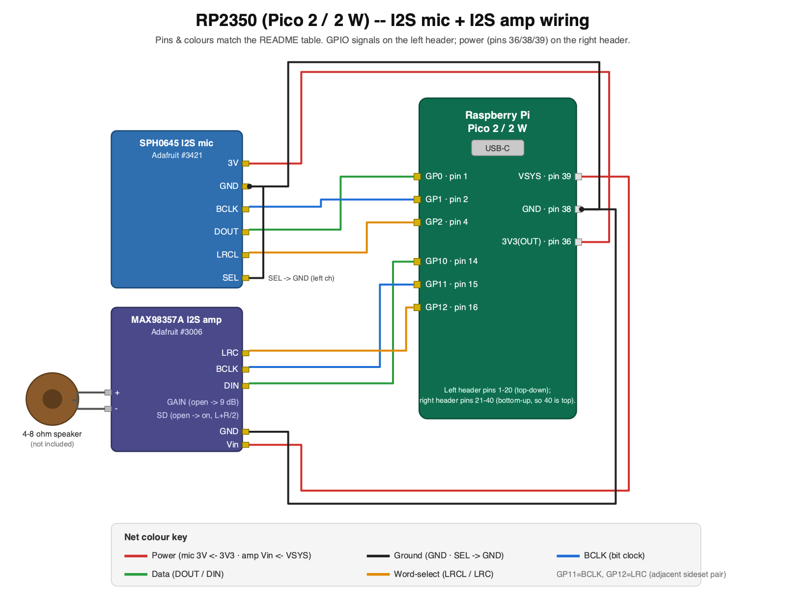

# RP2350 Moonshine Micro Example

This sample demonstrates **useful speech recognition and text-to-speech on a
low-end microcontroller** — a Raspberry Pi Pico 2 (RP2350, 520 KiB SRAM, 4 MiB
flash). It shows how you can run a complete WiFi setup process on a resource-constrained device using a voice interface. The full pipeline — log-mel front-end, VAD, SpellingCNN, and neural synth — runs entirely on-device with no cloud connection.

<!--TOC-->

- [Quick Start](#quick-start)
- [What it does](#what-it-does)
- [Vocabulary](#vocabulary)
- [Memory budget](#memory-budget)
- [Components](#components)
- [Wiring a real microphone \& speaker](#wiring-a-real-microphone--speaker)
- [Building the firmware](#building-the-firmware)
- [Host unit tests](#host-unit-tests)
- [Flashing \& monitoring](#flashing--monitoring)
- [Kernels \& cores](#kernels--cores)
- [Models](#models)
- [Regenerating embedded data](#regenerating-embedded-data)

## Quick Start

To make evaluating the example as easy as possible, you can connect your laptop's speaker and microphone to the board as virtual devices, instead of having to wire in physical components.

The default firmware **is** the live service: the laptop acts as the board's mic
and speaker via `usb_audio_bridge.py`, which streams the laptop microphone to the
device and plays the spoken reply back. Build, flash, then run the bridge:

```bash
cd moonshine-micro
export PICO_SDK_PATH="$HOME/projects/pico-sdk"
export PICO_TOOLCHAIN_PATH="$HOME/projects/arm-gnu-toolchain-13.3.rel1-darwin-arm64-arm-none-eabi/bin"

examples/rp2350/scripts/build.sh        # all non-wifi apps
examples/rp2350/scripts/flash.sh echo

# Bridge the laptop mic/speaker (needs `pip install sounddevice`).
# Do NOT run monitor.sh at the same time — it holds the serial port.
python examples/rp2350/scripts/usb_audio_bridge.py
```

Speak a letter or digit; the bridge prints `VAD start` / `VAD end` /
`RESULT <label> <prob>` events and plays the synthesized reply. It is turn-based —
the host pauses sending while the device classifies and speaks, then resumes.

## What it does

The default app (`moonshine_micro_echo`) runs a streaming **VAD → STT → TTS**
loop forever: `MelStreamer` (one FFT per 32 ms hop) feeds the int8 VAD; when
speech ends the 1 s clip is classified by SpellingCNN; the recognized letter/digit
is spoken back via TTS.

WiFi setup is triggered by passing `wifi` as the argument to `flash.sh`, instead of `echo`. This application listens out for the trigger word 'wifi' and then runs the user through a conversation to pick a network, enter the password, and connect. You can also say 'ip' to get the local IP address if you are connected.

Flash the `test` variant (`moonshine_micro_echo_test`) instead to run the embedded-clip
accuracy sweep (development/CI path; adds ~1.1 MiB of test clips to flash).

## Vocabulary

The embedded SpellingCNN recognizes **50 isolated spoken tokens** — one letter,
digit, or command word per ~1 s utterance, not running speech or whole words:

| Category | Labels | Count |
| -------- | ------ | ----- |
| Letters | `a` … `z` | 26 |
| Digits | `zero`, `one`, `two`, `three`, `four`, `five`, `six`, `seven`, `eight`, `nine` | 10 |
| Command / symbol words | `capital`, `uppercase`, `star`, `dollar`, `underscore`, `exclamation`, `percent`, `delete`, `finish`, `cancel`, `wifi`, `ip`, `yes`, `no` | 15 |

The default echo app uses the letters and digits; the command/symbol words drive
the [voice WiFi-setup flow](#voice-driven-wifi-setup-pico-2-w). NATO/ICAO names
("alpha", "bravo"), multi-character strings, and general open-vocabulary speech
are **out of scope** for this demo model.

Custom vocabulary models — other token sets, product names, command words,
locale-specific letter names, and similar — are available commercially from
**Moonshine AI**.

## Memory budget

The RP2350 has 520 KiB SRAM and 4 MiB flash. Numbers below are from the default
live-audio firmware (`moonshine_micro_echo`, dual-core CMSIS-NN), measured with
`arm-none-eabi-size` on a Release build.

### Firmware totals

| Resource | Size | Notes |
| -------- | ---- | ----- |
| Flash (`.text` + `.rodata`) | ~3.6 MiB | code + rodata; includes the ~1.8 MiB neural voice pack |
| Static RAM (`.bss`) | ~436 KiB | module + app buffers (see below); `echo_hardware` ~444 KiB with I2S rings |
| Heap (`PICO_HEAP_SIZE`) | 24 KiB | kissfft twiddles, short G2P transients, newlib/USB startup |
| Stack banks | 8 KiB | 2 × 4 KiB scratch-bank stacks (see below) |
| **Total provisioned** | **~468 KiB / 520 KiB** | main RAM + scratch SRAM on the RP2350 |

Hardware and WiFi variants add I2S DMA rings (~40 KiB) and/or the CYW43 + lwIP
stacks; `moonshine_micro_echo_wifi_hardware` provisions ~491 KiB and is the
tightest shipping target.

### SRAM by component

Static sizes are from the default live-audio firmware ELF. The tensor arena is
provisioned once in `.bss` and reused sequentially by VAD → STT → neural TTS;
peak arena use during each phase is listed in the transient column.

| Component | Static SRAM | Transient / peak | Notes |
| --------- | ----------- | ---------------- | ----- |
| [examples/rp2350](./) | 32 KiB | — | `g_waveform[16000]` int16 capture / STT clip buffer |
| [feature-generation](../../feature-generation/) | ~9 KiB | — | ~5 KiB shared FFT scratch pool + ~4 KiB `MelStreamer` ring |
| [vad](../../vad/) | — | ~36 KiB arena | `VadSegmenter` state (~0.3 KiB, on stack) |
| [stt](../../stt/) | 384 KiB arena | ~346 KiB arena | sized for SpellingCNN; fp32 features overlay in arena (0 extra) |
| [neural-tts](../../neural-tts/) | — | ~340 KiB arena | reuses `g_tensor_arena` after STT; RVQ decoder TFLM sub-arena ~144 KiB inside the bump |
| [klatt-tts](../../klatt-tts/) | — | few KiB bump | Klatt duration rules only (called from neural-tts); no separate static buffers |
| [g2p](../../g2p/) | — | few KiB heap | short-lived `std::string` per word during G2P |
| Platform (Pico SDK / USB) | ~8 KiB `.bss` | — | USB CDC, runtime globals |
| Platform (heap + stacks) | 24 KiB heap | >4 KiB core-0 stack | see stack note below |

**Arena sizes by target** (override via `SPELLING_TINY_ARENA_BYTES`):

| Target | Arena | Why |
| ------ | ----- | --- |
| `moonshine_micro_echo` (USB) | 384 KiB | default headroom for STT + neural TTS |
| `moonshine_micro_echo_hardware` | 352 KiB | trimmed for I2S DMA rings (~40 KiB) |
| `moonshine_micro_echo_wifi` (USB) | 360 KiB | trimmed for CYW43 + lwIP |
| `moonshine_micro_echo_wifi_hardware` | 346 KiB | CYW43 + lwIP + I2S rings; `NEURAL_TTS_MAX_CHUNK_FRAMES=300` on CYW43 builds |

**Stacks:** each core gets a 4 KiB scratch-bank stack (`PICO_STACK_SIZE=4096`), but
core 0 routinely needs **more than 4 KiB** during the deep STT `Invoke()` call chain.
The dual-core build links with [`memmap_dualcore_stack.ld`](memmap_dualcore_stack.ld),
which swaps the banks so core 0's overflow spills into unused main RAM (~20 KiB slack
below the scratch region) instead of corrupting core 1's live CMSIS-NN worker stack.
FFT working sets are kept in `.bss` for the same reason (see
[`feature-generation/src/fft_scratch.h`](../../feature-generation/src/fft_scratch.h)).

The log-mel window and Slaney filterbank live in flash; fp32 features are computed
into a slice of the (idle) arena overlay, so feature generation and inference share
the same bytes.

### Latency

Per-component latencies on the RP2350 at **250 MHz** (default dual-core firmware).
Compute figures are approximate MAC counts from the model/front-end structure (int8
MACs for the CNNs and s16x8 TFLM decoder; float MACs for log-mel and the WORLD-lite
vocoder), with inline input/output rates in MMAC/s.

| Component | Latency | Compute (approx.) | Notes |
| --------- | ------- | ----------------- | ----- |
| [feature-generation](../../feature-generation/) (VAD) | ~0.4 ms per 32 ms audio | ~12 KMAC per 32 ms audio (~0.4 MMAC/s) | always-on streaming mel |
| [feature-generation](../../feature-generation/) (STT) | ~40 ms per 1 s audio | ~1.5 MMAC per 1 s audio (~1.5 MMAC/s) | batch 64×128 log-mel plane |
| [vad](../../vad/) | ~3.1 ms per 32 ms audio | ~0.8 MMAC per 32 ms audio (~25 MMAC/s) | TinyVadCNN `Invoke` |
| [stt](../../stt/) | ~314 ms per 1 s audio | ~36 MMAC per 1 s audio (~36 MMAC/s) | SpellingCNN (dual-core CMSIS-NN) |
| [neural-tts](../../neural-tts/) | ~0.4–0.7 s letter reply | ~37 MMAC typical (~65 MMAC/s out) | 16 kHz; e.g. "bee" 0.37 s audio, 1 tile; s16x8 RVQ decoder (~29 MMAC/tile) + WORLD-lite vocoder; synthesis ~1× real-time |
| **Classify + speak** | **~0.7–1.0 s typical** | **~38 MMAC in; ~35 MMAC out** | 1 s audio in + letter reply (excludes VAD) |

Single-core STT inference is ~507 ms per 1 s audio; see [Kernels & cores](#kernels--cores).
Neural-TTS wall time tracks reply audio length at roughly real-time synthesis speed
(`NeuralTts::Stats` breaks out G2P, planning, tiled decode, and vocoder time on the
`tts` / `speaker` firmware targets). Long prompts are clause/chunk queued in
`Speak()`.

### Flash by component

| Component | Flash (typical) | README |
| --------- | --------------- | ------ |
| [feature-generation](../../feature-generation/) | ~26 KiB mel tables | [details](../../feature-generation/README.md#memory--compute) |
| [vad](../../vad/) | ~64 KiB model + ~25 KiB mel tables | [details](../../vad/README.md#memory--compute) |
| [stt](../../stt/) | ~1.3 MiB SpellingCNN | [details](../../stt/README.md#memory--compute) |
| [neural-tts](../../neural-tts/) | ~1.8 MiB voice pack | [details](../../neural-tts/README.md#memory--compute) |
| [g2p](../../g2p/) + [klatt-tts](../../klatt-tts/) | ~tens KiB code | shared G2P rules + Klatt duration engine linked into neural-tts |

## Components

The pipeline is split into reusable modules, each with its own CMake target, public
header, README, and unit tests. [`examples/rp2350/`](./) wires them
together for the Pico 2.

| Module | Role | README |
| ------ | ---- | ------ |
| [feature-generation](../../feature-generation/) | 16 kHz PCM → normalised log-mel features (batch + streaming) | [feature-generation/README.md](../../feature-generation/README.md) |
| [vad](../../vad/) | int8 voice-activity detection + segment boundaries | [vad/README.md](../../vad/README.md) |
| [stt](../../stt/) | int8 SpellingCNN — isolated letters, digits, and command words | [stt/README.md](../../stt/README.md) |
| [g2p](../../g2p/) | grapheme-to-phoneme front end (shared by neural-tts) | — |
| [klatt-tts](../../klatt-tts/) | Klatt duration / segment rules (used inside neural-tts) | [klatt-tts/README.md](../../klatt-tts/README.md) |
| [neural-tts](../../neural-tts/) | neural diphone TTS — RVQ decoder + WORLD-lite vocoder @ 16 kHz | [neural-tts/README.md](../../neural-tts/README.md) |

The TFLM dependency is decoupled behind a `tflm` CMake INTERFACE target, so modules
do not hard-code which TFLM implementation is linked.

## Wiring a real microphone & speaker

The `*_hardware` firmware variants (`echo_hardware`, `wifi_hardware`, and the
standalone `mic` / `speaker` / `loopback` bring-up tests) run the pipeline on
real on-board audio hardware instead of the USB bridge, so the device is fully
standalone — no laptop in the loop. The reference build uses two inexpensive
Adafruit breakouts:

| Part | Adafruit | Role | Notes |
| ---- | -------- | ---- | ----- |
| I2S MEMS mic — SPH0645LM4H | [#3421](https://www.adafruit.com/product/3421) | microphone input | 3.3 V digital I2S; mono element on the **left** slot (`SEL → GND`) |
| I2S mono amp — MAX98357A | [#3006](https://www.adafruit.com/product/3006) | speaker output | 3.2 W class-D amp that takes **I2S digital audio directly** — its own DAC reconstructs clean analog on-chip, so no PWM carrier and no RC filter. Amp only: connect a **4–8 Ω speaker** to its screw terminals |

Both coexist on a single Pico 2 / Pico 2 W: the mic uses GP0/GP1/GP2 and the
amp uses GP10/GP11/GP12, so nothing overlaps.

> **Why I2S instead of the old PWM speaker.** The RP2350 has no DAC, so the
> previous setup drove a filterless class-D amp (STEMMA Speaker, PAM8302) with a
> raw PWM carrier — which the amp partly demodulated into audible static, forcing
> an 8-bit carrier + external RC filter + firmware EQ to sound acceptable. The
> MAX98357A takes I2S straight in and does the D/A itself, so the carrier/filter
> problem disappears entirely and you get the full sample resolution.

### Microphone — SPH0645 → Pico (I2S, 3.3 V)

| Mic pin | Dir | Pico pin | Physical pin |
| ------- | --- | -------- | ------------ |
| `3V` (VDD) | Pico → mic | `3V3(OUT)` | 36 |
| `GND` | — | `GND` | 38 (any GND) |
| `BCLK` | Pico → mic | `GP1` | 2 |
| `DOUT` | mic → Pico | `GP0` | 1 |
| `LRCL` (word sel) | Pico → mic | `GP2` | 4 |
| `SEL` | tie low | `GND` | — (selects the left channel) |

`LRCL` **must** be `BCLK + 1` (GP2 = GP1 + 1): the PIO program drives the bit
clock and word-select as an adjacent side-set pair. Power the mic from `3V3`,
**not** 5 V.

### Speaker — MAX98357A I2S amp → Pico (I2S, 3.3 V logic)

| Amp pin | Dir | Pico pin | Physical pin | Notes |
| ------- | --- | -------- | ------------ | ----- |
| `Vin` | Pico → amp | `VSYS` | 39 | 2.5–5.5 V supply (see power note below) |
| `GND` | — | `GND` | 38 | share ground with the Pico |
| `BCLK` | Pico → amp | `GP11` | 15 | bit clock |
| `LRC` | Pico → amp | `GP12` | 16 | word-select (LRCLK); **must** be `BCLK + 1` |
| `DIN` | Pico → amp | `GP10` | 14 | I2S serial data (reuses the freed-up PWM pin) |
| `GAIN` | leave open | — | — | floating = **9 dB** default; for 3/6/12/15 dB tie to GND/Vin (directly or via 100 kΩ) |
| `SD` | leave open | — | — | board's default resistor keeps the amp **enabled** in `(L+R)/2` mono-mix mode |

Connect a **4–8 Ω speaker** to the amp's `+`/`-` screw terminals — the #3006 is
the amplifier only, no speaker included. The output is bridge-tied (BTL), so wire
the speaker straight to the terminals and **do not** ground either terminal.

`LRC` **must** be `BCLK + 1` (GP12 = GP11 + 1): an I2S transmit PIO drives the
bit clock and word-select as an adjacent side-set pair, exactly like the mic.
The three I2S signals are 3.3 V logic from the Pico — that's within the
MAX98357A's input range regardless of what `Vin` is.

Power the amp from **`VSYS` (pin 39)**, not `VBUS` (pin 40). `VBUS` is the USB
5 V rail and is **dead when running on battery** (a LiPo SHIM / power supply
feeds `VSYS`, not `VBUS`), so a `VBUS`-powered amp goes silent the moment you
unplug USB. `VSYS` is the system rail — it tracks the battery (~3.7–4.2 V) when
untethered and ~4.7 V on USB, both well within the MAX98357A's 2.5–5.5 V range.
(`3V3` at pin 36 also works but limits output power and can droop under load.)

In the default `(L+R)/2` mono-mix mode the firmware writes the mono TTS sample
into **both** I2S slots so the downmix reproduces it at full level (writing only
the left slot would halve the amplitude, i.e. 6 dB quieter).

### Pinout diagram



*(Source: [`wiring.svg`](wiring.svg); re-export with
`python -c "import cairosvg; cairosvg.svg2png(url='wiring.svg', write_to='wiring.png', output_width=1600)"`.)*
The same connections as an ASCII fallback:

```
   Adafruit SPH0645 I2S mic (#3421)            Raspberry Pi Pico 2 / 2 W
   +----------------------------+               (physical header pins)
   | 3V   o---------------------+-------------->  3V3(OUT)  pin 36
   | GND  o---------------------+-------------->  GND       pin 38
   | BCLK o---------------------+-------------->  GP1       pin  2
   | DOUT o<--------------------+---------------  GP0       pin  1
   | LRCL o---------------------+-------------->  GP2       pin  4
   | SEL  o---------------------+-------------->  GND  (left channel)
   +----------------------------+

   Adafruit MAX98357A I2S amp (#3006) + your own 4-8 ohm speaker
   +----------------------------+
   | Vin  o---------------------+-------------->  VSYS      pin 39
   | GND  o---------------------+-------------->  GND       pin 38
   | BCLK o---------------------+-------------->  GP11      pin 15
   | LRC  o---------------------+-------------->  GP12      pin 16
   | DIN  o---------------------+-------------->  GP10      pin 14
   | GAIN o   (leave open -> 9 dB gain)
   | SD   o   (leave open -> enabled, (L+R)/2 mono)
   +--[+]--[-]------------------+
       screw terminals -> speaker (4-8 ohm)
```

Once wired, build the hardware targets and flash one of them:

```bash
examples/rp2350/scripts/build.sh           # echo_hardware + the bring-up tests
examples/rp2350/scripts/flash.sh mic       # confirm the mic first (prints stats)
examples/rp2350/scripts/flash.sh speaker   # confirm the amp (tones + a/b/c clips)
examples/rp2350/scripts/flash.sh echo_hardware   # full live echo on real I/O
```

(For the standalone voice WiFi setup on this hardware, build with `--wifi` and
flash `wifi_hardware` — see
[Standalone variant: on-board I2S mic + speaker](#standalone-variant-on-board-i2s-mic--speaker).)

> **Firmware — I2S output backend.** The on-board speaker path is driven by
> `I2sAudioOutput` ([src/i2s_audio_out.h](src/i2s_audio_out.h) +
> [src/i2s_out.pio](src/i2s_out.pio)): a PIO I2S transmitter that mirrors the
> mic's PIO input and clocks 16-bit stereo frames out on DIN=GP10 / BCLK=GP11 /
> LRC=GP12 (it lives on the same `pio0` as the mic, on a second state machine).
> Each mono TTS/clip sample is duplicated into both I2S slots for full level in
> the amp's default `(L+R)/2` mode. The `speaker`, `echo_hardware`,
> `wifi_hardware`, and `loopback` builds all use it.

## Building the firmware

Needs **Arm GNU toolchain 13.3.Rel1** (Homebrew's `arm-none-eabi-gcc` 16.x lacks
`nosys.specs`/`nano.specs`) and the **Pico SDK** at `~/projects/pico-sdk`.

Point `PICO_SDK_PATH` / `PICO_TOOLCHAIN_PATH` at your toolchain, then use the
`build.sh` helper (it reads those env vars and picks the right board per app):

```bash
cd moonshine-micro
export PICO_SDK_PATH="$HOME/projects/pico-sdk"
export PICO_TOOLCHAIN_PATH="$HOME/projects/arm-gnu-toolchain-13.3.rel1-darwin-arm64-arm-none-eabi/bin"

examples/rp2350/scripts/build.sh          # all non-wifi apps (board: pico2)
examples/rp2350/scripts/build.sh --wifi   # + the wifi apps  (board: pico2_w)
```

`build.sh` just wraps the underlying CMake configure + build (pass extra cmake
args after `--`, e.g. `build.sh -- -DSPELLING_TINY_VAD=ON`). If you'd rather run
it by hand:

```bash
cmake -B build -S . -DPICO_SDK_PATH="$PICO_SDK_PATH" -DPICO_TOOLCHAIN_PATH="$PICO_TOOLCHAIN_PATH"
cmake --build build -j 8
```

> **One board flag, two build dirs.** `PICO_BOARD` is a *build-wide,
> configure-time* setting, so a single build tree targets exactly one board.
> The RP2350 in a **Pico 2** and a **Pico 2 W** is identical — the "W" only
> adds a CYW43 wireless module — so the default `pico2` build in `build/` runs
> on **any** RP2350 board, including a Pico 2 W. Only the **wifi** app touches
> the radio, so it (and only it) needs a `pico2_w` build; `build.sh --wifi`
> puts that in a separate `build-w/`. `flash.sh wifi` automatically picks it up.
> Everything below assumes `build/` (the non-wifi default).
>
> **Caveat — the on-board LED.** On a Pico 2 the LED is GPIO 25; on a
> Pico 2 W GPIO 25 is the CYW43 SPI chip-select and the LED hangs off the
> radio chip (`cyw43_arch_gpio_put(CYW43_WL_GPIO_LED_PIN, ...)`, `pico2_w`
> build only). A `pico2` build's LED blink is invisible on a Pico 2 W, and
> driving GPIO 25 there can disturb the radio. Any app that uses the LED as
> a liveness indicator must be built with `-DPICO_BOARD=pico2_w` for a
> Pico 2 W board (the bring-up `step*` targets do this in `build-w/`).

This builds one `.uf2` per app under `build/examples/rp2350/` (the first build
compiles TFLM + the SDK -- a couple of minutes; rebuilds are seconds):

| Target / artifact | App |
| ----------------- | --- |
| `moonshine_micro_echo.uf2` | live mic/speaker echo service (default) |
| `moonshine_micro_echo_hardware.uf2` | live echo on I2S mic + I2S amp |
| `moonshine_micro_echo_test.uf2` | embedded-clip accuracy sweep |
| `moonshine_micro_echo_wifi.uf2` | voice WiFi setup, USB bridge (`build-w/`; needs a Pico 2 W) |
| `moonshine_micro_echo_wifi_hardware.uf2` | voice WiFi setup on I2S mic + I2S amp (`build-w/`; Pico 2 W) |
| `moonshine_micro_i2s_mic_test.uf2` | standalone I2S mic bring-up test |
| `moonshine_micro_i2s_audio_test.uf2` | standalone I2S amp test — MAX98357A (tones + clips) |
| `moonshine_micro_audio_loopback_test.uf2` | 5 s mic -> I2S amp loopback |

Which app runs is chosen by which target you build and flash -- not by a
compile-time macro. `build.sh` builds them all; to build just one, target it
directly with `cmake --build build --target <name>`. Each entry point is a tiny
`src/main_*.cc`.

> **Troubleshooting — `cannot read spec file 'nosys.specs'` or missing headers.**
> CMake caches the compiler on first configure, so changing `PATH` later has no
> effect. Delete `build/` and reconfigure with `-DPICO_TOOLCHAIN_PATH` as above.
> Confirm with `grep CMAKE_C_COMPILER build/CMakeCache.txt` (should point inside
> the Arm toolchain, not `/opt/homebrew/bin`).

### Build options

These tune *how* targets are built (not which app runs -- that's the target you
flash):

| Option | Default | Effect |
| ------ | ------- | ------ |
| `PICO_BOARD` | `pico2` | `pico2` runs on any RP2350 board; set `pico2_w` to build the WiFi target (see `build.sh --wifi`) |
| `SPELLING_TINY_MULTICORE` | ON | Dual-core CMSIS-NN (~1.6× speedup, bit-identical) |
| `SPELLING_TINY_TTS` | OFF | Add the neural-TTS USB speak-loop demo to the **test** target |
| `SPELLING_TINY_VAD` | OFF | Add the VAD demo to the **test** target |
| `SPELLING_TINY_PROFILE_OPS` | OFF | Per-op timing in the **test** target |
| `SPELLING_TINY_PRINT_MEMORY_PLAN` | OFF | GreedyMemoryPlanner diagram on `AllocateTensors()` |

The live + WiFi targets always link the full VAD + STT + TTS pipeline regardless
of `SPELLING_TINY_VAD` / `SPELLING_TINY_TTS` (those only gate the test target's
optional demos).

### Voice-driven WiFi setup (Pico 2 W)

The `moonshine_micro_echo_wifi` target ([examples/rp2350/src/wifi_app.cc](src/wifi_app.cc))
reuses the same VAD → STT → TTS pipeline but, instead of echoing single letters,
walks a small state machine to join a network: say `wifi` and the device scans
for nearby networks, then prompts you to *spell the first few letters of the
network name*. You don't have to spell the whole SSID — as soon as the letters
you've spelled match exactly one scanned network it announces the full name and
asks you to confirm (say `finish` to resolve early; an exact name wins, then a
unique prefix, and if nothing matches it uses the typed text so hidden networks
still work). Then spell the password character-by-character (letters, digit
words, the symbol words `star`/`dollar`/`underscore`/`exclamation`/`percent`,
`capital` to upcase the next letter, `delete`/`finish`/`cancel`, and `yes`/`no` to
confirm), and the device associates over CYW43 and reads its DHCP address back
when you say `ip`.

The WiFi apps keep a **quiet serial log** (just `VAD start` / `VAD end` /
`RESULT` plus the `[wifi]` status lines) — the verbose recognizer heartbeats,
mic signal stats and the binary STT-clip dump are compiled out (they're kept in
the diagnostic `echo` / `echo_hardware` builds via `SPELLING_AUDIO_DIAG` /
`SPELLING_DUMP_STT_USB`).

It is only created when the board has a CYW43 radio, so it builds for the
Pico 2 W in a separate `build-w/` tree (keeping the default `build/` universal
— see [One board flag, two build dirs](#building-the-firmware) above). The
helper does this for you:

```bash
examples/rp2350/scripts/build.sh --wifi
examples/rp2350/scripts/flash.sh wifi   # auto-uses build-w/
```

Or by hand:

```bash
cmake -B build-w -S . -DPICO_SDK_PATH=$HOME/projects/pico-sdk \
  -DPICO_TOOLCHAIN_PATH=$HOME/projects/arm-gnu-toolchain-13.3.rel1-darwin-arm64-arm-none-eabi/bin \
  -DPICO_BOARD=pico2_w
cmake --build build-w -j 8 --target moonshine_micro_echo_wifi \
                                    moonshine_micro_echo_wifi_hardware
```

It links a minimized lwIP ([examples/rp2350/lwipopts.h](lwipopts.h):
poll mode, no TCP/DNS, small pools) tuned for a one-shot WPA2 join. To fit
alongside the radio stack the tensor arena is trimmed to **360 KiB** on the USB
WiFi build and **346 KiB** on `wifi_hardware` (via `SPELLING_TINY_ARENA_BYTES`);
both still clear the SpellingCNN ~346 KiB working set during STT, with neural
TTS reusing the same arena afterward.

Audio still flows over the USB tether for this build (the laptop is the mic +
speaker via [examples/rp2350/scripts/usb_audio_bridge.py](scripts/usb_audio_bridge.py))
while the Pico actually joins WiFi. Only WPA2-PSK and the model's character set
(letters, digits, `* $ _ ! %`) are supported in v1.

#### Standalone variant: on-board I2S mic + speaker

`moonshine_micro_echo_wifi_hardware` runs the **exact same** setup flow without
the laptop: the mic + speaker are the on-board I2S mic (GP0/1/2) and the on-board
speaker (GP10, see [wiring above](#wiring-a-real-microphone--speaker)), so the
device is fully standalone. It reuses the shared
`RunWifiAppWithIo()` state machine in [src/wifi_app.cc](src/wifi_app.cc) — the
only difference from the USB build is which `AudioInput`/`AudioOutput`
([src/audio_io.h](src/audio_io.h)) it constructs (`I2sAudioInput` +
`I2sAudioOutput`, the same backends as `moonshine_micro_echo_hardware`). Its
tensor arena is **346 KiB** (8 KiB smaller than the USB WiFi build) to make room
for the I2S DMA ring buffer alongside the CYW43 + lwIP stacks.

```bash
examples/rp2350/scripts/build.sh --wifi          # builds both wifi targets
examples/rp2350/scripts/flash.sh wifi_hardware   # speak into the I2S mic
examples/rp2350/scripts/monitor.sh               # watch the setup log over USB
```

The same on-board speaker notes apply as for `moonshine_micro_echo_hardware`
(the `I2sAudioOutput` backend, unprocessed PCM — see
[Wiring a real microphone & speaker](#wiring-a-real-microphone--speaker) above).

## Host unit tests

Module logic is unit-tested on the host with TFLM's `micro_test.h` — no SDK or
device needed:

```bash
cmake -B build-host -S . -DMOONSHINE_MICRO_HOST_TESTS=ON
cmake --build build-host -j 8
ctest --test-dir build-host --output-on-failure
```

The interpreter wrappers (`stt::Classifier`, `vad::Vad`) are built for the target;
host tests cover the surrounding logic.

## Flashing & monitoring

```bash
examples/rp2350/scripts/flash.sh echo   # waits for BOOTSEL, copies the UF2
examples/rp2350/scripts/monitor.sh      # USB CDC serial monitor (tees a log)
```

`flash.sh` takes a variant (`echo`, `test`, `wifi`, `wifi_hardware`, `mic`,
`speaker`, ...; run it with no args for the full list). It looks in `build/` by
default; the `wifi` and `wifi_hardware` variants automatically prefer
`build-w/`. Override with
`BUILD_DIR=/path examples/rp2350/scripts/flash.sh <variant>`, or pass an
explicit `.uf2` path as a second argument.

The firmware uses USB CDC stdio (UART off). Run `monitor.sh` in one terminal and
`flash.sh` in another so the boot banner is not missed.

## Kernels & cores

The int8 classifier runs on **CMSIS-NN with the Cortex-M33 DSP SIMD path**
(`smlad` / `sxtb16`), using a customized fork of [Pico TensorFlow Lite Micro](https://github.com/raspberrypi/pico-tflmicro). The default dual-core build splits the SIMD GEMM (~74% of
inference) and the 3×3 depthwise conv (~19%) across both cores for ~1.6× at
250 MHz with bit-identical output. See
[`third-party/pico-tflmicro/PATCHES.md`](../../third-party/pico-tflmicro/PATCHES.md).

Embedded-clip sweep on the default dual-core firmware at 250 MHz:

| Build | infer | log-mel | avg latency (log-mel + infer) | accuracy |
| ----- | ----- | ------- | ----------------------------- | -------- |
| single-core | ~507 ms | ~40 ms | ~549 ms | 65/72 |
| dual-core | ~314 ms | ~40 ms | ~354 ms | 65/72 |

## Models

Canonical `.tflite` and `.onnx` exports for the two neural models live in
[`models/`](../../models/). See [`models/README.md`](../../models/README.md) for tensor
shapes, architecture notes, the pipeline diagram, and MMAC estimates.

| Model | Deployed artifact | Classes |
| ----- | ----------------- | ------- |
| SpellingCNN | `models/spelling_cnn_mel_int8.tflite` | 51 letters + digits + command words |
| TinyVadCNN | `models/tinyvad_cnn_speech_mel_head16.tflite` | speech / non-speech |
| Neural RVQ decoder | embedded in `generated/neural_tts_pack.bin` (~1.8 MiB) | diphone / word units for on-device TTS |

## Regenerating embedded data

The `generated/` blobs are checked in but reproducible:

```bash
python stt/scripts/generate_embedded_data.py            # -> examples/rp2350/generated/
python vad/scripts/generate_vad_embedded_data.py --config-only
python feature-generation/scripts/generate_mel_tables.py --help
python ../scripts/export_neural_tts_pack.py --out examples/rp2350/generated
```