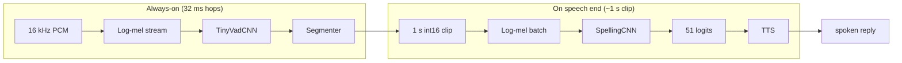

# Models

Pre-exported **SpellingCNN** and **TinyVadCNN** artifacts for the on-device
spelling pipeline. The copies here use canonical, human-readable names for
desktop inspection and re-embedding into firmware.

<!--TOC-->

- [System diagram](#system-diagram)
- [SpellingCNN — letters, digits, and command words](#spellingcnn--letters-digits-and-command-words)
  - [Provenance](#provenance)
  - [Architecture](#architecture)
  - [Files](#files)
  - [Inputs and outputs](#inputs-and-outputs)
- [TinyVadCNN — voice activity detection](#tinyvadcnn--voice-activity-detection)
  - [Architecture](#architecture-1)
  - [Files](#files-1)
  - [Inputs and outputs](#inputs-and-outputs-1)

## System diagram

Both models consume **normalised log-mel** features computed separately
(16 kHz PCM → Slaney filterbank → per-clip or per-hop normalisation). Neither
`.tflite` / `.onnx` file includes the mel front-end — only the classifier head.

## SpellingCNN — letters, digits, and command words

51-way classifier for hyperarticulated **isolated spoken tokens** in a ~1 s
window: the 26 letters `a`…`z`, the ten digit words `zero`…`nine`, and 15
command/symbol words used by the voice WiFi-setup flow (`capital`, `uppercase`,
`star`, `dollar`, `underscore`, `exclamation`, `percent`, `delete`, `done`,
`cancel`, `wifi`, `ip`, `yes`, `no`, `hey rp`). Limited to isolated tokens — not
NATO names, running speech, or multi-character strings.

### Provenance

| Field | Value |
| ----- | ----- |
| Source run | `run_2026_06_24_19_08` (best epoch 45) |
| Training data | local TTS wavs (ElevenLabs / Google / Polly) + People's Speech real-voice clips (packed parquet on the Hub), class-balanced sampling (`--sampling-power 1.0`) |
| Speaker-independent val | 98.47% top-1, 97.16% macro, 97.00% E-set |
| Held-out `captured` (220 real clips) | **90.91%** top-1, **85.96%** E-set |

The int8 export is accuracy-neutral vs the fp32 PyTorch model on `captured`
(90.91% / 85.96%, argmax parity on the export check). Supersedes the previous
`run_2026_06_18_18_43` export (which scored 89.55% / 85.96% on the same set).

### Architecture

MobileNetV2-style inverted-residual CNN (`model_size=1`, width multiplier
**1.0**, ~**1.02M** params):

| Stage | Blocks | Notes |
| ----- | ------ | ----- |
| Stem | 3×3 conv, stride `(2, 2)` | downsamples freq and time |
| Backbone | 7 IR stages: `(1,16,1)`, `(4,24,2)`, `(4,32,3)`, `(4,64,3)`, `(4,96,2)`, `(4,160,2)`, `(4,240,1)` | expand · out-channels · repeats |
| Head | 1×1 conv (640) → global average pool → linear | 51 logits |

`pad_to_odd` is enabled, so every stride-2 conv sees an odd input: PyTorch's
symmetric `padding=1` then matches TFLite SAME and folds into the conv, avoiding
the standalone `PAD` op that would otherwise set the TFLM arena peak.

TFLM op set: `PAD`, `DEPTHWISE_CONV_2D`, `CONV_2D`, `ADD`, `SUM`,
`FULLY_CONNECTED`, `RESHAPE`.

**Per-inference compute:** ~**36 MMAC** per forward pass on a `(1, 1, 64, 128)`
log-mel input (int8 LiteRT estimate).

### Files

| File | Format | Role |
| ---- | ------ | ---- |
| [`spelling_cnn_mel_int8.tflite`](spelling_cnn_mel_int8.tflite) | int8 LiteRT | primary int8 deploy artifact, embedded into firmware (~1.28 MiB) |
| [`spelling_cnn_mel_fp32.tflite`](spelling_cnn_mel_fp32.tflite) | fp32 LiteRT | reference / re-quantization |
| [`spelling_cnn_mel.onnx`](spelling_cnn_mel.onnx) | fp32 ONNX | desktop inspection |
| [`spelling_cnn_mel.shrunk.onnx`](spelling_cnn_mel.shrunk.onnx) | int8 ONNX | compact desktop deploy |
| [`spelling_cnn_meta.json`](spelling_cnn_meta.json) | JSON | classes, audio dims |

The `spelling_cnn_letters_digits_mel*` files are the superseded 36-class
(letters + digits only) export, kept for reference; the embed/resolve tooling
prefers the `spelling_cnn_mel*` names above.

### Inputs and outputs

| Tensor | Shape | Dtype | Description |
| ------ | ----- | ----- | ----------- |
| `log_mel` (in) | `(B, 1, 64, 128)` | fp32 (ONNX) / int8 (TFLM) | per-clip normalised log-mel: 64 mels × 128 frames, 16 kHz, hop 125 (~1 s) |
| `logits` (out) | `(B, 51)` | fp32 | unnormalised class scores; apply softmax for probabilities |

Class order is in `spelling_cnn_meta.json` (`classes` array).

## TinyVadCNN — voice activity detection

Runs once per 32 ms hop while listening; a moving-average segmenter turns frame
probabilities into speech boundaries.

### Architecture

Compact MobileNetV2-style binary classifier (`TinyVadCNN`):

| Stage | Blocks | Notes |
| ----- | ------ | ----- |
| Stem | 3×3 conv, stride `(2, 1)` | ~20.6K params total |
| Backbone | 4 IR stages: `(1,16,1)`, `(3,24,1)`, `(3,32,1)`, `(3,48,1)` | freq-downsample, short time axis |
| Head | 1×1 conv → GAP → linear | 1 speech logit |

The primary export uses **head16** mixed precision: int8 conv body, int16
`head_conv` / pool / output (recovers accuracy at near-int8 size).

**Per-inference compute:** ~**0.78 MMAC** per forward pass on a `(1, 1, 32, 16)`
log-mel window (781 KMAC).

### Files

| File | Format | Role |
| ---- | ------ | ---- |
| [`tinyvad_cnn_speech_mel_head16.tflite`](tinyvad_cnn_speech_mel_head16.tflite) | int8/int16 LiteRT | primary int8 deploy artifact (64 KiB) |
| [`tinyvad_cnn_speech_mel_fp32.tflite`](tinyvad_cnn_speech_mel_fp32.tflite) | fp32 LiteRT | reference / re-quantization |
| [`tinyvad_cnn_speech_mel.onnx`](tinyvad_cnn_speech_mel.onnx) | fp32 ONNX | desktop inspection |
| [`tinyvad_cnn_speech_meta.json`](tinyvad_cnn_speech_meta.json) | JSON | mel dims, hop |

### Inputs and outputs

| Tensor | Shape | Dtype | Description |
| ------ | ----- | ----- | ----------- |
| `log_mel` (in) | `(B, 1, 32, 16)` | fp32 (ONNX) / int8 (TFLM) | streaming normalised log-mel window: 32 mels × 16 frames |
| `speech_logit` (out) | `(B, 1)` | fp32 / int16 | raw logit; `sigmoid(logit)` → speech probability in `[0, 1]` |

Streaming audio config (from `tinyvad_cnn_speech_meta.json`): 16 kHz, `n_fft=512`,
hop **512 samples** (32 ms), `f_min=20`, `f_max=8000`.
